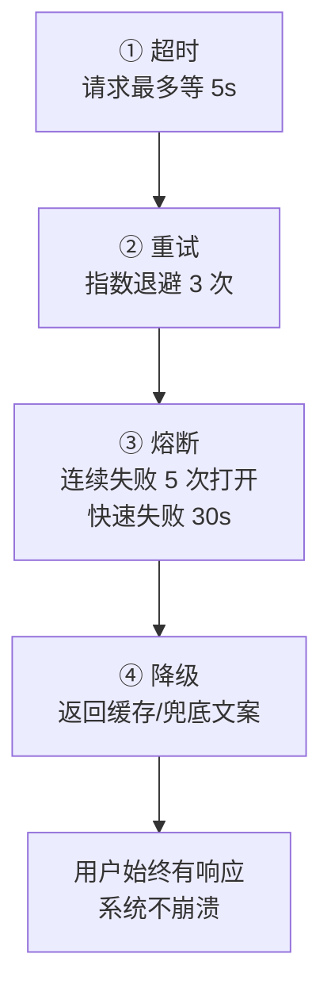

# 第 64 课 可靠性工程入门：给过山车装保险丝

> 定位：教学引导。系统上线后最怕"突然全线崩溃"。这一课讲四件保命开关：超时、重试、熔断、降级；再学用故障演练主动"电自己一下"，提前发现问题。用"过山车安全装置"比喻贯穿全课。

四项保护从"轻"到"重"是一道阶梯，平时各守其位、故障时层层兜底：



---

## 1. 本节课目标

- 理解可靠性三件套：SLO / 错误预算 / 故障预案；
- 亲手实现超时 + 重试 + 熔断 + 降级四项保护；
- 完成一次最小故障演练并复盘。

---

## 2. 用"过山车安全装置"理解可靠性

| 安全装置 | 过山车 | LLM 系统 |
| --- | --- | --- |
| 刹车限速 | 超时 | 请求不超过 N 秒撤回来 |
| 安全绳 | 重试 | 失败后按退避规则再来 |
| 断轨保护 | 熔断 | 坏了一半立刻整体停 |
| 备用道 | 降级 | 顶不住时给低配答案 |

> 一句话：**先定"可以坏多少"（错误预算），再用四件套把坏的程度控制住**。

---

## 3. 动手实现四件套（约 20 分钟）

### 3.1 超时 + 指数退避重试

```python
import time
from tenacity import (
    retry, stop_after_attempt, wait_exponential,
    retry_if_exception_type,
)

@retry(
    stop=stop_after_attempt(3),
    wait=wait_exponential(multiplier=1, max=4),
    retry=retry_if_exception_type(TimeoutError),
)
def ask_llm_with_retry(question):
    return llm.invoke(question)   # 自带超时的客户端
```

> 只对可重试错误（超时/5xx）重试；4xx 和"回答质量差"不要盲重试。

### 3.2 熔断器（状态机完整实现）

```python
class CircuitBreaker:
    """closed → open → half-open 三态切换"""
    def __init__(self, fail_threshold=5, reset_after=30):
        self.fail_threshold = fail_threshold
        self.reset_after = reset_after
        self.state = "closed"        # closed/open/half-open
        self.fails = 0
        self.opened_at = None

    def allow(self) -> bool:
        if self.state == "open":
            if time.time() - self.opened_at > self.reset_after:
                self.state = "half-open"   # 放一个探针请求
                return True
            return False
        return True

    def record(self, ok: bool):
        if ok:
            self.fails = 0
            self.state = "closed"
        else:
            self.fails += 1
            if self.state == "half-open" or self.fails >= self.fail_threshold:
                self.state = "open"
                self.opened_at = time.time()

breaker = CircuitBreaker()

def safe_ask(q):
    if not breaker.allow():
        return {"answer": "系统繁忙，请稍后再试（降级）"}
    try:
        ans = ask_llm_with_retry(q).content
        breaker.record(True)
        return {"answer": ans}
    except Exception:
        breaker.record(False)
        return {"answer": "系统繁忙，请稍后再试（降级）"}
```

### 3.3 限流 + 降级

```python
import time, threading

class TokenBucket:
    def __init__(self, rate=5, capacity=10):
        self.rate, self.capacity = rate, capacity
        self.tokens, self.ts = capacity, time.time()
        self.lock = threading.Lock()

    def take(self) -> bool:
        with self.lock:
            now = time.time()
            self.tokens = min(self.capacity,
                             self.tokens + (now - self.ts) * self.rate)
            self.ts = now
            if self.tokens >= 1:
                self.tokens -= 1
                return True
            return False

b = TokenBucket(rate=5, capacity=10)

def smart_answer(q):
    if not b.take():
        return "问的人太多了，请一分钟后再试"
    # 模型超时走重试，连续失败走熔断，再不行走固定兜底答案
    return safe_ask(q)["answer"]
```

多级降级阶梯：**完整回答 → 单文档摘要 → 关键词清单 → 固定提示语**。任何一级失败，就往下一级落。

---

## 4. 故障演练：主动电自己一下（约 15 分钟）

| 场景 | 怎么演练 | 预期表现 |
| --- | --- | --- |
| 模型 API 超时 | mock 注入 10s 延迟 | 重试后仍失败→熔断→降级 |
| 检索服务宕机 | 停掉向量库连接 | 缓存兜底或降级 |
| 突发流量 | 并发 50 请求 | 限流生效，放弃 429 之外全部正常 |
| 单节点宕机 | 杀一个 worker | 其余节点接管，无错误暴露 |
| 断网 | 拔网络 | 全部走降级，不白屏 |

演练单要点：**目标 → 注入方式 → 预期 → 实测 → 复盘**。复盘五问：

1. 故障发生了多久才被发现？
2. 系统自己恢复了，还是靠人？
3. 用户侧看到了什么（白屏/错误/降级文案）？
4. 熔断/限流有没有按预期生效？
5. 下一次怎么更快发现、更快恢复？

---

## 5. 自查清单

- [ ] 每个外部调用都有超时？
- [ ] 超时/5xx 都有重试+退避？
- [ ] 熔断器在连续失败时真的打开了？
- [ ] 降级文案用户能看懂？
- [ ] 至少 3 个故障场景演练过并有记录？

---

## 6. 小结

- 四件套 = 超时（刹车）+ 重试（安全绳）+ 熔断（断轨保护）+ 降级（备用道）；
- 可靠性不是"保证不出事"，而是"出事也在预算内、还能快速恢复"；
- 你已经能自己把系统"电一跳"再修好它。

**下一课（收官）**：第 65 课——安全 + 成本双体检 + 基础版正式上线，并规划你的进阶路线。