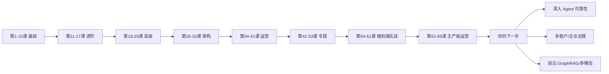

# 第 65 课 收官：安全成本双体检与你的进阶路线

> 定位：教学引导（全系列第 65 课，收官课）。学到的所有知识，最终要过两道关：**安不安全、贵不贵**。本课带你做一次"上线前双体检"，完成基础版正式发布流程，并给出全系列之后的进阶路线图。

---

## 1. 本节课目标

- 完成 5 项安全必查 + 成本摸底；
- 走通一次"测试环境 → 预发 → 生产"的平稳升级；
- 明确上完本系列后，你可以向哪个方向继续深造。

---

## 2. 上线前体检：五件事必查

| 检查项 | 怎么做 | 通过标准 |
| --- | --- | --- |
| ① Prompt 注入 | 用攻击性输入试（"忽略之前指令"） | 系统不泄露系统提示 |
| ② 越权访问 | 用他人账号测试查询 | 数据隔离生效 |
| ③ 密钥泄露 | 扫描代码/日志/环境 | 无明文 key |
| ④ 非法内容 | 输入测试样本 | 有拒绝机制 |
| ⑤ 依赖漏洞 | `pip-audit` / 依赖扫描 | 高危清零 |

> 哪怕只做定性排查，也务必在发布清单上留痕。

---

## 3. 成本摸底：算清一笔账（约 10 分钟）

单请求成本 ≈ 检索成本 + 模型 cost，粗略估算：

```python
def cost_per_request(k_tokens_in, k_tokens_out, price_in, price_out):
    return (k_tokens_in * price_in + k_tokens_out * price_out) / 1000
```

> 示例：输入 2K 词元出 0.3K 词元，按某模型 $0.3/K + $1.2/K 计，单次约 $0.96K ÷ 1000 ≈ $0.96（约 ¥7/千次）。

降本三板斧：**缓存高频问答、模型分级（简单问题用小模型）、压缩上下文**。设好 60%/80%/100% 三级预算告警。

---

## 4. 基础版正式上线流程（约 20 分钟）

| 阶段 | 动作 | 完成标志 |
| --- | --- | --- |
| ① 测试环境 | 跑评测门禁 + 安全体检 | 冒烟/回归通过 |
| ② 预发 | 小流量灰度 1 小时 | 指标平稳 |
| ③ 生产 | 全量发布 | 监控告警就位 |
| ④ 复盘 | 首周 SLO 回顾 | 错误预算未爆 |

发布前检查清单（可贴在工位上）：

- [ ] 评测门禁通过（第 63 课）
- [ ] 四件套就位：超时/重试/熔断/降级（第 64 课）
- [ ] 指标+日志+追踪已接（第 62 课）
- [ ] 安全 5 项 + 成本估算有结论
- [ ] 应急预案 + 回滚方式明确

---

## 5. 你的"毕业自测"（10 分钟）

| 问题 | 能否讲清楚 |
| --- | --- |
| 一套 RAG 系统由哪些模块组成？ | 是 / 否 |
| 召回和生成的延迟各自怎么量？ | 是 / 否 |
| 检索质量怎么自动化评测？ | 是 / 否 |
| 连续失败时系统会怎样自我保护？ | 是 / 否 |
| 一次升级如何安全发布？ | 是 / 否 |

> 追答：哪怕是"否"，也先知道去哪一课补回来（见文末知识地图）。

---

## 6. 全系列进阶路线图



**往后的可选方向**：

- **方向 A**：Agent 深度——把评测、可观测、可靠性套用到更复杂的 Agent 工作流；
- **方向 B**：企业级——多租户、合规、审计、成本分摊（可继续学习附录 W/X 专题）；
- **方向 C**：前沿——GraphRAG、多模态 Agent、MCP 生态，随时关注 LangChain/LangGraph 版本更新。

---

## 7. 最后一句话

从"第一次调 API"到"把系统平稳送上线"，你已经走完一条完整的学习闭环。接下来不是"再学多少"，而是**带着自己的项目持续迭代**——学到的这些方法，会随你的系统一起生长。

**配套资料**：知识库 61《生产安全与成本治理实战》；附录 AA（运行命令与检查清单）、附录 AB（故障演练剧本模板）。