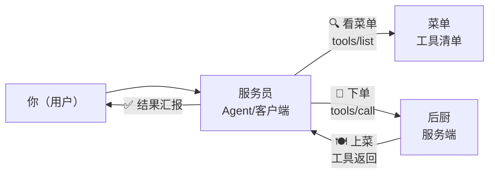

# 第 66 课 MCP 实战一：像"点餐"一样看懂 MCP

> 定位：教学引导。MCP 听起来很专业，其实就像去餐厅吃饭：菜单、服务员、后厨各司其职。学完这一课，你能用自己的话讲清楚 MCP 是什么、里面有哪些角色。

---

## 1. 把 MCP 想成一家餐厅

**对应关系一次记住：**

| 餐厅 | MCP | 它干什么 |
| --- | --- | --- |
| 菜单 | tools/list | 告诉客户端"我有哪些工具" |
| 服务员 | MCP 客户端（你的 Agent） | 传话、递结果 |
| 下单 | tools/call | 真正调用工具 |
| 后厨 | MCP 服务端 | 干活并返回成品 |
| 上菜 | 工具结果 | 喂回给模型继续思考 |

> 记住这张图，后面所有代码都是它的翻译。

---

## 2. 为什么大家要统一"点餐方式"

过去每家餐厅（平台）有自己的点餐小程序：OpenAI 一套、LangChain 一套、每家 Agent 框架又一 套——写代码接一个平台就要学一套新接口。MCP 是"行业通用点餐协议"：**只要后厨会做（实现协议），任何服务员都能服务**。

- 以前：写 N 个适配器接 N 个平台；
- 现在：写 1 个 MCP 服务，所有兼容客户端通用。

---

## 3. 服务端能提供三类"服务"

| 能力 | 类比 | 一句话 |
| --- | --- | --- |
| Tools 工具 | 后厨能做菜 | 让模型"做动作"（查天气、写文件） |
| Resources 资源 | 食材仓库 | 让模型"取数据"（配置文件、文档） |
| Prompts 提示词 | 招牌话术单 | 给模型"现成话术"（审代码模板） |

> 新手先专攻 Tools（工具），这是最常用的。

---

## 4. 一次真实对话的幕后

你问 Agent："北京今天多少度？"，幕后发生了：

1. Agent 连接服务端，`tools/list` 拿到"查天气"工具和参数说明；
2. LLM 判断：这个问题该用"查天气"；
3. Agent 发 `tools/call`，参数 &#123;"city":"北京"&#125;；
4. 服务端查天气返回结果；
5. Agent 把结果组织成人话回答你。

（整段仅 1 次工具往返，多工具场景会循环多轮。）

---

## 5. 本课动手任务

1. 启动一个现成服务端（下一步用），或用命令查看它的工具清单：
   `python -m mcp.cli tools/list`
2. 打开 MCP Inspector 点开 tools/list，看一个工具的 JSON Schema ；
3. 用一句话向朋友解释"MCP 是什么"（要求用到餐厅比喻）。

---

## 6. 小结

- MCP = Agent 世界的统一"点餐协议"；
- 三个角色：菜单（list）、下单（call）、后厨（服务端）；
- 三类能力：工具 / 资源 / 提示词；
- 先会看图、会跑工具清单，再写代码。

**下一步**：第 67 课，亲手写一个"后厨"（MCP 服务端）。