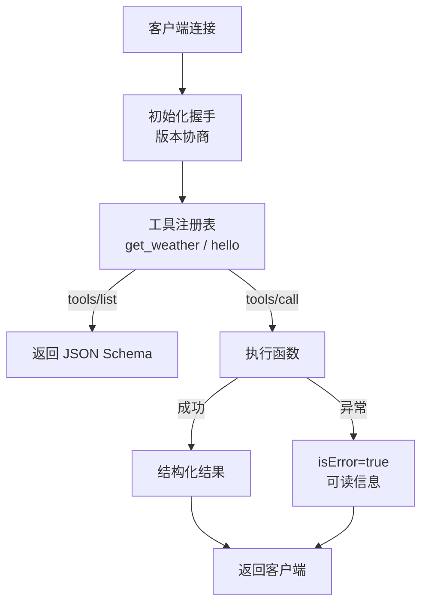

# 第 67 课 MCP 实战二：手写你的第一个 MCP 服务

> 定位：教学引导。上一课看懂了"点餐"，这一课亲自当一回"后厨"：用 FastMCP 写一个会查天气的服务端，并让它通过工具清单和调用验证。

---

## 1. 目标与工具

- 目标：写一个 MCP 服务端，暴露 `get_weather` 工具；
- 工具：Python 3.10+、官方 SDK `mcp`、可选 `uv`。

安装（二选一）：

```bash
pip install "mcp[cli]"
# 或
uv venv .venv && uv pip install "mcp[cli]"
```

---

## 2. 从"最小后厨"开始

新建 `weather_server.py`：

```python
from mcp.server.fastmcp import FastMCP

mcp = FastMCP("Weather Server")

@mcp.tool()
def hello(name: str) -> str:
    """跟用户打个招呼（工具说明就写在这里）"""
    return f"你好，{name}！"

if __name__ == "__main__":
    mcp.run()          # 默认 stdio 传输
```

跑起来：`python weather_server.py`（会等待客户端连接）。

> 先跑 1 个工具跑通全流程，再往上加——这是"最小闭环"原则。

---

## 3. 升级成真正的天气工具

```python
from mcp.server.fastmcp import FastMCP
import httpx

mcp = FastMCP("Weather Server")

@mcp.tool()
async def get_weather(city: str, unit: str = "celsius") -> dict:
    """查询城市的实时天气。

    Args:
        city: 城市名，如"北京"
        unit: 温度单位，celsius 或 fahrenheit
    """
    async with httpx.AsyncClient(timeout=5) as client:
        resp = await client.get(
            "https://api.example.com/weather",
            params={"city": city, "unit": unit},
        )
        resp.raise_for_status()
        return resp.json()

if __name__ == "__main__":
    mcp.run()
```

三个"自动"：参数类型注解自动生成 Schema；docstring 自动变成工具描述；异步函数自动支持。

---

## 4. 服务端内部结构长这样



---

## 5. 验证"后厨"合格（必做）

```bash
# 1) 图形界面利器：MCP Inspector
npx @modelcontextprotocol/inspector python weather_server.py

# 2) 命令行直调工具清单
python -m mcp.cli tools/list

# 3) 命令行直调工具
python -m mcp.cli tools/call get_weather '{"city": "北京"}'
```

三条都通过，说明 Schema 与真实行为对齐。

---

## 6. 再练手：加一个资源（食材仓库）

```python
@mcp.resource("guide://prompt-rules")
def rules() -> str:
    """查询系统的回答规则"""
    return "简明回答，先给结论。"
```

完成后重跑 tools/list/resources/list，`guide://prompt-rules` 应该出现在资源清单里。

---

## 7. 本课动手任务

1. 写出 `hello` 工具并用 Inspector 调通；
2. 加上 `get_weather` 工具，跑 `tools/list` 看它的 Schema；
3. 故意传 `{"city": 123}`（类型错误）看服务端怎么返回；
4. 把服务端升级为 HTTP 模式（`mcp.run(transport="streamable-http")`）并思考它们的区别。

---

## 8. 小结

- FastMCP = 三行代码起步写工具；
- 注解 → Schema、docstring → 描述，都是"自动的"；
- 调通标准 = tools/list + tools/call 两条命令实测通过；
- stdio 适合本机，HTTP 适合跨机。

**下一步**：第 68 课，把写好的服务装进你的 LangChain/LangGraph Agent。