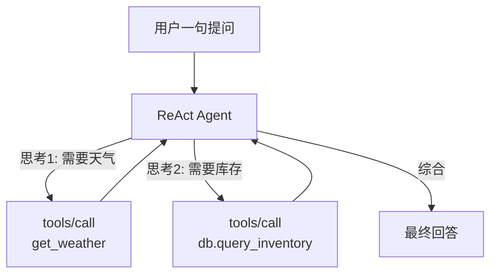

# 第 68 课 MCP 实战三：把 MCP 服务装进你的 Agent

> 定位：教学引导。服务端就绪，这一课做"服务员"：让 LangGraph 里的 Agent 学会用你写的工具，并同时接上两个服务让它自己挑着用。

---

## 1. 三种"当服务员"的方式

| 方式 | 一句话 | 推荐度 |
| --- | --- | --- |
| 裸客户端（ClientSession） | 自己控制连接和调用 | 需要精细控制时 |
| LangChain Adapters | 一个类批量拉工具 | ⭐ 首选 |
| 直接手写 Tool 包装 | 不用适配器，自己转 BaseTool | 特殊定制时 |

> 本课主角：`langchain-mcp-adapters` 的 `MultiServerMCPClient`——一行接一个服务。

安装：

```bash
pip install "langchain-mcp-adapters" langgraph langchain-openai
```

---

## 2. 连接两个服务（天气 + 数据库）

```python
from langchain_mcp_adapters.client import MultiServerMCPClient

client = MultiServerMCPClient(
    {
        "weather": {
            "command": "python",
            "args": ["weather_server.py"],     # 上一步写好的服务
            "transport": "stdio",
        },
        "db": {
            "url": "http://localhost:8000/mcp",
            "transport": "streamable-http",    # 远程服务同理
        },
    }
)

async with client as mcp_client:
    tools = mcp_client.get_tools()
    for t in tools:
        print(t.name, "→", t.description[:40])
```

---

## 3. 装进 LangGraph 的 ReAct Agent

```python
from langgraph.prebuilt import create_react_agent
from langchain_openai import ChatOpenAI

model = ChatOpenAI(model="gpt-4o-mini")

async with client as mcp_client:
    tools = mcp_client.get_tools()
    agent = create_react_agent(model, tools)

    result = await agent.ainvoke({
        "messages": [{
            "role": "user",
            "content": "北京今天多少度？顺便查一下库存里缺货的商品。",
        }]
    })
    print(result["messages"][-1].content)
```

模型会自动：先决定调 `get_weather`，再决定调 `db.query_inventory`，最后综合回答。整个决策-调用-回填循环由 LangGraph 的 ReAct 机制完成。

---

## 4. 幕后流程图



多工具 = 多轮"思考→调用→回填"，直到模型认为信息足够。

---

## 5. 工程习惯：先手压再放手

给模型自主用工具之前，至少手压一遍：

```python
# 手压：直接调一次工具
for t in tools:
    if t.name == "get_weather":
        r = await t.ainvoke({"city": "深圳"})
        print("手压结果:", r)   # 确认 Schema 和返回都对得上再交给模型
```

---

## 6. 坑位提醒

| 坑 | 症状 | 解法 |
| --- | --- | --- |
| 工具名冲突 | 两服务都有 query | 服务名加前缀（MultiServer 自动处理） |
| 会话泄漏 | 子进程不退出 | 用 `async with client` 保证关闭 |
| 工具超时 | LLM 空等 | call_tool 设 read_timeout |
| 服务重启 | 工具清单过期 | 监听 list_changed 并 refresh_tools |

---

## 7. 本课动手任务

1. 接上一个服务（weather），确认 get_tools() 有结果；
2. 接上第二个服务（任意 http 服务），看工具如何合并；
3. create_react_agent 跑一次"需要两个工具的提问"；
4. 手压每个工具一次，把结果贴进项目日志。

---

## 8. 小结

- MultiServerMCPClient：一个类批量接入多个 MCP 服务；
- create_react_agent：工具即插即用，模型自主编排；
- 先手压验证、再交模型，是省 debug 的铁律。

**下一步**：第 69 课收官，把服务"安全上线"，并给你的学习之路做导航。