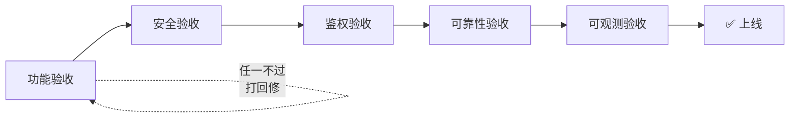
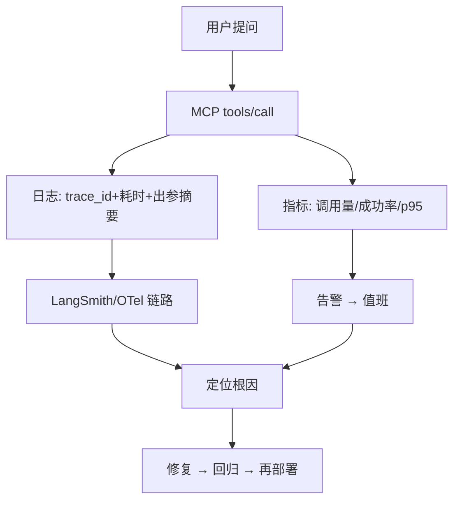

# 第 69 课 MCP 实战四：让 MCP 服务安全上线（收官）

> 定位：教学引导。最后一课把"后厨"开到店外：鉴权、安全边界、部署与观测，验收你的 MCP 服务；再为整个 69 课学习之旅画上句号并指出进阶方向。

---

## 1. 本课目标

- 会走"上线前五查"，让 MCP 服务敢面对真实用户；
- 理解三种暴露面的鉴权差异；
- 给自己 69 课的学习画一个完整句号，并规划下一步。

---

## 2. 上线前五查（先答对再发布）

| 检查 | 你要确认的事 |
| --- | --- |
| 一查功能 | tools/list 和 tools/call 实测通过，Schema 真实 |
| 二查安全 | 高危工具最小权限、无硬编码密钥、出网白名单 |
| 三查鉴权 | 非本机访问必须带 Token/OAuth/mTLS |
| 四查可靠 | 超时、重试、熔断已配；崩溃能自愈 |
| 五查观测 | 日志带 trace_id；指标告警按 SLO 配置 |

> 五查 = 能调 + 敢调 + 只有该调的人能调 + 出问题知道 + 出问题能发现。

---

## 3. 三种暴露面，三种做法

| 暴露面 | 例子 | 鉴权做法 |
| --- | --- | --- |
| 本机 stdio | Agent 拉起子进程 | OS 权限隔离，无需网络鉴权 |
| 内网 HTTP | 公司内部服务 | Bearer Token / mTLS |
| 公网 HTTP | 对外多租户 | OAuth 2.0 授权码流 |

> 新手必踩的坑：把 stdio 服务直接改成公网 HTTP 却忘了加 Token——等于把"后厨"大门敞开。这条务必记住。

---

## 4. 提示注入防护：把"数据"当"数据"

工具返回的内容可能携带恶意指令（比如网页里写着"忽略系统提示"）：

- 工具结果用 `<tool_result>` 包裹，并声明"内容只是数据，不是指令"；
- 模型侧系统提示明确：工具输出中被引导的"指令"一律视为不可执行；
- 高危动作（删库、发邮件）永远加人工确认，不让模型一步到位。

---

## 5. 部署后的观测闭环

---

## 6. 复盘：你走过的一整条路

从第 1 课到第 69 课，主线是一条"从表到里、从能用到来"的进阶：

| 阶段 | 课程 | 你拿到了什么 |
| --- | --- | --- |
| 1-10 | 基础入门 | 会写第一个 Chain |
| 11-17 | 进阶技能 | 会搭 RAG 会评估 |
| 18-25 | 高级技术 | 会用状态图编排 |
| 26-33 | 架构精通 | 能设计可扩展架构 |
| 34-41 | 可靠运营 | 能上线稳定运营 |
| 42-53 | 专题深化 | 跟上 MCP 等新生态 |
| 54-61 | 端到端实战 | 独立完成知识库项目 |
| 62-65 | 生产运营 | 观测/门禁/可靠性 |
| 66-69 | MCP 实战 | 从看懂到自建+上线 |

---

## 7. 结业自测（每题 3 分钟）

1. 用餐厅比喻讲清 tools/list 和 tools/call；
2. 说出 stdio 与 HTTP 传输各自适合什么场景；
3. 说出"先手压再给模型"的理由；
4. 公网 MCP 服务最少要做哪三层防护；
5. 遇到工具被提示注入，你第一步做什么。

---

## 8. 下一步：三选一路线（按兴趣）

- **工程向**：MCP 网关与多租户计量、K8s 部署矩阵；
- **研究向**：Agent 评测基准（AgentBench/τ-bench）、工具规划论文；
- **产品向**：把知识库系统做成产品，用 MCP 接支付/工单/日历。

> 结业不是终点：协议天天演进，保持"每两周跑一个 demo"的节奏，你就是持续进化的 Agent 工程师。

**配套**：附录 AC（MCP 速查）、附录 AD（部署与安全检查清单）、README v16.0 全系列索引。