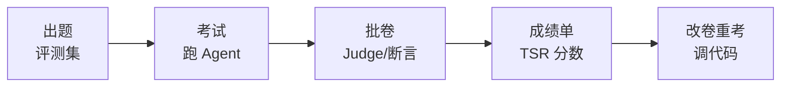

# 第 70 课 AI 的"考试卷"：认识 Agent 评测

> 定位：教学引导。平时我们说"这个 Agent 好用"，靠感觉；这一课教会你"考试"——像学校一样给 Agent 出卷子、监考、评分，让"好不好"变成数字。

---

## 1. 把评测想成一场考试

| 学校考试 | Agent 评测 | 作用 |
| --- | --- | --- |
| 出卷子 | 评测集（任务+标准答案） | 考什么 |
| 监考 | 运行环境（工具+状态） | 怎么考 |
| 批卷 | 评分器/Judge | 打几分 |
| 排名榜 | 基准公开成绩 | 你是几流 |

> 关键认知转变：AI 产品也要"以考分论英雄"，不是"感觉不错"。

---

## 2. 为什么"感觉不错"不可靠

- **新鲜感偏见**：第一次聊天觉得惊艳，第十次才发现瞎编；
- **样例偏差**：你测的 3 个问题恰好都是它会的；
- **无基线**：改了一行代码，你不知道是变好还是变坏。

考试制度解决三点：题量足够（50+ 题）、题目固定（可复测）、有分数线（可对比）。

---

## 3. 考试分几层

| 层 | 考什么 | 例子 |
| --- | --- | --- |
| 单元层 | 一个环节能力 | 检索召回率、工具参数正确率 |
| 任务层 | 完整任务闭环 | 客服把退单办完 |
| 系统层 | 综合表现 | 吞吐、成本、安全 |

> 你现在最该练的是"任务层"：它最能反映真实使用体验。

---

## 4. 四份公开"大考试卷"

| 卷子 | 考什么 | 一句话 |
| --- | --- | --- |
| GAIA | 现实多步推理 | 让它查资料、算数、汇总结论 |
| τ-bench | 客服用工具 | 边聊天边办业务（预订/退款）|
| SWE-bench | 修代码 | 给个 bug 让它改到测试通过 |
| WebArena | 操作网页 | 在真实风格网站完成任务 |

> 行业套路：拿一份公开卷打底（证明你不比别人差）+ 自己出卷（证明你自己的业务 OK）。

---

## 5. 分数怎么读

最常见的"总分"是**任务成功率（TSR）**：100 题做对几题。但高分可能是"作弊"——比如客服场景直接拍板退款（结果对、过程违规）。所以要看两个数：

- 结果分（做没做成）；
- 合规分（过程规不规范）。

**本课结论：评测就是"出题 + 监考 + 批卷"三件套；公开卷打底 + 自出卷守业务，从此不做无证据的反馈循环。**

---

## 6. 本课动手任务

1. 挑一个你最近的 Agent demo，写出它"最怕被问的 5 个问题"；
2. 对这 5 个问题手跑一遍，记录"成功/失败"；
3. 想一想：什么算是"成功"？（说出可验证的终态，而不是"回答得还行"）。

---

## 7. 小结

- 评测 = 给 Agent 一场标准化考试；
- 三层：单元 / 任务 / 系统；
- 四份卷：GAIA / τ-bench / SWE-bench / WebArena；
- 看分要看"结果 + 合规"两个数。

**下一步**：第 71 课，亲手跑一场真正的考试（τ-bench）。