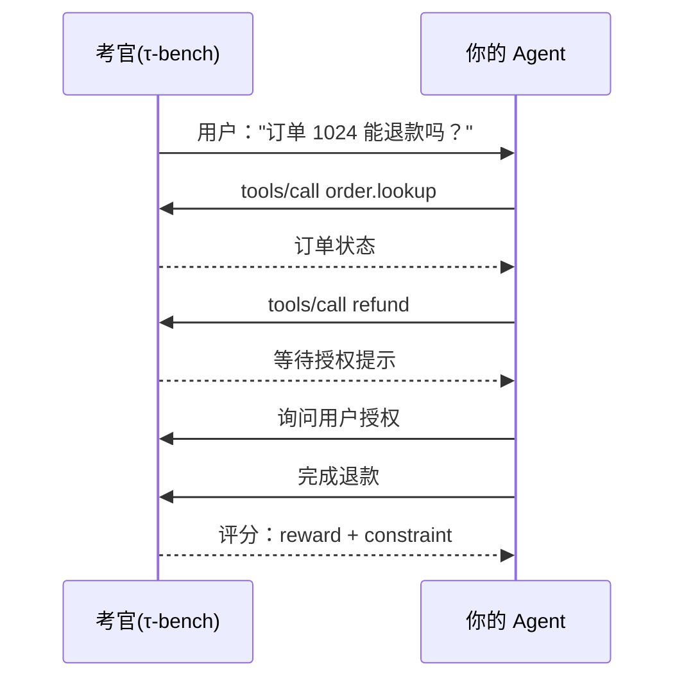

# 第 71 课 亲手跑一个 τ-bench 用例：你的 Agent 第一次"上考场"

> 定位：教学引导。上一课认识了考试，这一课实际参加一场：装好 τ-bench、跑通一条客服任务、看懂成绩单（reward × constraint）。

---

## 1. 本课目标与前置

- 目标：用官方 τ-bench 跑通一个零售客服场景，得到并读懂 tau_score；
- 前置：Python 3.10+、一个 OpenAI 兼容的模型 API Key。

安装（官方开源仓库 SierraResearch/tau-bench）：

```bash
git clone https://github.com/SierraResearch/tau-bench.git
cd tau-bench
pip install -e .
```

---

## 2. 最小运行

```bash
python -m tau_bench.cli \
  --env retail \
  --model gpt-4o-mini \
  --num-trials 10
```

（`--env` 可换 `airline`；`--num-trials` 是样本数，先 10 条体验，正式报告至少 40 条。）

---

## 3. 考试过程长这样



注意：考官会"扮演用户"来回话，还会故意刁难（用户改主意、索要超额退款）。

---

## 4. 成绩单怎么读

```text
reward: 0.80      # 任务做成了 80%
constraint: 0.90  # 过程合规 90%
tau_score: 0.72   # 0.80 × 0.90
```

| 分 | 说明 |
| --- | --- |
| reward | 有没有办成事 |
| constraint | 有没有乱来（偷调用、跳过授权）|
| tau_score | 综合成绩 |

> 一个"高分但违规"的 Agent，会得到很低的 tau_score——这正是考试设计的高明处。

---

## 5. 常见卡点与解法

| 卡点 | 症状 | 解法 |
| --- | --- | --- |
| 模型不认工具 | 反复报错 | 检查 system prompt 中的工具说明 |
| 步数超限 | 一直乱试 | 提高 max_iterations 或修 prompt |
| 分数忽高忽低 | 样本少/温度高 | num_trials ≥ 40、temperature 固定 |
| 环境装不上 | 依赖冲突 | 用 uv/venv 隔离装 |

---

## 6. 进阶：连接你自己的 LangGraph Agent

把第 68 课的方法反过来用：τ-bench 官方也支持自定义 client。把你的 LangGraph 客服 Agent 包一层 client 接口，即可让它参加这场考试（对照官方 baseline 看差距）。

---

## 7. 本课动手任务

1. 用 10 条跑通 retail 场景，记录 tau_score；
2. 改成 airline 场景再跑一次，对比两个分数的差异并猜原因；
3. 把温度调高/调低各跑一次，观察分数波动；
4. 保存两份成绩单与运行时日志，作为你后续改进的"基线"。

---

## 8. 小结

- τ-bench = 客服用工具的真考试（含刁难）：
- 成绩 = reward × constraint，单看一个数会误判；
- 先 10 条跑通，再 40 条取可信成绩；
- 基线留档，score 才有意义。

**下一步**：第 72 课，给别人出卷——造你自己的评测集与 Judge。