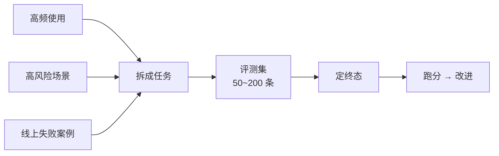

# 第 72 课 造你自己的"考卷"：评测集与 LLM-Judge

> 定位：教学引导。公开卷考完，还要有自己的卷子。这一课教"出题三部曲"：从业务里挖任务、定可验证的终态、用 LLM 当"考官"统一批卷。

---

## 1. 你的 Agent 应该考什么

问三个问题：

1. **用户最常让它做什么？**（高频任务）
2. **最怕它做错什么？**（高风险任务）
3. **最近失败了什么？**（回归任务）

把答案写成一句话任务 → 你就有了"考卷"的第一道题。



---

## 2. 出题模板（照抄就可用）

| 字段 | 说明 | 示例 |
| --- | --- | --- |
| id | 编号 | retail-014 |
| user_msg | 用户原话 | "订单 1024 能改地址吗" |
| gold_tools | 应该用到的工具 | order.lookup, order.update_address |
| success | 可验证终态 | 地址字段已更新且回复确认 |

> 铁律：**终态必须"可验证"**——"回答得很专业"不算，"订单状态变为 cancelled 且已告知用户"才算。

---

## 3. 让 LLM 当"考官"（LLM-as-Judge）

有些答案没法用代码判断（语气、解释是否清楚），这时让第二个 LLM 当考官：

```text
你是客服质检员。按标准打分：
1) 正确性：是否达成用户目标（最重要，权重 50%）
2) 完整性：是否告知必要信息（权重 30%）
3) 合规性：是否违规操作（权重 20%）
输出格式：分数:reason
```

**用考官的三个纪律：**

- 考官和考生**不是同一个模型**（避免自夸）；
- 评分标准写进提示词，不让考官"自由发挥"；
- 抽 20% 自己复核，发现考官打错就修标准。

---

## 4. 把整个流程串起来

```python
# 伪代码：一次最小评测
for case in eval_set:                    # 逐个出题
    reply = agent.run(case.user_msg)     # 考生作答
    hit = check_state_assert(case)       # 硬断言：终态
    score = judge_score(case, reply)     # 软评分：质检
    rows.append((case.id, hit, score))

report = summarize(rows)                 # 总分 + 失败 Top5
```

---

## 5. 第一批 50 条怎么凑

| 场景 | 条数 | 难度分布 |
| --- | --- | --- |
| 常见任务 | 20 | 简单 |
| 组合任务（多工具） | 15 | 中等 |
| 边界/刁难 | 10 | 难 |
| 历史失败 | 5 | 回归 |
| 合计 | 50 | 简单:中等:难 ≈ 4:3:3 |

> 先 50 条跑通流程，再逐步扩到 200 条；比"憋大招 500 条"靠谱。

---

## 6. 本课动手任务

1. 给你上一步的 Agent 写 10 条任务（含可验证终态）；
2. 代码硬断言判 5 条，LLM Judge 判 5 条；
3. 人工复核 2 条 Judge 成绩，看看考官准不准；
4. 整理成 JSON 存进项目（Git 管理）。

---

## 7. 小结

- 题源：高频 + 高风险 + 历史失败；
- 终态：必须可验证；
- 考官：第二个 LLM + 明确标准 + 人工抽查；
- 节奏：先 50 条跑通，再扩规模。

**下一步**：第 73 课收官，把考卷做成"门禁"，让它拦住每一个烂版本。