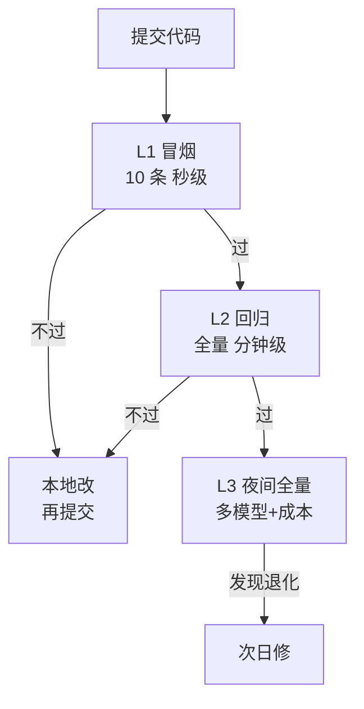

# 第 73 课 让评测拦住烂版本：EDD 与 CI 门禁（收官）

> 定位：教学引导。最后一课把"考试制度"变成"入职门槛"：每次改代码必考、不过不让上线。学完本课，你拥有完整可落地的评测驱动开发（EDD）闭环，并拿到自己的后续进阶地图。

---

## 1. 从"考完试"到"进门安检"

`普通评测`：改完代码 → 手动跑一次 → 看分数 → 差不多就上线。
`评测门禁`：提交代码 → 自动考试 → 不及格自动拦截 → 发回重做。

区别只在一个词：**自动化 + 强制**。



---

## 2. 三档考试（成本换速度）

| 档 | 名字 | 多少题 | 什么时候考 |
| --- | --- | --- | --- |
| L1 | 冒烟 | 10 条 | 你本地，随时 |
| L2 | 回归 | 100+ 条 | 每次提 PR |
| L3 | 夜间全量 | 大样本 | 每天半夜自动 |

> 最快反馈在 L1，最可信结论在 L3——三层各司其职，别混用。

---

## 3. 分数线怎么定

先跑你当前版本，记录基线（比如 TSR 82%）。然后定规则：

- 新版本 TSR ≥ 基线 -2 个百分点 → 放行；
- 低于 60% → 无论如何禁止上线；
- 工具违规率 > 5% → 禁止上线。

**关键认知：门槛盯"相比基线不退化"，而不是盯"绝对高分"**——绝对分会被难题/简单题分布误导。

---

## 4. 最小可落地的 CI 门禁

```yaml
# .github/workflows/eval.yml
on: [pull_request]
jobs:
  eval:
    runs-on: ubuntu-latest
    steps:
      - run: pip install -r requirements.txt
      - name: 跑回归门禁
        run: python eval/run.py --suite regression --gate
      - name: 上传报告
        uses: actions/upload-artifact@v4
        with: { name: eval-report, path: report/ }
```

`--gate`：不达标非零退出码 → PR 变红叉 → 合并被拦。

---

## 5. 防两个坑

| 坑 | 现象 | 解法 |
| --- | --- | --- |
| 题库迁就答案 | 版本烂了分还高 | 定期换 20% 新题 |
| 门禁被跳过 | 人人点"跳过" | 门禁结果进发布审批 |

---

## 6. 收官：你的 73 课全景

| 阶段 | 你掌握了 |
| --- | --- |
| 1-10 | 写 Chain/Access LLM |
| 11-17 | RAG + 评估 + 安全 |
| 18-25 | LangGraph 状态编排 |
| 26-41 | 架构 + 可靠运营 |
| 42-53 | 专题（多租户/MCP） |
| 54-61 | 端到端知识库实战 |
| 62-65 | 生产运营（观测/门禁） |
| 66-69 | MCP 从看懂到上线 |
| 70-73 | 给 Agent 上考场 + 门禁 |

**你的下一步（三选一）：**

- **工程向**：Agent 网关 + 多租户计量；把 L2/L3 门禁接到真实发布流水线；
- **研究向**：读 τ-bench 论文与 AgentBench 报告，跑你 Agent 的官方对照；
- **产品向**：用"评测分"驱动产品迭代会——每次改版先看分数曲线再谈体验。

> 结业信条：**再小的 Agent，也要有一份考卷、一个门禁、一条回归趋势线。** 这是你把 AI 从"demo"变成"产品"的那道分水岭。

**配套**：附录 AE（基准速查）、附录 AF（模板库）、README v17.0 全索引。