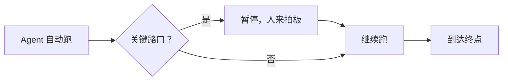
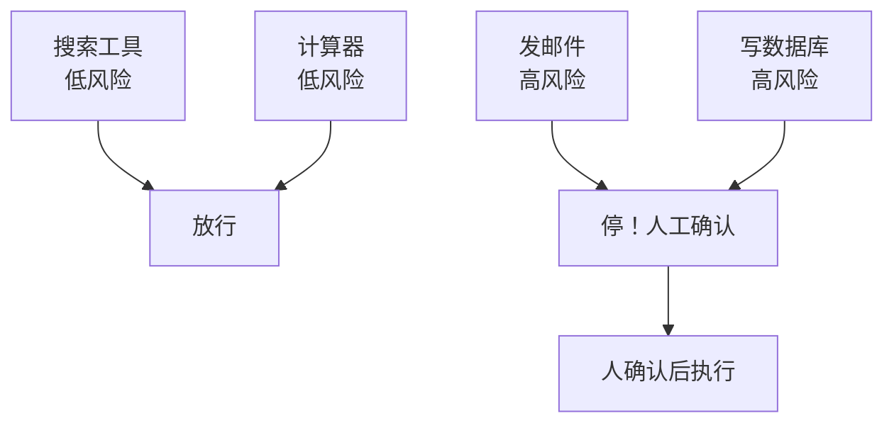

# 第 74课 什么时候该让人参与 认识 Human-in-the-Loop

> 阶段 11·人机协同实战·第 1 课。前面 73 课我们一直在让 Agent 自己跑——这节课开始，我们学会在关键时刻"踩刹车"，让人来把关。

---

## 一、一个生活比喻

想象你在用自动驾驶开车。大部分路段车自己开没问题，但遇到这几种情况你会想接管方向盘：

- 前方施工、路线不明（**低置信**）
- 要变道进窄路、可能剐蹭（**高风险**）
- 导航让你逆行单行道（**明显出错**）

Human-in-the-Loop（HITL，人在回路）就是给 Agent 装上这个"接管机制"：平时让它自己跑，到了关键路口，停下来让你看一眼、拍个板，再继续。

---

## 二、哪些时候该让人参与

不是所有事都要人管——那就退回纯人工了。只有三类情况值得踩刹车：

| 情况 | 例子 | 为什么需要人 |
| --- | --- | --- |
| 不可逆操作 | 发邮件、转账、删数据 | 做错了收不回来 |
| 低置信度 | 检索结果不确定、答案有歧义 | Agent 自己都没把握 |
| 方向性错误 | 跑偏了需要纠正 | 继续跑只会更错 |

> 记住：**让人参与是稀缺资源**。什么都让人管，人会麻木，等于没有护栏（这个坑我们第 77 课细讲）。

---

## 三、HITL 和全自动、纯人工的区别

| 模式 | 谁干活 | 速度 | 安全 | 适合 |
| --- | --- | --- | --- | --- |
| 全自动 | Agent | 快 | 低 | 简单可逆的小事 |
| 纯人工 | 人 | 慢 | 高 | 极重要的一次性大活 |
| **HITL** | **Agent 干 + 人把关** | **中** | **高** | **有风险但量大的日常活** |

HITL 的精髓：**让 Agent 干苦活累活，人只做关键决策**。就像流水线上机器负责生产、质检员只负责抽检关键环节。

---

## 四、动手任务：给你的 Agent 体检

拿出你之前做过的任何一个 Agent（比如第 13 课的 Agent、第 56 课的问答系统），画一张图，标出哪些环节该让人参与：

1. 列出它用到的所有工具/动作；
2. 给每个动作标风险：高（不可逆）/中（可能错）/低（可逆）；
3. 高风险的画个"停"字——这就是你该装 HITL 的地方。

> 把这张图存好，下一课我们就用 LangGraph 真正把这些"停"字实现出来。

---

## 五、和已学知识的衔接

- 第 27 课（记忆系统）：记忆让 Agent 跨轮次记得状态，是 HITL 中断后能恢复的前提；
- 第 28 课（检查点）：检查点把"暂停那一刻"冻结保存，是人走开再回来的地基；
- 第 73 课（评测门禁）：评测是出厂质检，HITL 是上路后的紧急制动——两者都是护栏，缺一不可。

---

## 小结

- HITL = 自动执行 + 关键点人工把关，像自动驾驶的"接管"；
- 只有不可逆、低置信、方向错三类情况才值得让人参与；
- 让人参与是稀缺资源，少而精才有用；
- 下一课我们用 LangGraph 的 `interrupt` 给 Agent 真正装上"刹车"。

**下节预告**：第 75 课——给 Agent 装上刹车，学会用 `interrupt()` 让它在发邮件前停下来等你点头。