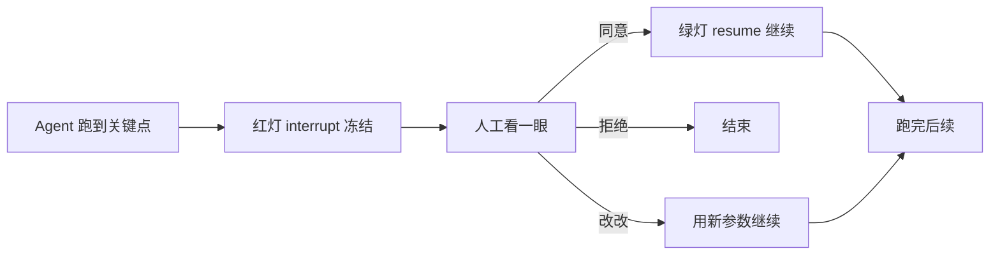
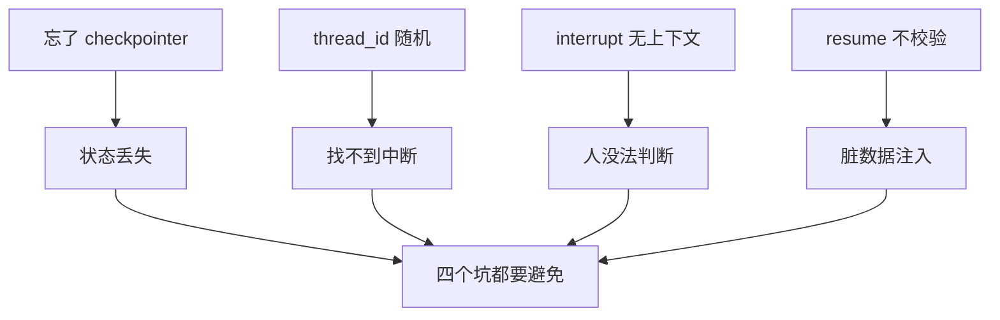

# 第 75课 给 Agent 装上刹车 中断与恢复

> 阶段 11·人机协同实战·第 2 课。上一课我们想清楚了"哪里该停"，这节课动手把"停"和"继续"真正实现出来。

---

## 一、红绿灯比喻

LangGraph 的中断恢复就像红绿灯：

- **红灯（interrupt）**：Agent 跑到关键点，停下，把当前情况亮给你看；
- **你看一眼**：决定放行、拒绝、还是改改再走；
- **绿灯（resume）**：你拍完板，Agent 从停的地方继续走，而不是从头重跑。

关键：**停不是结束，是冻结**。Agent 此刻的状态被检查点保存下来，你处理完它就从原地继续。



---

## 二、两个关键口令

就两个 API，记住这俩就够：

| 口令 | 谁喊 | 作用 |
| --- | --- | --- |
| `interrupt(内容)` | Agent 喊 | "停！这里需要人看一下，内容是这个" |
| `Command(resume=答案)` | 人喊 | "看完了，答案是这个，继续跑" |

就像 Agent 打电话给你："老板，这封邮件要发给张三，内容是这样，发不发？"你回："发"或"别发"或"把收件人改成李四再发"。

---

## 三、动手：让发邮件前停一下

我们来写一个最小的"带刹车"Agent：它要发邮件，但在发送前停下来问你。

```python
from langgraph.types import interrupt, Command
from langgraph.graph import StateGraph, START, END
from langgraph.checkpoint.memory import MemorySaver

def review(state):
    # 红灯：把要发的内容亮给人看
    decision = interrupt({"ask": "这封邮件发不发？",
                          "to": state["to"], "body": state["body"]})
    return {"approved": decision == "yes"}

def send(state):
    if state["approved"]:
        return {"result": f"已发给 {state['to']}"}
    return {"result": "已取消"}

g = StateGraph(dict)
g.add_node("review", review)
g.add_node("send", send)
g.add_edge(START, "review")
g.add_edge("review", "send")
g.add_edge("send", END)
app = g.compile(checkpointer=MemorySaver())
```

跑起来：

```python
cfg = {"configurable": {"thread_id": "t1"}}
# 第一次跑：会在 review 处停下
app.invoke({"to": "张三", "body": "你好"}, cfg)
# 这时返回里有 __interrupt__，说明停了

# 你看完，决定发：
app.invoke(Command(resume="yes"), cfg)
# Agent 从 review 继续，跑到 send，结束
```

> 重点体会：第二次 `invoke` 我们传的是 `Command(resume="yes")`，不是从头跑。Agent 记得它停在哪，从停的地方接着走。

---

## 四、踩坑提醒

| 坑 | 症状 | 怎么避免 |
| --- | --- | --- |
| 忘了加 checkpointer | 中断后状态丢了，没法恢复 | `compile(checkpointer=...)` 必须有 |
| thread_id 每次随机 | 找不到上次停在哪 | 同一会话用同一个 thread_id |
| interrupt 的内容没上下文 | 人只看到"发不发"却不知发啥 | interrupt 值带上待审批内容 |
| resume 后不校验 | 人随便填，脏数据进去 | resume 值先校验再注入 |



---

## 五、和上节课的衔接

上节课你画了"哪里该停"的图，现在你可以把图里标"停"的地方，真的换成 `interrupt()`。比如发邮件那个节点，就在发送函数第一行加一句 `interrupt()`，它就老老实实停下了。

---

## 小结

- 中断 = 红灯冻结，恢复 = 绿灯继续，状态靠检查点保存；
- 两个口令：`interrupt(内容)` 停、`Command(resume=答案)` 继续；
- 四个坑必避：要有 checkpointer、thread_id 要稳、interrupt 带上下文、resume 要校验；
- 下一课我们学更进阶的：Agent 走偏了，怎么改一改让它接着跑，甚至退回去重来。

**下节预告**：第 76 课——人机接力赛，学会人工纠错与回退重跑。