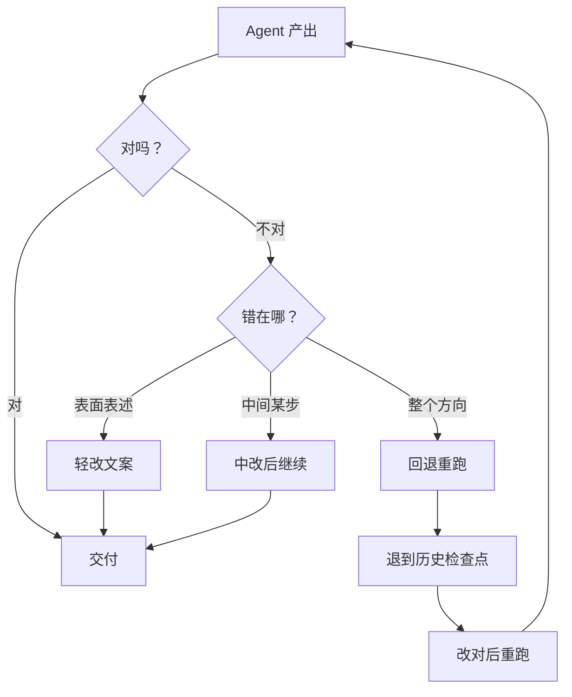
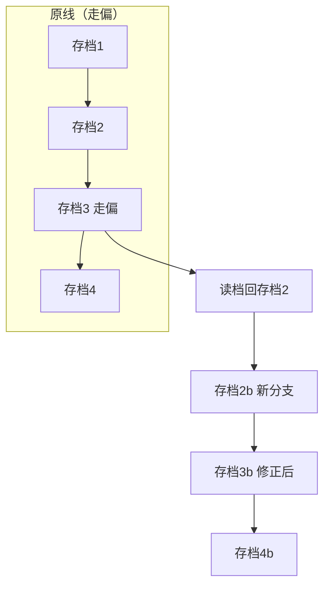
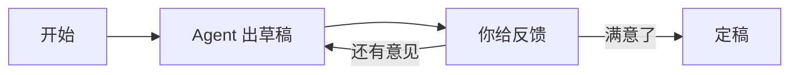
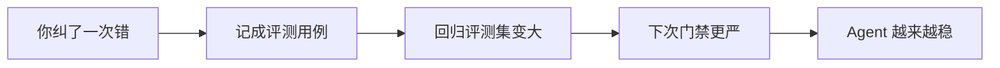

# 第 76课 人机接力赛 纠错与回退

> 阶段 11·人机协同实战·第 3 课。前两课学会了"停和继续"。这节课学更深一层：Agent 跑到一半发现走偏了，怎么改一改让它接着跑，甚至退回去重来。

---

## 一、接力赛比喻

把 Agent 跑任务想象成接力赛：Agent 是跑者，你是教练。

- **轻改**：跑者姿势不对，你在场边喊一嗓子改个动作——改改最终文案就行；
- **中改**：跑者跑错了一棒，你把那一棒的结果改对，它接着跑下一棒；
- **回退**：跑者整个跑偏了，你喊"退回上一棒重新跑"。

成本从小到大：轻改 < 中改 < 回退。**能用轻改别中改，能中改别回退。**



---

## 二、中改：改一步，接着跑

Agent 在某个节点产出了错误结果，你不用让它从头跑，直接改那一步的输出，让它从下一步继续。

```python
# 假设图在 answer 节点后停了
state = app.get_state(cfg)
# 你发现 answer 字段不对，直接改
app.update_state(cfg, {"answer": "正确的答案"})
# 从下一步继续（不重跑 answer 节点）
app.invoke(None, cfg)   # 传 None = 从当前停的地方继续
```

三个口令：

| 口令 | 作用 |
| --- | --- |
| `get_state(cfg)` | 看看现在停在哪、状态是啥 |
| `update_state(cfg, &#123;...&#125;)` | 把某个字段改成对的 |
| `invoke(None, cfg)` | 从当前停的地方继续跑 |

> 就像考试改卷：Agent 答错了一题，你把那题答案涂对，它从下一题继续答，不用整张卷子重做。

---

## 三、回退：退回去重跑

如果整个方向都错了，光改一步救不回来，就得退到更早的检查点重跑。LangGraph 会给每一步存检查点，你能列出历史、选一个回去。

```python
# 列出这个会话走过的所有检查点
history = list(app.get_state_history(cfg))
# 比如退到第 3 个检查点
target = history[3]
# 从那一刻继续跑（会生成新的分支，不覆盖原来的）
app.invoke(None, target.config)
```

重要：**回退不会抹掉原来的记录**。原来的"走偏的那条线"还在，你退回去重跑的是一条新分支。就像游戏存档——你可以读旧档重玩，原来的通关记录还在。



---

## 四、多轮打磨：草稿到定稿

不是改一次就完。很多时候是"Agent 出草稿 → 你提意见 → Agent 改 → 你再看 → 定稿"的来回。这就是多轮交互式修正。



小提醒：**给多轮修正设个上限**（比如最多 5 轮），不然人和 Agent 可能无限改下去空耗 token。

---

## 五、动手任务

用上一课的邮件 Agent 做这个练习：

1. 让它跑一次，在 review 节点停住；
2. 用 `get_state` 看看当前状态；
3. 用 `update_state` 把收件人从"张三"改成"李四"；
4. 用 `invoke(None)` 让它继续——观察它是不是用新收件人跑完了 send；
5. 再用 `get_state_history` 列出它走过的检查点，找到最初那个，试着回退重跑。

> 这个练习做完，你就掌握了"改一步接着跑"和"退回去重跑"两种纠错方式。

---

## 六、一个重要习惯

**每次纠错都记下来**。你帮 Agent 改了一次，说明这里有个 Agent 会犯的错。把它记成一条评测用例（第 72 课讲过怎么造考卷），下次发版前用评测门禁（第 73 课）就能拦住同类问题。

纠错 = 免费的标注数据，别浪费。



---

## 小结

- 纠错三粒度：轻改文案 → 中改中间步 → 回退重跑，按错误大小选；
- 中改用 `update_state` 改字段再 `invoke(None)` 继续；回退用 `get_state_history` 选旧检查点重跑，会开新分支；
- 多轮打磨要设轮次上限，别无限改；
- 每次纠错都该沉淀成评测用例——这是让 Agent 越用越稳的飞轮。

**下节预告**：第 77 课（收官）——让人在回路里不添乱：HITL 落地纪律、反模式与全系列 77 课回顾。