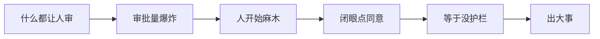
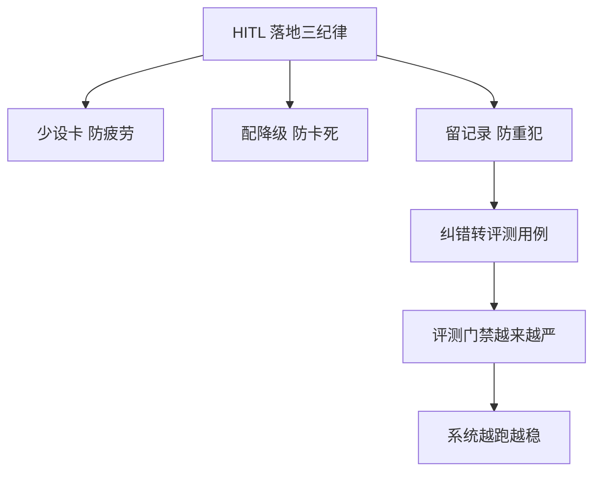
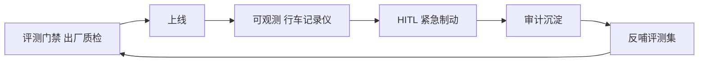

# 第 77课 让人在回路里不添乱 HITL 落地与全系列收官

> 阶段 11·人机协同实战·收官课。前三课我们学会了停、继续、纠错。这最后一课讲落地纪律——别让人在回路里反而添乱。同时回顾全系列 77 课，给你下一步的方向。

---

## 一、HITL 最大的坑：审批疲劳

很多人第一次知道 HITL，反应是"太好了，什么都让人审一遍最安全"。这是最危险的念头。

想象你每天收到 200 条审批请求，每条都是"是否同意发送"。第一天你认真看，第三天你开始闭眼点"同意"，第七天你根本不看了——**这就是审批疲劳**。人一旦麻木，HITL 等于没有。

> 铁律：**让人参与是稀缺资源，少而精才有用**。只在真正高风险、不可逆的点设卡，其余让 Agent 自己跑。

---

## 二、落地三条纪律

| 纪律 | 做什么 | 为什么 |
| --- | --- | --- |
| 少设卡 | 只在高风险不可逆点 interrupt | 防审批疲劳 |
| 配降级 | 中断超时后自动降级（拒绝/转备班） | 防人工不在就卡死 |
| 留记录 | 每次审批都落审计，纠错转评测 | 防同类错重犯 |

---

## 三、质量护栏全景

到这里，你已经集齐了生产 Agent 的三道护栏：

| 护栏 | 比喻 | 何时用 |
| --- | --- | --- |
| 评测门禁（第 73 课） | 出厂质检 | 发版前拦烂版本 |
| 可观测性（第 62 课） | 行车记录仪 | 运行中看异常 |
| HITL（本阶段） | 紧急制动 | 执行高风险动作前 |

三者缺一不可：质检过关也可能遇突发（要制动），有记录仪也得能刹住车，能刹车也得知道哪里出过事。而 HITL 拦下的每一次偏差，反哺成评测用例，让下一次质检更严——这就是飞轮。

---

## 四、全系列 77 课回顾

恭喜你，从零基础走到了这里。回顾这段旅程：

| 阶段 | 课次 | 你学会了 |
| --- | --- | --- |
| 1 基础入门 | 1-10 | Chain、组件、提示词、记忆、RAG |
| 2 进阶技能 | 11-17 | LCEL、高级 RAG、评估、安全 |
| 3 高级技术 | 18-25 | LangGraph、向量库、多 Agent、流式 |
| 4 架构精通 | 26-33 | 工具、检查点、时间旅行、系统设计 |
| 5 可靠运营 | 34-41 | 安全、可观测、可靠性、幻觉检测 |
| 6 专题深化 | 42-53 | 微调、多模态、平台、MCP、多租户 |
| 7 端到端实战 | 54-61 | 从零搭知识库问答系统并上线 |
| 8 生产运营 | 62-65 | 可观测/评测门禁/可靠性/安全成本 |
| 9 MCP 实战 | 66-69 | 自建并上线 MCP 服务 |
| 10 评测实战 | 70-73 | 用基准和评测台守住 Agent 质量 |
| **11 人机协同** | **74-77** | **HITL 中断恢复、纠错回退、落地纪律** |

---

## 五、结业自测

用这几条检验自己是否真学到了：

1. 你能说出哪三类场景该用 HITL 吗？
2. `interrupt()` 和 `Command(resume=)` 分别是谁喊的、干什么？
3. 中改和回退的区别是什么？什么时候该用哪个？
4. 审批疲劳为什么危险？怎么避免？
5. 评测门禁、可观测、HITL 三道护栏各自管什么？怎么形成飞轮？

> 答不上来的，回去翻对应课。能答上来的，你已经具备用 LangChain/LangGraph 做生产级 Agent 的完整知识体系了。

---

## 六、下一步方向

77 课是体系化学习的"毕业"，但不是终点。按你的兴趣选方向深入：

| 方向 | 入手点 |
| --- | --- |
| 深耕 LangGraph 平台 | LangGraph Cloud / Studio 可视化部署 |
| Agent 可观测进阶 | LangSmith trace 与数据集深度 |
| 多 Agent 架构 | 源码级对比 LangGraph / AutoGen / CrewAI |
| 垂直行业落地 | 选一个行业做端到端 Agent 项目 |
| 前沿追踪 | MCP 生态、Agentic RAG、长上下文工程 |

> 最有效的下一步：**挑一个真实需求，从 0 到 1 做一个能上线的 Agent**。前面 77 课的知识，只有在亲手做项目时才会真正变成你的能力。

---

## 小结

- HITL 最大的敌人是审批疲劳——少设卡、配降级、留记录是三条落地纪律；
- 评测门禁 + 可观测 + HITL 三道护栏组成飞轮，让系统越跑越稳；
- 77 课体系已完整覆盖从入门到生产落地全链路；
- 下一步最好的学习就是动手做一个真实项目。

**全系列 77 课完。祝你用 Agent 做出真正有价值的产品。**