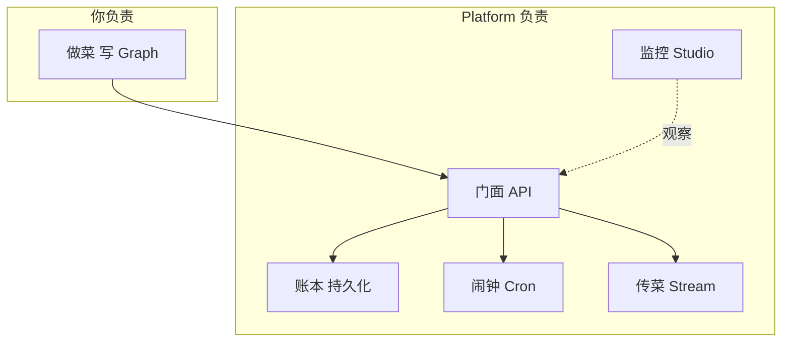
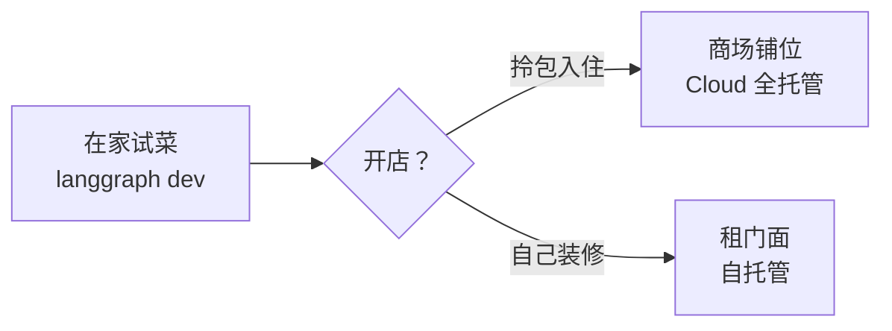

# 第 78课 从本地到云端 认识 LangGraph Platform

> 阶段 12·LangGraph Platform 云端深度实操·第 1 课。前面 77 课你的 Agent 都在本地跑——从这节课开始，我们把它推到云端，变成真正能对外服务的生产级应用。

---

## 一、餐厅比喻

你开了一家餐厅（Agent）。一开始自己在家做饭，客人就是几个朋友——锅碗瓢盆（本地 langgraph）够用。但生意做大了：

- 要有门面（API 网关）让客人能找到你；
- 要有账本（持久化存储）记住每个客人上次点了啥；
- 要有闹钟（定时任务）提醒你每天盘点；
- 要有传菜窗口（流式输出）让客人边等边上菜；
- 要有监控摄像头（可视化）让你看到厨房哪卡了。

**LangGraph Platform 就是给这家餐厅配齐上述配套的"商业厨房解决方案"**——你只管做菜（写 Graph），门面、账本、闹钟、传菜、监控都给你配好。



---

## 二、和本地开发的区别

| 你关心的 | 本地 langgraph | LangGraph Platform |
| --- | --- | --- |
| 怎么跑 | `python main.py` | 平台托管运行时 |
| 状态存哪 | 内存，重启就没 | Postgres，永久保存 |
| 多人访问 | 单进程，难并发 | 平台帮你扩容 |
| 定时任务 | 自己写脚本 | 配置就行 |
| 看流程 | print 大法 | Studio 可视化 |
| 对外 API | 自己包 FastAPI | 内置 REST/WS |

> 一句话：本地管"能跑"，Platform 管"能上线、能运维、能扩展"。

---

## 三、三种部署模式怎么选

就像开店选铺面：

| 模式 | 比喻 | 适合 |
| --- | --- | --- |
| LangGraph Cloud | 租成熟商场铺位，拎包入住 | 快速上线，不想管运维 |
| 自托管 | 自己租门面装修 | 数据要放自己手里 |
| `langgraph dev` | 在家试做新菜 | 开发调试 |



---

## 四、动手：跑起本地开发服务器

最快的体验：用 `langgraph dev` 在本地启动 Platform 的开发版，自带 Studio 可视化。

```bash
# 安装 CLI
pip install langgraph-cli

# 初始化项目
langgraph init --path my-agent

# 启动开发服务器
langgraph dev
```

启动后打开 `http://localhost:1634`，你会看到 Studio 界面——你的 Graph 被画成了交互式状态图，可以点节点、看状态、设断点。

> 这一步做完，你就从"本地跑 Graph"跨到了"用 Platform 托管 Graph"。虽然还是本地，但体验和线上一致。

---

## 五、和已学知识的衔接

- 第 19 课（生产部署）：那时是把 Chain 包成 API，现在是用 Platform 把 Graph 连同持久化/调度/流式一起托管，是升级版；
- 第 46 课（LangGraph 云平台入门）：那时只了解 Cloud 的概念，现在我们深入到选型、自托管、配置细节；
- 第 65 课（生产运营收官）：那时讲的可观测/可靠性/安全，Platform 上都有内置对应能力。

---

## 小结

- Platform = 商业厨房方案，你做菜（写 Graph），它管门面/账本/闹钟/传菜/监控；
- 三种模式：Cloud（拎包入住）、自托管（自己装修）、`langgraph dev`（在家试菜）；
- 用 `langgraph dev` 本地体验，自带 Studio 可视化；
- 下一课我们把 Agent 真正部署上线。

**下节预告**：第 79 课——把你的 Agent 部署到生产：持久化配置与上线全流程。