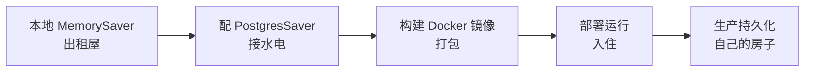
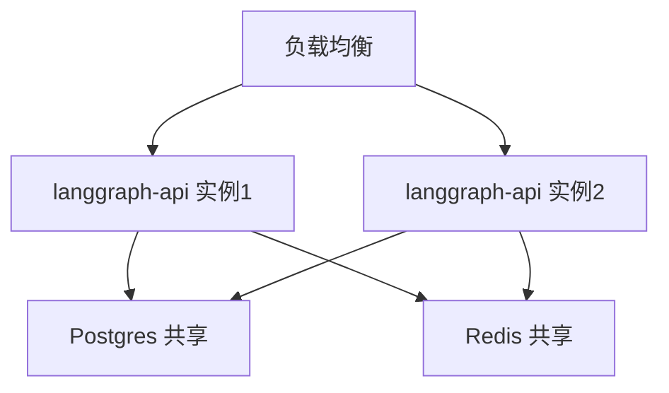
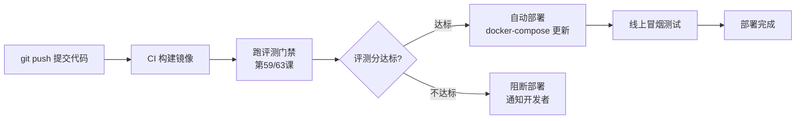

# 第 79课 把你的 Agent 部署到生产 持久化配置与上线全流程

> 阶段 12·LangGraph Platform 云端深度实操·第 2 课。上一课你用 `langgraph dev` 体验了 Platform。这节课我们走真正的上线流程：配持久化、构建镜像、部署运行。

---

## 一、搬家比喻

从本地到生产，就像从出租屋搬到自己的房子：

- **出租屋（MemorySaver）**：东西堆在客厅，搬走就没了；
- **自己的房子（PostgresSaver）**：东西放柜子里，永久保存；
- **装修配置**：水电网（数据库连接、环境变量）要接好；
- **搬家流程**：打包（构建镜像）→ 运输（推送）→ 入住（运行）。



---

## 二、第一步：换掉 MemorySaver

本地用的是内存存储，生产要换成 Postgres。关键是：**代码不用改，只改配置**。

```python
import os
from langgraph.checkpoint.memory import MemorySaver
from langgraph.checkpoint.postgres import PostgresSaver

# 靠环境变量切换，代码不变
if os.getenv("ENV") == "production":
    checkpointer = PostgresSaver.from_conn_string(os.getenv("DB_URI"))
    checkpointer.setup()   # 首次建表
else:
    checkpointer = MemorySaver()

graph = builder.compile(checkpointer=checkpointer)
```

> 记住第 19 课教的环境切换原则：用环境变量区分开发/生产，代码不变。这里完全一致。

---

## 三、第二步：配置 langgraph.json

这是 Platform 的"户型图"，告诉平台你的 Graph 在哪、依赖什么：

```json
{
  "dependencies": ["./pyproject.toml"],
  "graphs": {
    "agent": "./src/agent/graph.py:graph"
  },
  "env": ".env"
}
```

| 字段 | 作用 |
| --- | --- |
| dependencies | 依赖声明文件（pyproject.toml） |
| graphs | 图名→入口文件的映射 |
| env | 环境变量文件 |

---

## 四、第三步：构建与部署

### 自托管：构建 Docker 镜像

```bash
# 构建镜像
langgraph build -t my-agent:latest

# 用 docker-compose 运行（配 Postgres + Redis）
docker-compose up -d
```

`docker-compose.yml` 核心：

```yaml
services:
  langgraph-api:
    image: my-agent:latest
    ports: ["8000:8000"]
    environment:
      - POSTGRES_URI=postgresql://user:pass@db:5432/langgraph
      - REDIS_URI=redis://redis:6379
    depends_on: [db, redis]
  db:
    image: postgres:16
    environment:
      POSTGRES_DB: langgraph
      POSTGRES_USER: user
      POSTGRES_PASSWORD: pass
    volumes: ["pgdata:/var/lib/postgresql/data"]
  redis:
    image: redis:7
volumes:
  pgdata:
```



### Cloud：直接推送

```bash
# 登录 LangGraph Cloud
langgraph login

# 部署
langgraph deploy
# 返回一个 URL，直接可用
```

---

## 五、第四步：验证上线

部署完要验证能不能用：

```bash
# 1. 健康检查
curl http://localhost:8000/ok
# 期望: {"status":"ok"}

# 2. 发起一次 Run
curl -X POST http://localhost:8000/threads/t1/runs \
  -H "Content-Type: application/json" \
  -d '{"assistant_id":"agent","input":{"messages":[{"role":"user","content":"你好"}]}}'

# 3. 查状态（验证持久化）
curl http://localhost:8000/threads/t1/state
```

> 如果重启服务后 state 还在，说明 Postgres 持久化生效了。

---

## 六、第五步：CI/CD 流水线集成

> 在第 59 课和第 63 课，你学会了用评测分做"质量门禁"。现在把这个门禁接进 CI/CD 流水线——每次提交代码自动构建、跑评测、达标才部署。

### 为什么要 CI/CD？

手动部署的问题是：你改了代码，手动构建、手动部署、忘了跑评测——线上就出了问题。CI/CD（持续集成/持续部署）就是把这个流程自动化：**提交代码 → 自动构建镜像 → 自动跑评测门禁 → 评测达标才部署上线**。



### GitHub Actions 流水线示例

在项目根目录创建 `.github/workflows/deploy-agent.yml`：

```yaml
name: Build & Deploy Agent

on:
  push:
    branches: [main]

jobs:
  build-and-deploy:
    runs-on: ubuntu-latest
    steps:
      # 1. 拉代码
      - uses: actions/checkout@v4

      # 2. 构建 Docker 镜像
      - name: Build image
        run: |
          docker build -t my-agent:${{ github.sha }} .
          docker tag my-agent:${{ github.sha }} my-agent:latest

      # 3. 启动测试环境（Postgres + Redis + Agent）
      - name: Start test stack
        run: docker-compose -f docker-compose.test.yml up -d
        env:
          OPENAI_API_KEY: ${{ secrets.OPENAI_API_KEY }}

      # 4. 等服务就绪
      - name: Wait for API
        run: |
          for i in $(seq 1 30); do
            curl -sf http://localhost:8000/ok && break
            sleep 2
          done

      # 5. 跑评测门禁（第63课的评测脚本）
      - name: Run eval gate
        run: python scripts/run_eval_gate.py --threshold 0.75

      # 6. 评测达标才部署（自托管示例）
      - name: Deploy to production
        if: success()
        run: |
          ssh deploy@prod-server "docker pull my-agent:latest && docker-compose up -d"

      # 7. 线上冒烟测试
      - name: Smoke test
        run: python scripts/smoke_test.py --url http://prod-server:8000
```

### 关键环节解读

| 步骤 | 干什么 | 对应课程 |
| --- | --- | --- |
| 构建镜像 | `docker build` 打包代码 | 本课第四节 |
| 启动测试环境 | 用 docker-compose 拉起完整栈 | 附录 AJ 模板 |
| 评测门禁 | 跑评测集，分数低于阈值则阻断 | 第 59 课/第 63 课 |
| 部署 | 拉新镜像 + 滚动更新 | 本课第四节 |
| 冒烟测试 | 部署后验证核心功能 | 本课第五节 |

> 这就是 CI/CD 的核心：**把第 59 课的评测门禁变成自动化的"守门人"——代码不达标，别想上线。**

### GitLab CI 版本

如果你用 GitLab，等价的 `.gitlab-ci.yml`：

```yaml
stages:
  - build
  - test
  - deploy

build_image:
  stage: build
  script:
    - docker build -t my-agent:$CI_COMMIT_SHA .

eval_gate:
  stage: test
  script:
    - docker-compose -f docker-compose.test.yml up -d
    - python scripts/run_eval_gate.py --threshold 0.75
  only:
    - main

deploy_prod:
  stage: deploy
  script:
    - ssh deploy@prod-server "docker pull my-agent:$CI_COMMIT_SHA && docker-compose up -d"
  only:
    - main
  when: manual  # 生产部署需手动确认
```

> 注意：GitLab CI 的 `when: manual` 相当于第 77 课学的 HITL——在生产部署环节留一个人工确认点。

---

## 七、动手任务

1. 把你之前做的 Agent（比如第 76 课的 HITL Agent）配上环境变量切换；
2. 写一个 `langgraph.json`；
3. 用 `langgraph build` 构建镜像；
4. 用 docker-compose 跑起来；
5. 重启容器后查 state，验证持久化是否生效；
6. **进阶**：写一个 GitHub Actions 工作流，把评测门禁接进 CI/CD。

---

## 八、踩坑提醒

| 坑 | 症状 | 怎么避免 |
| --- | --- | --- |
| 忘了 `setup()` | 表不存在，报错 | 首次运行必须调 |
| DB_URI 写错 | 连接超时 | 用 `psql` 先测连接 |
| 环境变量没注入 | 用了 MemorySaver | 检查容器 env |
| 镜像太大 | 构建慢/拉取慢 | 用多阶段构建瘦身 |
| CI 密钥泄露 | API Key 被偷 | 用 GitHub Secrets/GitLab Variables，不写死 |
| 评测门禁太松 | 烂代码上线 | 阈值不低于 0.75，逐步收紧 |

---

## 小结

- 上线五步：换 PostgresSaver → 配 langgraph.json → 构建镜像 → 部署验证 → 接 CI/CD；
- 开发/生产靠环境变量切换，代码不改；
- 自托管用 docker-compose（api + Postgres + Redis），Cloud 用 `langgraph deploy`；
- 重启后 state 还在 = 持久化生效；
- CI/CD 把评测门禁自动化：代码提交→构建→评测→达标才部署，接第 59/63 课的评测体系。

**下节预告**：第 80 课——让 Agent 自己定时干活：Cron 定时任务与后台异步任务。