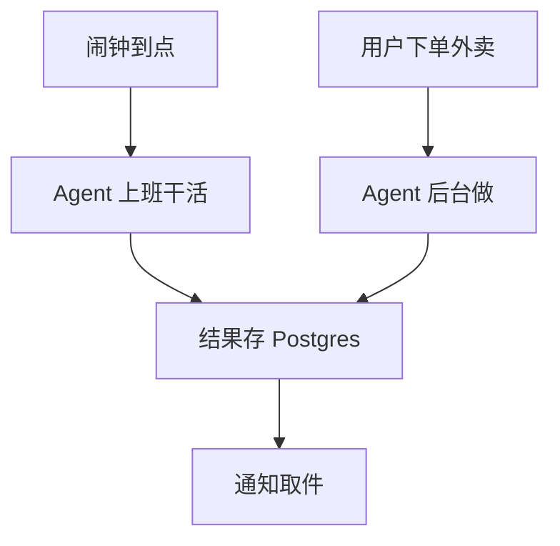
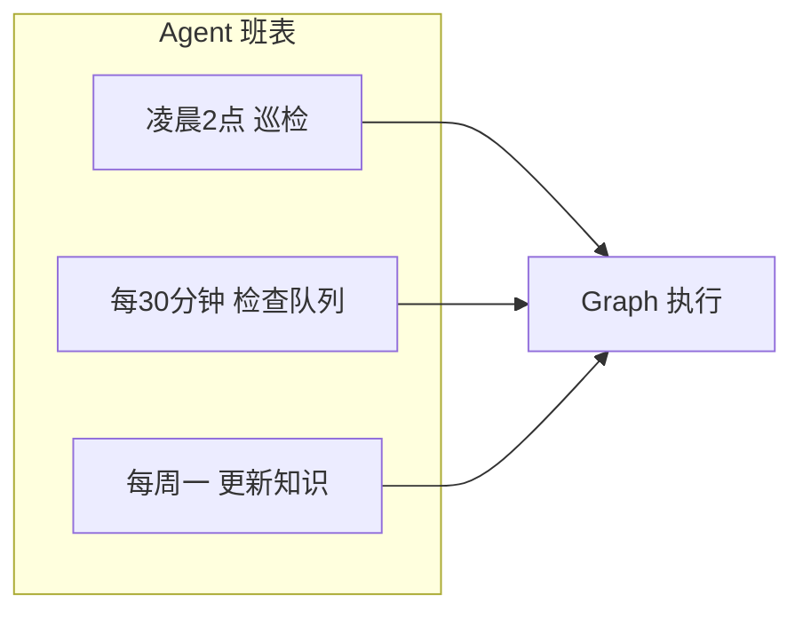
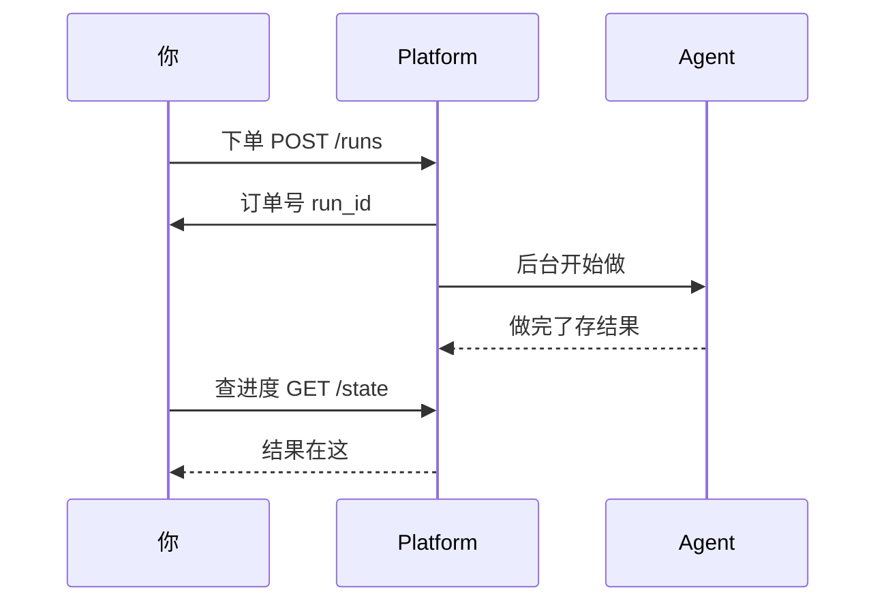
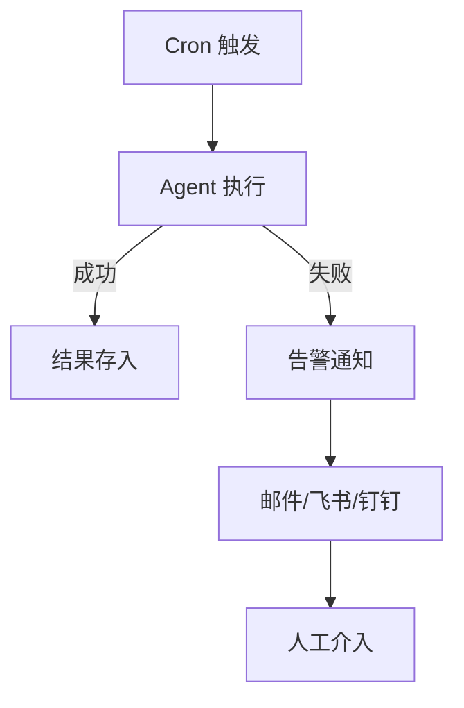

# 第 80课 让 Agent 自己定时干活 Cron 定时任务与后台异步任务

> 阶段 12·LangGraph Platform 云端深度实操·第 3 课。上一课你的 Agent 上线了，但它只会"有人问才答"。这节课让它自己定时干活——不用人盯着，它按点上班。

---

## 一、闹钟与外卖比喻

- **Cron 定时任务**：像闹钟——到点自动响，Agent 开始干预定的事。每天凌晨 2 点检查知识库、每小时处理文档队列。
- **后台异步任务**：像外卖——你下单（触发）就给你一个订单号（run_id），不等做好你就走了，做好了通知你来取。

| 任务类型 | 比喻 | 谁触发 | 等不等 |
| --- | --- | --- | --- |
| 同步 Run | 面对面聊天 | 用户请求 | 等 |
| Cron Run | 闹钟 | 定时自动 | 不等 |
| 后台 Run | 外卖 | API 触发 | 不等 |



---

## 二、Cron：给 Agent 排班表

在 `langgraph.json` 里加一段 `cron`，就像给 Agent 排班：

```json
{
  "graphs": {"agent": "./src/graph.py:graph"},
  "cron": {
    "schedules": [
      {
        "graph": "agent",
        "cron": "0 2 * * *",
        "input": {"task": "daily_scan"}
      }
    ]
  }
}
```

`0 2 * * *` 的意思：

| 段 | 值 | 含义 |
| --- | --- | --- |
| 分 | 0 | 第 0 分 |
| 时 | 2 | 凌晨 2 点 |
| 日 | * | 每天 |
| 月 | * | 每月 |
| 周 | * | 每周 |

常用 cron 速查：

| cron | 含义 |
| --- | --- |
| `0 2 * * *` | 每天凌晨 2 点 |
| `*/30 * * * *` | 每 30 分钟 |
| `0 0 * * 1` | 每周一 0 点 |
| `0 9-18 * * 1-5` | 工作日每小时 |



---

## 三、后台任务：点外卖模式

不想等结果的长任务，用后台 Run：

```python
import httpx

# 下单：立即返回订单号
resp = httpx.post(
    "http://localhost:8000/threads/t1/runs",
    json={
        "assistant_id": "agent",
        "input": {"task": "summarize_100page_pdf", "doc_id": "123"}
    }
)
run_id = resp.json()["run_id"]   # 拿到订单号就走

# 想查进度时再来看
state = httpx.get(
    f"http://localhost:8000/threads/t1/runs/{run_id}/state"
)
```



---

## 四、典型场景

| 场景 | 用 Cron 还是后台 | 为什么 |
| --- | --- | --- |
| 每天巡检知识库 | Cron | 固定时间，不用人触发 |
| 用户上传 100 页 PDF 要摘要 | 后台 | 用户触发但耗时长 |
| 每周一重新嵌入全库 | Cron | 定期自动 |
| 每小时清理过期缓存 | Cron | 定期自动 |
| 用户发起长报告生成 | 后台 | 用户触发但不等 |

---

## 五、动手任务

1. 给你的 Agent 加一个 Cron：每天凌晨 2 点打印一句"巡检完成"；
2. 把它部署起来（用上一课的流程），看看第二天凌晨有没有自动执行；
3. 再写一个后台任务：发一个摘要长文档的请求，拿到 run_id 后关掉终端，过几分钟再回来查结果。

> 提示：本地调试可以用 `*/1 * * * *`（每分钟）快速验证 Cron 是否生效，别真等到凌晨 2 点。

---

## 六、关键提醒：Cron 必须有失败告警

Cron 任务是"没人盯着自动跑"的，所以**失败了也没人知道**，除非你有告警。这是生产事故的常见来源（第 64 课讲过）。



> 最少要做：Cron 失败时发一条告警消息到你常用的 IM（飞书/钉钉），怎么发参见前面讲过的消息推送技能。

---

## 小结

- Cron = 闹钟，到点自动跑；后台任务 = 外卖，下单不等做好；
- Cron 在 `langgraph.json` 配 `cron.schedules`，后台任务通过 API 触发拿 run_id；
- Cron 必须配失败告警——静默失败是事故来源；
- 下一课收官：Studio 可视化调试与全阶段总结。

**下节预告**：第 81 课（收官）——用 Studio 可视化调试你的 Agent + 全系列 81 课回顾与下一步。