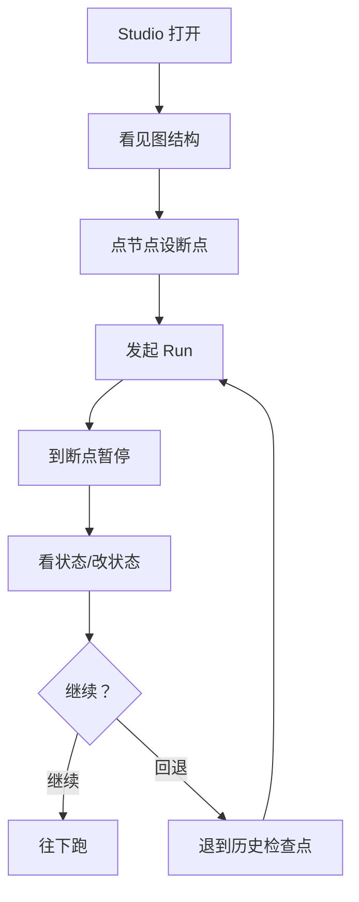
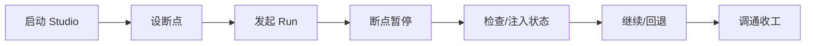
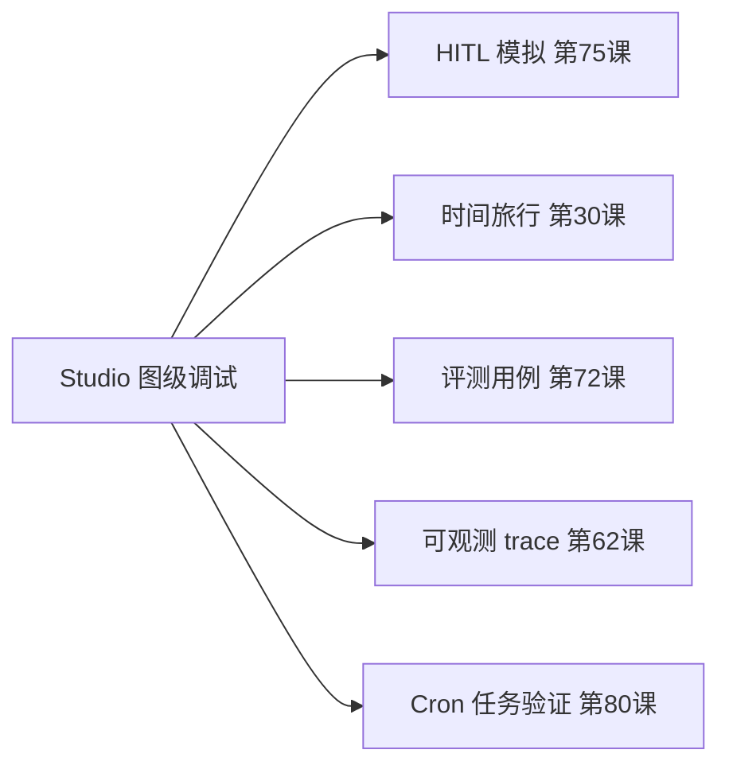

# 第 81课 看见你的 Agent 在想什么 Studio 可视化调试与全系列收官

> 阶段 12·LangGraph Platform 云端深度实操·收官课。前三课你的 Agent 上线了、会定时干活了。这最后一课，我们用 Studio 看见它内部在想什么——然后回顾全系列 81 课，给你下一步方向。

---

## 一、X 光机比喻

之前调试 Agent 像"黑箱猜谜"——print 一堆日志，猜哪步出了问题。**Studio 是给 Agent 照 X 光**：它的每个节点、每一步状态、每条边都看得清清楚楚。

---

## 二、Studio 能干什么

| 功能 | 做什么 | 有什么用 |
| --- | --- | --- |
| 图结构可视化 | 看 Graph 长什么样 | 确认图设计对不对 |
| 断点调试 | 在某节点暂停 | 查那一步的状态 |
| 状态检查 | 看每步状态值 | 找哪步算错了 |
| 时间旅行 | 回退到历史检查点重跑 | 试不同参数 |
| HITL 模拟 | 在断点手动注入值 | 测人工审批流程 |
| Replay | 重放历史 Run | 复现 bug |

> 本地 `langgraph dev` 自带 Studio（`localhost:1634`），不用额外装。

---

## 三、动手：用 Studio 调一个 Agent

1. 启动开发服务器：`langgraph dev`；
2. 打开 `http://localhost:1634`，看到你的 Graph 图；
3. 在 `review` 节点（第 75 课的 HITL 审批节点）上点一下，设断点；
4. 发起一次对话，看它跑到 `review` 就停了；
5. 在 Studio 里看当前状态，手动输入 `"yes"` 模拟人工审批；
6. 看 Agent 继续跑完到 `send` 节点；
7. 点"时间旅行"，退到前面的检查点，改个输入重跑，看结果有何不同。

---

## 四、流式输出：打字机效果

部署到 Platform 后，客户端可以用 SSE 订阅流式输出，实现打字机效果：

| stream_mode | 你看到什么 |
| --- | --- |
| `messages` | LLM 一个字一个字往外吐 |
| `updates` | 每步状态变化 |
| `values` | 每步完整状态 |

> 前端用 `EventSource` 订阅 SSE，用户体验从"干等 10 秒"变成"边出边看"。

---

## 五、Studio 与其他工具的协同

Studio 不是孤立工具，它和你前面学的连成一条链：

- **HITL 模拟**：在 Studio 断点处注入值，模拟人工审批（第 75 课）；
- **时间旅行**：Studio 里回退到历史检查点重跑（第 30 课）；
- **评测**：在 Studio 里跑评测用例看结果（第 72 课）；
- **可观测**：Studio 看图级流程，trace 看调用级细节（第 62 课）；
- **Cron 验证**：在 Studio 里手动触发 Cron 任务看效果（第 80 课）。

---

## 六、全系列 81 课回顾

| 阶段 | 课次 | 你学会了 |
| --- | --- | --- |
| 1 基础入门 | 1-10 | Chain、组件、提示词、记忆、RAG |
| 2 进阶技能 | 11-17 | LCEL、高级 RAG、评估、安全 |
| 3 高级技术 | 18-25 | LangGraph、向量库、多 Agent、流式 |
| 4 架构精通 | 26-33 | 工具、检查点、时间旅行、系统设计 |
| 5 可靠运营 | 34-41 | 安全、可观测、可靠性、幻觉检测 |
| 6 专题深化 | 42-53 | 微调、多模态、平台、MCP、多租户 |
| 7 端到端实战 | 54-61 | 从零搭知识库问答系统并上线 |
| 8 生产运营 | 62-65 | 可观测/评测门禁/可靠性/安全成本 |
| 9 MCP 实战 | 66-69 | 自建并上线 MCP 服务 |
| 10 评测实战 | 70-73 | 用基准和评测台守住 Agent 质量 |
| 11 人机协同 | 74-77 | HITL 中断恢复、纠错回退、落地纪律 |
| **12 Platform** | **78-81** | **从本地到云端、部署上线、Cron 定时、Studio 可视化** |

---

## 七、结业自测

1. Platform 的三种部署模式分别是什么？怎么选？
2. MemorySaver 和 PostgresSaver 有什么区别？怎么靠配置切换？
3. Cron 和后台任务各自适合什么场景？
4. Studio 的断点调试和时间旅行怎么配合 HITL 用？
5. 流式输出的四种 stream_mode 分别流什么？

> 答得上来，你已经具备从零搭建到生产部署一个 LangGraph Agent 的完整能力。

---

## 八、下一步方向

81 课是体系化学习的"毕业典礼"。下一步最有效的学习是**做一个真实项目**：

| 方向 | 入手点 |
| --- | --- |
| 做一个能上线的 Agent | 选一个真实需求，从 0 到 1 走完全流程 |
| 深耕 LangSmith | trace、数据集、评测闭环深度 |
| 多 Agent 架构 | 源码级对比 LangGraph / AutoGen / CrewAI |
| 垂直行业落地 | 选一个行业做端到端项目 |
| 前沿追踪 | MCP 生态、Agentic RAG、长上下文工程 |

> **最好的下一步：挑一个真实需求，用 Platform 把它部署上线。** 前面 81 课的知识，只有在亲手做项目时才真正变成你的能力。

---

## 小结

- Studio 是 Agent 的 X 光机：图结构可视化 + 断点 + 状态检查 + 时间旅行 + HITL 模拟；
- 流式输出让用户体验从"干等"变"边出边看"，四种 mode 按粒度选；
- Studio 与 HITL、评测、可观测、Cron 验证连成完整工具链；
- 全系列 81 课已完整覆盖从入门到生产部署全链路——下一步最好做一个真实项目。

**全系列 81 课完。用 Platform 把你的 Agent 部署上线，真正交付价值。**