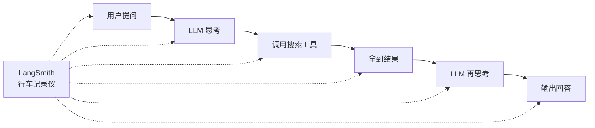
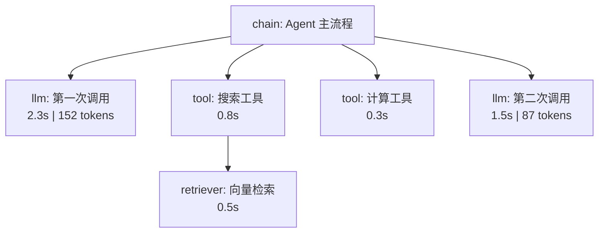

# 第 82课 认识 LangSmith 从追踪到可观测性

> 阶段 13·LangSmith 深度实战·第 1 课。上一阶段（第 78-81 课）你把 Agent 部署到了 Platform。部署上线只是开始——线上跑起来后，"为什么用户说答得不对？" 这才是真正的挑战。LangSmith 就是你看线上发生了什么的"监控室"。

---

## 一、比喻：Agent 的行车记录仪

想象你的 Agent 是一辆出租车：

- **没有 LangSmith**：乘客（用户）说"司机绕路了"，你只有起点和终点，没法判断；
- **有 LangSmith**：车上装了行车记录仪 + GPS——走了哪条路、每个路口停了多久、什么时候调的头，全程可回放。



---

## 二、LangSmith 是什么

LangSmith 是 LangChain 团队做的**全栈 LLM 可观测性平台**，核心能力三件事：

| 能力 | 干什么 | 比喻 |
| --- | --- | --- |
| 追踪 | 记录 Agent 每一步 | 行车记录仪 |
| 评测 | 用固定考卷批量打分 | 年度考试 |
| 实验 | 对比不同版本谁更好 | 试衣间 A/B 试 |

> 第 62 课讲了可观测性三支柱（指标、日志、链路追踪）。LangSmith 把三件事都做了：trace = 链路追踪，仪表盘 = 指标，评估 = 质量日志。

---

## 三、怎么开启追踪

只需三个环境变量：

```bash
# .env
LANGSMITH_TRACING=true
LANGSMITH_API_KEY=ls_在此填入你的API密钥
LANGSMITH_PROJECT=my-agent-prod
```

```python
import os
os.environ["LANGSMITH_TRACING"] = "true"
os.environ["LANGSMITH_API_KEY"] = "ls_在此填入你的API密钥"
os.environ["LANGSMITH_PROJECT"] = "my-agent-prod"

# 之后的 LangChain/LangGraph 调用自动被追踪
from langchain_openai import ChatOpenAI
llm = ChatOpenAI(model="gpt-4o")
response = llm.invoke("什么是 RAG?")
# 这条调用会出现在 LangSmith 的 trace 列表中
```

> 就这么简单——设好环境变量，所有 LangChain 组件的调用自动上传 trace。不需要改任何业务代码。

---

## 四、Trace 长什么样

在 LangSmith UI 打开一个 trace，你会看到一棵树：



每个节点可以展开看到：
- **输入**：用户问什么
- **输出**：返回什么
- **耗时**：这一步花了多久
- **Token**：用了多少 token（llm 类型）
- **错误**：是否报错、报什么错

---

## 五、Run 的五种类型

| 类型 | 标记 | 追踪什么 |
| --- | --- | --- |
| chain | 链/Agent | 编排流程 |
| llm | LLM 调用 | prompt、completion、token |
| tool | 工具 | 工具名、参数、返回 |
| embedding | 向量化 | 文本、维度 |
| retriever | 检索 | 查询、召回文档 |

> 不是所有函数都会被追踪——只有 LangChain/LangGraph 的 `Runnable` 组件或用 `@traceable` 标记的自定义函数才会生成 Run。

---

## 六、用 @traceable 追踪自定义函数

如果你的代码不在 LangChain 体系内，用 `@traceable` 装饰器：

```python
from langsmith import traceable

@traceable(run_type="tool")
def my_search(query: str) -> str:
    # 你的搜索逻辑
    return "搜索结果"

@traceable(run_type="chain")
def my_agent(question: str) -> str:
    result = my_search(question)   # 这一步会被追踪
    return f"基于 {result} 回答"

my_agent("什么是 LangSmith?")
# trace 树: chain(my_agent) → tool(my_search)
```

---

## 七、动手任务

1. 注册 LangSmith 账号，拿到 API Key；
2. 在你的 Agent 项目里配好三个环境变量；
3. 跑一次你的 Agent，在 LangSmith UI 看到 trace；
4. 点开每个 Run 节点，看输入输出和耗时；
5. 找到耗时最长的那个 Run——这就是你下一步要优化的目标。

---

## 八、踩坑提醒

| 坑 | 症状 | 怎么避免 |
| --- | --- | --- |
| 忘了设 `LANGSMITH_TRACING=true` | trace 列表为空 | 检查环境变量 |
| API Key 写错 | 认证失败 | 从 UI 复制完整 Key |
| trace 不完整 | Run 显示 running 一直不结束 | 函数异常退出时用 try/finally |
| @traceable 不生效 | 自定义函数没 trace | 确保函数在设好环境变量后定义 |
| 项目名不一致 | trace 在别的 project | `LANGSMITH_PROJECT` 要一致 |

---

## 小结

- LangSmith = Agent 的行车记录仪 + 考卷 + 试衣间；
- 三个环境变量开启自动追踪，不用改业务代码；
- Trace 是一棵树，每个节点是一次 Run（llm/chain/tool/embedding/retriever）；
- 第 62 课的三支柱在 LangSmith 里落地：trace = 链路追踪，仪表盘 = 指标，评估 = 质量日志。

> 下一课我们用 Trace 找 Bug——看到 trace 只是第一步，关键是从中定位问题。