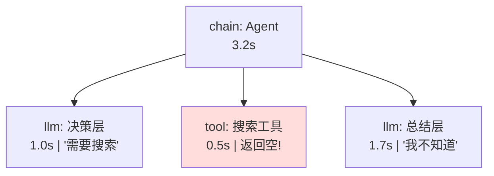
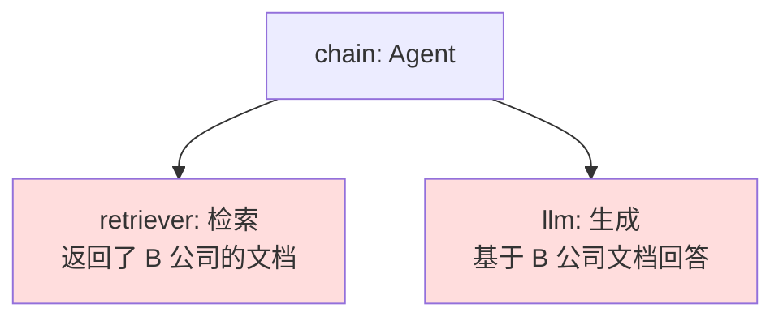
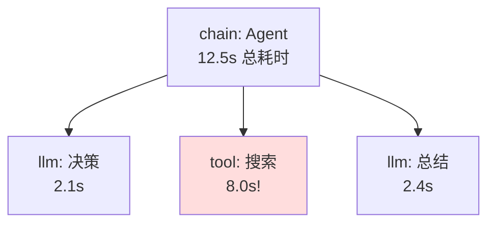
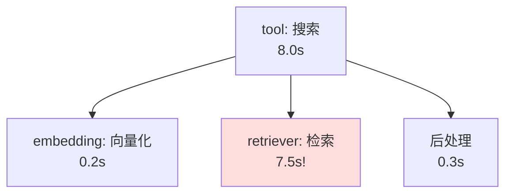

# 第 83课 用 Trace 找 Bug 追踪系统实战

> 阶段 13·LangSmith 深度实战·第 2 课。上一课你学会了开追踪、看 trace。这节课我们用一个有 Bug 的 Agent，带你从 trace 中一步步定位问题——这是线上排障最核心的技能。

---

## 一、比喻：看监控回放找故障

trace 就像监控回放：

- **用户投诉**："Agent 答非所问"——你知道出了问题，但不知道在哪
- **打开 trace**：像回放监控，一步步看哪出了岔子
- **定位故障点**：某个工具返回了空、某次 LLM 调用超时、prompt 缺了关键信息

---

## 二、实战场景：Agent 答非所问

用户问"帮我查一下 2024 年北京 GDP"，Agent 回答"我不知道"。

**直觉判断**：要么没搜到、要么 LLM 没用搜索结果。但不确定。**打开 trace**。



trace 告诉你：
1. 决策层正确判断"需要搜索"——没问题
2. 搜索工具返回了 **空结果**——问题在这里！
3. 总结层因为没拿到结果，回答"我不知道"——连锁反应

---

## 三、五种常见 Bug 模式

| Bug 模式 | trace 中的表现 | 根因 | 修复 |
| --- | --- | --- | --- |
| 工具返回空 | tool Run 的 output 为空 | 搜索 query 不对 | 调整 query 构造 |
| LLM 幻觉 | llm Run 输出与检索结果矛盾 | prompt 没约束 | 加"仅基于检索结果回答" |
| 超时 | 某个 Run 耗时 >30s | 外部 API 慢 | 加超时+重试 |
| 嵌套太深 | trace 树 >8 层 | 工具调 Agent 再调工具 | 拆分或限制深度 |
| Token 暴增 | llm Run token 比平时多 5 倍 | prompt 塞了太多上下文 | 截断/压缩上下文 |

---

## 四、实战一：工具返回空

```python
# 在 trace 中看到搜索工具返回空
# 问题：query 构造有问题
@traceable(run_type="tool")
def search_docs(query: str) -> list:
    # Bug: 直接用用户原话搜，太长太模糊
    results = vector_store.similarity_search(query, k=3)
    return results

# 修复：提取关键词再搜
@traceable(run_type="tool")
def search_docs_v2(query: str) -> list:
    # 用 LLM 提取关键词
    keywords = extract_keywords(query)  # "2024年 北京 GDP"
    results = vector_store.similarity_search(keywords, k=3)
    return results
```

> 验证方法：修复后在 LangSmith 中对比修复前后的 trace——搜索工具的 output 从空变成了有结果。

---

## 五、实战二：LLM 幻觉

用户问"A 公司的产品有哪些"，Agent 回答了一堆 B 公司的产品。

trace 中的发现：



根因：检索器没有按公司名过滤。修复：

```python
# Bug: 检索没加公司过滤
results = vector_store.similarity_search(query, k=5)

# 修复: 加 metadata 过滤
results = vector_store.similarity_search(
    query, k=5,
    filter={"company": "A公司"}  # 只搜 A 公司
)
```

---

## 六、实战三：性能瓶颈

用户反馈"Agent 太慢"。看 trace 发现：



8 秒花在搜索上！进一步展开搜索工具的 trace：



根因：向量数据库索引没建好，全表扫描。修复：建 HNSW 索引，检索从 7.5s 降到 0.3s。

---

## 七、用 SDK 查询 trace

不只能在 UI 看，也能用代码查——适合做自动化监控：

```python
from langsmith import Client

client = Client()

# 找出过去 1 小时的错误 Run
error_runs = list(client.list_runs(
    project_name="my-agent-prod",
    error=True,
    limit=20
))

for run in error_runs:
    print(f"[{run.start_time}] {run.name} [{run.run_type}]")
    print(f"  Error: {run.error}")
    print(f"  Input: {str(run.inputs)[:100]}")

# 找出最慢的 10 个 Run
slow_runs = sorted(
    list(client.list_runs(
        project_name="my-agent-prod",
        run_type="chain",
        limit=100
    )),
    key=lambda r: (r.end_time - r.start_time).total_seconds(),
    reverse=True
)[:10]

for run in slow_runs:
    duration = (run.end_time - run.start_time).total_seconds()
    print(f"{duration:.1f}s | {run.name}")
```

---

## 八、从 trace 到数据集

发现一个好/坏的 trace，直接沉淀为评测用例：

```python
# 把有问题的对话加入数据集，下次 CI 自动检测
for run in error_runs:
    if run.inputs and run.outputs:
        client.create_example(
            inputs=run.inputs,
            outputs={"expected": "应该正确回答，不应报错"},
            dataset_id=eval_dataset.id,
            metadata={"source": "error_trace", "bug_type": "tool_empty"}
        )
```

> 这就是 trace → 数据集 → 评测 → 改进 的闭环：线上踩的坑变成考试题，下次代码改动自动检测不再犯同样错误。

---

## 九、动手任务

1. 在你的 Agent 里故意制造一个 Bug（比如把搜索 query 改错）；
2. 跑一次，在 LangSmith 中找到对应的 trace；
3. 定位哪个 Run 出了问题，输入输出分别是什么；
4. 修复后重跑，对比修复前后的 trace；
5. 把这个有 Bug 的 trace 沉淀为评测数据集的用例。

---

## 十、踩坑提醒

| 坑 | 症状 | 怎么避免 |
| --- | --- | --- |
| trace 太多找不到 | 列表很长 | 用 filter 按 error/慢请求筛选 |
| 只看根节点 | 漏掉子 Run 的问题 | 一定要展开看子 Run |
| 修复后不验证 | 同样的 Bug 反复出现 | 修复后重跑 trace 对比 |
| 忽略 token 暴增 | 成本超预算 | 看 llm Run 的 token 趋势 |
| 不沉淀为数据集 | 踩过的坑忘了 | 把 Bug trace 加入 Dataset |

---

## 小结

- trace 是线上排障的核心工具——比看日志高效 10 倍；
- 五种常见 Bug 模式：工具空返回、LLM 幻觉、超时、嵌套过深、token 暴增；
- 用 SDK 可以编程查询 trace——适合自动化监控和报警；
- 把 Bug trace 沉淀为评测用例 = 踩过的坑变成考试题，防止重犯。

> 下一课我们用 LangSmith 的数据集做实验——A/B 对比和回归测试。