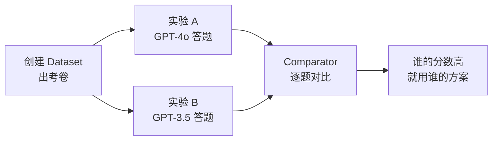
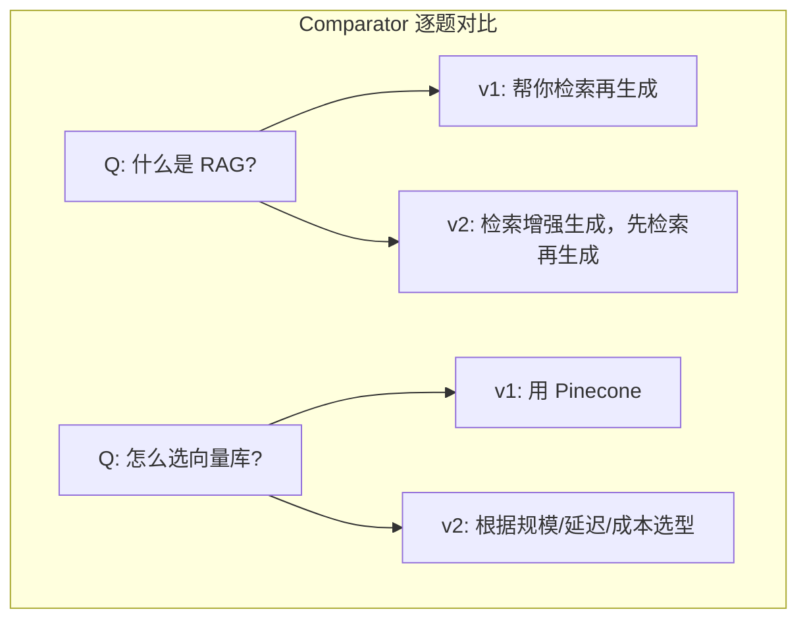

# 第 84课 用数据集做实验 A/B 对比与回归测试

> 阶段 13·LangSmith 深度实战·第 3 课。上一课你学会了用 trace 找 Bug。这节课把找到的 Bug 变成"考卷"——用数据集做实验，对比不同版本谁更好，改了代码不比原来差。

---

## 一、比喻：Agent 的年度考试

把 Agent 想象成一个学生：

- **数据集（Dataset）**：期末考卷，固定题目和标准答案
- **实验**：让学生用不同方法答题（换模型、改 prompt）
- **Comparator**：把两份答卷放一起，逐题对比谁答得好
- **回归测试**：改了学习方法后重考，确保不退步



---

## 二、创建数据集

```python
from langsmith import Client

client = Client()

# 创建数据集
dataset = client.create_dataset(
    name="qa-eval-v1",
    description="问答系统评测集 v1"
)

# 手动添加样例
client.create_example(
    inputs={"question": "什么是 RAG?"},
    outputs={"answer": "检索增强生成"},
    dataset_id=dataset.id,
    metadata={"difficulty": "easy"}
)

# 从 trace 中挑选样例（第 83 课学过）
runs = list(client.list_runs(
    project_name="my-agent-prod",
    run_type="chain",
    error=False,
    limit=50
))

for run in runs:
    if run.outputs and len(str(run.outputs)) > 50:
        client.create_example(
            inputs=run.inputs,
            outputs=run.outputs,
            dataset_id=dataset.id,
            metadata={"source": "trace"}
        )
```

> 数据集的两个来源：手动编写（质量可控）+ 从 trace 挑选（真实场景）。

---

## 三、跑第一次实验

```python
# 定义被测函数
def answer_question(question: str) -> str:
    llm = ChatOpenAI(model="gpt-4o")
    return llm.invoke(question).content

# 在数据集上跑实验
experiment = client.run_on_dataset(
    dataset_name="qa-eval-v1",
    llm_or_chain_factory=answer_question,
    experiment_name="exp-gpt4o-v1",
    evaluation_name="correctness"
)
```

跑完后在 LangSmith UI 看到每个样例的得分。

---

## 四、A/B 对比实验

换一个模型或 prompt，再跑一次，然后对比：

```python
# 实验 A: 当前 prompt
prompt_v1 = ChatPromptTemplate.from_messages([
    ("system", "你是一个助手。"),
    ("user", "{question}")
])

# 实验 B: 改进 prompt
prompt_v2 = ChatPromptTemplate.from_messages([
    ("system", "你是专业技术助手，回答简洁准确。"),
    ("user", "{question}")
])

# 跑两个实验
for name, prompt in [("prompt-v1", prompt_v1), ("prompt-v2", prompt_v2)]:
    client.run_on_dataset(
        dataset_name="qa-eval-v1",
        llm_or_chain_factory=prompt | ChatOpenAI(model="gpt-4o"),
        experiment_name=name
    )

# 在 LangSmith UI 的 Comparator 视图逐题对比
```



v2 的回答更完整——这就是 Comparator 的价值。

---

## 五、回归测试

改了代码后，确保不退步：

```python
import os, sys

def run_regression_test():
    """CI/CD 中的回归测试（衔接第79课）"""
    experiment = client.run_on_dataset(
        dataset_name="qa-eval-v1",
        llm_or_chain_factory=current_agent,
        experiment_name=f"regression-{os.getenv('GIT_SHA', 'local')}"
    )
    
    # 获取结果
    results = list(client.list_experiment_results(experiment.id))
    avg_score = sum(r.score for r in results) / len(results)
    
    baseline = 0.75  # 上线时的基线分
    if avg_score < baseline:
        print(f"回归失败: {avg_score:.3f} < {baseline}")
        sys.exit(1)
    else:
        print(f"回归通过: {avg_score:.3f} >= {baseline}")

run_regression_test()
```

> 这就是第 79 课 CI/CD 流水线中 `run_eval_gate.py` 的核心逻辑——用 Dataset 做考卷，CI 自动评分，不达标阻断部署。

---

## 六、评估器选择

| 评估器 | 怎么打分 | 适用 |
| --- | --- | --- |
| LLM 评估 | 用 LLM 判断回答对不对 | 开放式问答 |
| 关键词命中 | 检查答案是否包含关键词 | 有明确要点 |
| 字符串相似 | 编辑距离 | 精确匹配 |
| 自定义函数 | 你定义的评分逻辑 | 业务规则 |

```python
# 自定义评估器示例
class KeywordHitEvaluator:
    def evaluate(self, run, example):
        output = str(run.outputs)
        keywords = example.outputs.get("keywords", [])
        hits = sum(1 for kw in keywords if kw in output)
        score = hits / len(keywords) if keywords else 0
        return {"key": "keyword_hit", "score": score}

# 在实验中使用
client.run_on_dataset(
    dataset_name="qa-eval-v1",
    llm_or_chain_factory=answer_question,
    evaluation=RunEvalConfig(
        custom_evaluators=[KeywordHitEvaluator()]
    ),
    experiment_name="exp-keywords"
)
```

---

## 七、数据集版本管理

| 策略 | 说明 | 何时用 |
| --- | --- | --- |
| 锁定版本 | 上线时用的版本号固定 | 回归测试必须用固定版 |
| 增量添加 | 只加不删 | 扩充覆盖面 |
| 新版替换 | 发现旧样例有误 | 改正后用新版本 |
| 分类分桶 | 按难度/类别分多个 | 分类评估 |

> 铁律：回归测试用的 Dataset 版本要锁死。不然"考卷变了"就没法比。

---

## 八、动手任务

1. 创建一个有 5-10 道题的数据集；
2. 跑第一次实验，记录每个样例的分数；
3. 改一个参数（temperature 或 prompt）；
4. 跑第二次实验；
5. 用 Comparator 逐题对比两个实验；
6. 把第二次实验的分数与基线对比，判断是否退化。

---

## 九、踩坑提醒

| 坑 | 症状 | 怎么避免 |
| --- | --- | --- |
| 数据集太小 | 分数波动大 | 至少 20 条样例 |
| 只有简单题 | 评估虚高 | 加入困难/边缘用例 |
| 评估器太松 | 全部满分 | 用 LLM 评估器或加关键词要求 |
| 版本不锁 | 无法对比 | 回归测试用固定版本 |
| 只跑一次 | 偶然性大 | 同一实验至少跑 3 次取均值 |

---

## 小结

- 数据集 = Agent 的固定考卷，从手动编写和 trace 挑选两个来源获取；
- A/B 实验：同一数据集跑两个版本，用 Comparator 逐题对比；
- 回归测试：改代码后重跑数据集，确保不退步——这就是第 79 课 CI/CD 门禁的核心；
- 评估器决定怎么打分：LLM 评估（开放式）、关键词命中（有要点）、自定义（业务规则）；
- 数据集版本要锁定——考卷变了就没法比。

> 下一课是 LangSmith 可观测性仪表盘，也是全系列 85 课的总收官。