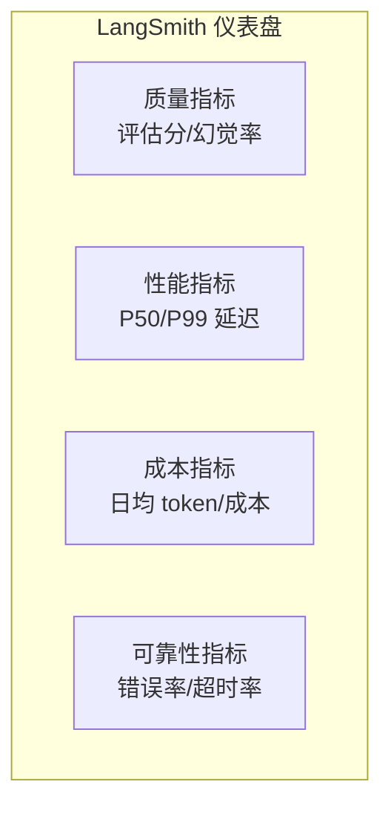

# 第 85课 LangSmith 全景回顾与全系列总收官

> 阶段 13·LangSmith 深度实战·第 4 课（全系列收官课）。上节课你用数据集做了 A/B 对比和回归测试。这节课把 LangSmith 的可观测性仪表盘补完，然后带你回顾整个 85 课的全貌——从"什么是 Chain"到"用 LangSmith 守住线上质量"，这是一条完整的成长路径。

---

## 一、可观测性仪表盘

前面的课你学会了追踪（看每一步）和数据集（批量评测）。但线上的日常运营需要的是"一眼看全局健康度"——这就是仪表盘。



| 指标 | 目标 | 告警阈值 |
| --- | --- | --- |
| 评估分均值 | > 0.80 | < 0.75 |
| 错误率 | < 1% | > 5% |
| P99 延迟 | < 10s | > 15s |
| 日均成本 | < $50 | > $80 |

> 仪表盘 = trace 数据的聚合视图。第 62 课的可观测性三支柱在 LangSmith 中全部落地：trace = 链路追踪，仪表盘 = 指标，数据集 = 质量日志。

---

## 二、告警：指标异常时自动通知

```python
# 告警脚本（配合 cron 每小时跑一次）
def check_and_alert():
    client = Client()
    runs = list(client.list_runs(
        project_name="my-agent-prod",
        start_time={"gte": datetime.now() - timedelta(hours=1)},
        run_type="chain"
    ))
    total = len(runs)
    if total == 0: return
    errors = sum(1 for r in runs if r.status == "error")
    error_rate = errors / total
    if error_rate > 0.05:
        # 发 Slack 告警
        send_slack(f"Agent 错误率 {error_rate:.1%} 超过 5%")
```

---

## 三、全系列 85 课全景回顾

```mermaid
graph LR
    S1["阶段1<br/>1-10课<br/>基础入门"] --> S2["阶段2<br/>11-17课<br/>进阶技能"]
    S2 --> S3["阶段3<br/>18-25课<br/>高级技术"]
    S3 --> S4["阶段4<br/>26-33课<br/>架构精通"]
    S4 --> S5["阶段5<br/>34-41课<br/>可靠运营"]
    S5 --> S6["阶段6<br/>42-53课<br/>专题深化"]
    S6 --> S7["阶段7<br/>54-61课<br/>端到端实战"]
    S7 --> S8["阶段8<br/>62-65课<br/>生产运营"]
    S8 --> S9["阶段9<br/>66-69课<br/>MCP实战"]
    S9 --> S10["阶段10<br/>70-73课<br/>评测实战"]
    S10 --> S11["阶段11<br/>74-77课<br/>人机协同"]
    S11 --> S12["阶段12<br/>78-81课<br/>Platform"]
    S12 --> S13["阶段13<br/>82-85课<br/>LangSmith"]
```



| 阶段 | 课程 | 你学会了什么 |
| --- | --- | --- |
| 1 基础入门 | 1-10 | 第一个 Chain、LCEL、提示词、记忆、RAG 入门 |
| 2 进阶技能 | 11-17 | 向量库、工具、Agent、高级 RAG、评估、安全 |
| 3 高级技术 | 18-25 | 多模态、LangGraph、多 Agent、流式异步 |
| 4 架构精通 | 26-33 | 工具/记忆/检查点、复杂工作流、Agentic RAG |
| 5 可靠运营 | 34-41 | 安全、网关、上下文工程、幻觉检测、推理性能 |
| 6 专题深化 | 42-53 | 微调、多模态 Agent、多租户、MCP 协议 |
| 7 端到端实战 | 54-61 | 从零搭企业知识库问答系统 |
| 8 生产运营 | 62-65 | 可观测性、评测门禁、可靠性 SLO、安全成本 |
| 9 MCP 实战 | 66-69 | MCP 协议、服务端、客户端、安全上线 |
| 10 评测实战 | 70-73 | Agent 评测基准、自建评测台、EDD 门禁 |
| 11 人机协同 | 74-77 | HITL 中断恢复、纠错回退、落地纪律 |
| 12 Platform | 78-81 | 部署模式、持久化、Cron、Stream、Studio |
| **13 LangSmith** | **82-85** | **追踪系统、Trace 找 Bug、数据集实验、仪表盘告警** |

---

## 四、你应该有的"工具箱"

学完 85 课，你应该具备以下能力：

| 能力 | 对应阶段 | 你能做到什么 |
| --- | --- | --- |
| 写 Chain | 1-2 | 从零搭一个问答/检索 Chain |
| 搭 RAG | 2-3 | 搭一个带评估的检索增强系统 |
| 编排 Agent | 3-4 | 用 LangGraph 编排多 Agent 复杂流程 |
| 上线运营 | 5-8 | 部署、监控、告警、SLO 管理 |
| 接 MCP | 9 | 自建 MCP 服务并安全上线 |
| 守质量 | 10 | 用评测基准和数据集守住 Agent 质量 |
| 装刹车 | 11 | 关键环节加人工审批和纠错回退 |
| 部署平台 | 12 | 用 Platform 把 Agent 部署到云端 |
| 看见一切 | 13 | 用 LangSmith 追踪、实验、监控、告警 |

---

## 五、结业自测

回答以下问题，检验你是否真正掌握了全系列：

**基础层**：
1. Chain 和 Agent 的区别是什么？（第 5/13 课）
2. LCEL 的管道符 `|` 做了什么？（第 6 课）
3. RAG 的三个核心步骤？（第 10 课）

**架构层**：
4. LangGraph 的 StateGraph 和传统 Chain 有什么不同？（第 20 课）
5. 检查点机制解决了什么问题？（第 28 课）
6. Agentic RAG 和普通 RAG 的区别？（第 32 课）

**生产层**：
7. 可观测性三支柱是什么？（第 62 课）
8. SLO 怎么设定和追踪？（第 64 课）
9. CI/CD 中评测门禁怎么接？（第 79 课）

**进阶层**：
10. MCP 协议解决什么问题？（第 66 课）
11. HITL 中断恢复的 `interrupt` 怎么用？（第 75 课）
12. LangSmith 的 trace 和 Dataset 分别解决什么问题？（第 82-84 课）

> 如果 12 道题都能答上来，恭喜你——你已经具备了从零搭建到生产运营 LLM 应用的完整能力。

---

## 六、后续学习方向

LangChain/LangGraph 生态在持续演进，以下是值得持续关注的方向：

| 方向 | 为什么重要 | 去哪学 |
| --- | --- | --- |
| LangGraph 新特性 | 框架持续更新 | 官方文档 + changelog |
| 多模态 Agent | 图文音视频融合是趋势 | 第 43 课基础 + 官方 cookbook |
| Agent 评测前沿 | 评测方法论在快速迭代 | 第 70-73 课 + 论文 |
| 垂直行业应用 | 通用方案落地到具体行业 | 第 54-61 课方法论 + 实践 |
| 开源 Agent 框架 | AutoGen/CrewAI 互补 | 第 47 课对比 + 源码 |

---

## 七、动手任务（终课）

1. 搭一个端到端的项目：从数据准备到 Agent 部署到 LangSmith 监控；
2. 创建一个 20 题的评测数据集，锁定版本；
3. 在 CI/CD 中接回归测试（第 79 课 + 第 84 课）；
4. 配置 LangSmith 仪表盘 + 告警（本课）；
5. 回顾结业自测 12 题，答不上来的回去翻对应课程。

---

## 小结

- LangSmith 仪表盘 = trace 数据的聚合视图，一眼看全局健康度；
- 告警 = 指标超阈值时自动通知，衔接第 64 课 SLO；
- 全系列 85 课，13 个阶段，从"什么是 Chain"到"用 LangSmith 守住线上质量"；
- 你现在拥有的能力链：写 Chain → 搭 RAG → 编排 Agent → 上线 → 监控 → 评测 → 人机协同 → 部署平台 → 看见一切。

> **恭喜你走完了 85 课的完整旅程。** LangChain/LangGraph 的世界很大，这 85 课是地图——真正的高手是拿着地图走遍每一处、踩过每一个坑、建过每一个项目的人。继续动手，继续构建。