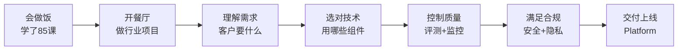
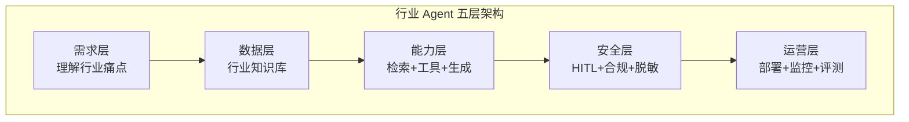

# 第 86课 从学完到用起来 垂直行业项目入门

> 阶段 14·垂直行业端到端 Agent 项目实战·第 1 课。前 13 个阶段你学了全部工具链。现在把工具组合起来，在真实行业场景中交付项目——这是从"会用工具"到"能交付项目"的跨越。

---

## 一、比喻：从会做饭到开餐厅

学了 85 课，你已经会做饭了——切菜（LCEL）、炒菜（LangGraph）、摆盘（提示词）、品控（评测）、安全（HITL）、开店（Platform）、装监控（LangSmith）。

但开餐厅跟在家做饭不一样：要理解顾客需求、选对食材、控制成本、应对高峰、满足合规。**垂直行业项目就是开餐厅**——工具还是那些工具，但组合方式完全不同。

---

## 二、四个行业项目一览

本阶段 4 课覆盖 4 个典型行业：

| 项目 | 行业 | 核心 | 难点 | 对应知识库 |
| --- | --- | --- | --- | --- |
| 客服 Agent | 通用 | RAG + 工具 + HITL | 意图识别准确 | KB82 |
| 法律/金融 RAG | 专业 | 精排 + 引用 + 合规 | 准确性 + 可溯源 | KB83 |
| 电商购物 Agent | 商业 | 混合检索 + 多轮 + HITL | 多系统对接 | KB84 |
| 医疗问答 Agent | 医疗 | 安全分诊 + 合规红线 | 安全底线 | KB85 |

---

## 三、行业项目的通用框架

无论哪个行业，Agent 项目的结构都是这五层：

| 层 | 做什么 | 用到什么 |
| --- | --- | --- |
| 需求层 | 行业痛点是什么 | 需求调研 |
| 数据层 | 行业知识从哪来 | 第 55 课文档治理 |
| 能力层 | Agent 怎么处理 | RAG + 工具 + LangGraph |
| 安全层 | 怎么保证不出事 | 第 75 课 HITL + 第 44 课合规 |
| 运营层 | 怎么上线和监控 | 第 78-85 课 Platform + LangSmith |

---

## 四、从需求到上线的七步法

每个行业项目都走这七步：

| 步骤 | 做什么 | 对应课程 |
| --- | --- | --- |
| 1 需求分析 | 客户要解决什么问题 | 本课 |
| 2 数据准备 | 收集和治理行业数据 | 第 55 课 |
| 3 架构设计 | 选组件、画状态图 | 第 20 课 |
| 4 原型开发 | 先做 MVP | 第 10/12 课 |
| 5 评测建立 | 创建数据集和门禁 | 第 84 课 |
| 6 安全加固 | 加 HITL 和合规 | 第 75/44 课 |
| 7 部署运营 | Platform + LangSmith | 第 78-85 课 |

---

## 五、行业项目 vs 通用项目的差异

| 维度 | 通用项目 | 行业项目 |
| --- | --- | --- |
| 数据 | 通用文档 | 行业专业文档（法规/财报/医学） |
| 准确性 | "差不多就行" | "错了出事" |
| 安全 | 重要 | 红线（尤其医疗/金融） |
| 合规 | 建议有 | 必须有 |
| 评测 | 通用指标 | 行业特定指标 |
| HITL | 可选 | 常常必须 |

---

## 六、动手任务

1. 选一个你最感兴趣的行业（客服/法律/金融/电商/医疗）；
2. 列出这个行业的 3 个核心痛点；
3. 画出你的 Agent 五层架构图；
4. 写出七步法中每一步你的具体计划。

---

## 小结

- 前 13 阶段学了全部工具，现在把它们组合起来交付真实项目；
- 行业项目五层架构：需求→数据→能力→安全→运营；
- 七步法：需求→数据→架构→原型→评测→安全→部署；
- 行业项目与通用项目的核心差异：准确性、安全、合规是底线不是加分项。

> 下一课我们做第一个行业项目：客服 Agent 从需求到上线全流程。