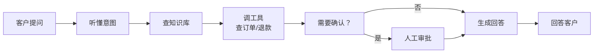
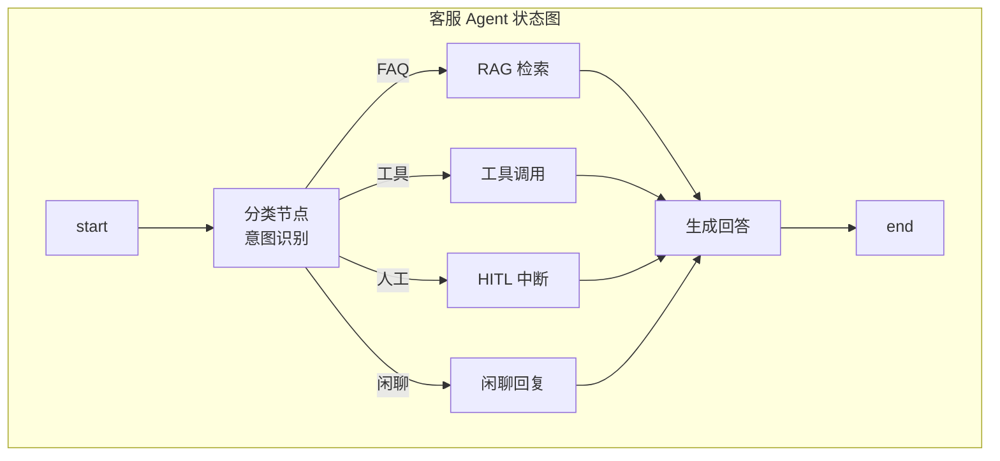

# 第 87课 客服 Agent 从需求到上线全流程

> 阶段 14·第 2 课。本课用一个完整的客服 Agent 项目，带你从需求走到上线。这是最容易上手、也最能体现 Agent 价值的行业场景。

---

## 一、比喻：客服 Agent 就像一个优秀的接线员

好的接线员要做到：快速听懂客户要什么、从知识库翻答案、必要时找人帮忙、必要时让人工确认。客服 Agent 就是接线员的数字化版。



---

## 二、需求分析：客户要什么

| 场景 | 客户说什么 | Agent 要做什么 |
| --- | --- | --- |
| 查询 | "我的订单到哪了" | 调物流工具 |
| 售后 | "我要退货" | 调售后工具 + HITL |
| FAQ | "退款多久到账" | 查知识库 |
| 闲聊 | "你好" | 礼貌回应 |
| 投诉 | "我要投诉" | 转 HITL |

---

## 三、数据准备

| 数据类型 | 来源 | 格式 | 处理 |
| --- | --- | --- | --- |
| FAQ 文档 | 客服团队 | Markdown | 分块 + 向量化 |
| 产品手册 | 产品团队 | PDF | 提取 + 分块 |
| 历史对话 | 工单系统 | CSV | 清洗 + 去敏 |
| 政策文档 | 合规团队 | Word | 分块 + 权限 |

---

## 四、架构设计



---

## 五、原型开发：最小可用版本

MVP 只做三件事：

1. 意图分类（FAQ / 工具 / 人工）
2. RAG 回答 FAQ
3. 工具调用查订单

```python
from typing import TypedDict, Literal
from langgraph.graph import StateGraph, END

class State(TypedDict):
    query: str
    intent: str
    answer: str

def classify(state: State) -> State:
    # 简化版意图分类
    if "订单" in state["query"] or "物流" in state["query"]:
        state["intent"] = "tool"
    elif "人工" in state["query"] or "投诉" in state["query"]:
        state["intent"] = "human"
    else:
        state["intent"] = "faq"
    return state

def faq_search(state: State) -> State:
    state["answer"] = "FAQ 检索结果（示例）"
    return state

def tool_call(state: State) -> State:
    state["answer"] = "工具调用结果（示例）"
    return state

def human_handoff(state: State) -> State:
    state["answer"] = "已转人工，请稍候"
    return state

def route(state: State) -> str:
    return state["intent"]

g = StateGraph(State)
g.add_node("classify", classify)
g.add_node("faq", faq_search)
g.add_node("tool", tool_call)
g.add_node("human", human_handoff)
g.set_entry_point("classify")
g.add_conditional_edges("classify", route, {
    "faq": "faq",
    "tool": "tool",
    "human": "human",
})
g.add_edge("faq", END)
g.add_edge("tool", END)
g.add_edge("human", END)
app = g.compile()
```

---

## 六、评测建立

| 评测维度 | 数据集 | 指标 |
| --- | --- | --- |
| 意图准确率 | 200 条标注 | accuracy |
| 回答正确率 | 100 条 FAQ | 正确率 |
| 工具调用率 | 50 条工具 | 成功率 |
| 转人工率 | 30 条人工 | 召回率 |
| 响应时间 | 全量 | P95 < 3s |

---

## 七、安全加固

| 风险 | 加固方式 | 对应课 |
| --- | --- | --- |
| 退款操作 | HITL 审批 | 第 75 课 |
| 敏感信息 | 输入脱敏 | 第 44 课 |
| 越权访问 | 权限检查 | KB48 |
| 对抗攻击 | 输入过滤 | 第 42 课 |

---

## 八、部署运营

| 步骤 | 做什么 | 对应课 |
| --- | --- | --- |
| 打包 | langgraph.json | 第 78 课 |
| 部署 | Platform | 第 79 课 |
| 监控 | LangSmith Trace | 第 82 课 |
| 告警 | SLO + 告警 | 第 85 课 |
| 迭代 | 数据集 + 实验 | 第 84 课 |

---

## 九、动手任务

1. 用本课的 MVP 代码跑一个意图分类 + RAG 原型；
2. 创建 20 条 FAQ 测试数据；
3. 写 5 条工具调用测试用例；
4. 画出你的客服 Agent 部署架构图。

---

## 小结

- 客服 Agent 是最典型的行业 Agent：意图分类 + RAG + 工具 + HITL；
- 从需求到上线七步法：需求→数据→架构→原型→评测→安全→部署；
- MVP 只做三件事：分类、检索、工具调用——先跑通再迭代；
- 评测和安全是上线的前提，不是上线后再补的。

> 下一课我们深入法律和金融行业，看专业领域 RAG 的差异化和合规要点。