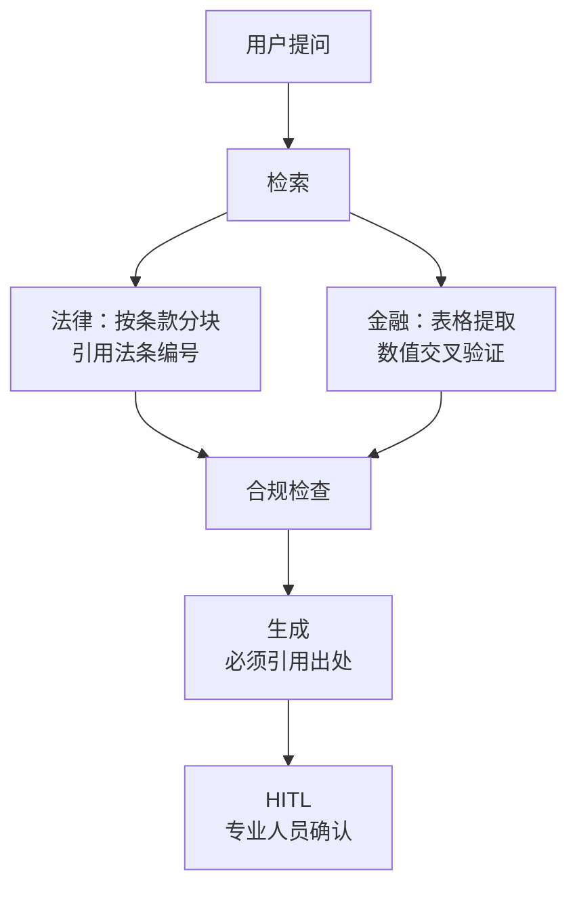

# 第 88课 法律与金融行业 RAG 差异化与合规要点

> 阶段 14·第 3 课。法律和金融是两个对准确性要求最高的行业。本课看 RAG 在这两个领域要怎么"卷"准确性和合规。

---

## 一、比喻：法律 RAG 像写法律意见书，金融 RAG 像做审计

普通 RAG 是"差不多就行"，法律/金融 RAG 是"错了要担责"。就像法律意见书要引法条、审计报告要交叉验证——不能有"大概"。

---

## 二、法律 RAG 的三个差异

### 差异 1：分块按条款，不按字数

普通 RAG 按 500 字分块。法律文档按条款分块——一条法条不能被截断。

| 维度 | 普通 RAG | 法律 RAG |
| --- | --- | --- |
| 分块 | 固定字数 | 按条款编号 |
| 引用 | 答案附出处 | 必须附法条编号 |
| 准确性 | 语义近似 | 条款精确匹配 |

### 差异 2：引用溯源到条款

每个答案必须注明引用了哪部法、第几条。用户可以"追到源头"。

### 差异 3：合规免责

涉及法律建议时，必须声明"本回答不构成法律意见"。

---

## 三、金融 RAG 的三个差异

### 差异 1：表格提取

财报里大量表格。普通 RAG 把表格压扁成文本会丢信息。金融 RAG 要做结构化表格提取。

### 差异 2：数值交叉验证

"营收增长 20%"要从多个来源验证——不能只信一个文档。

### 差异 3：脱敏审计

回答不能包含客户姓名、账户号等敏感信息。所有回答要留审计日志。

---

## 四、合规清单

| 行业 | 合规项 | 实现方式 |
| --- | --- | --- |
| 法律 | 免责声明 | 生成时追加 |
| 法律 | 引用完整 | 检索时记录来源 |
| 金融 | 数据脱敏 | 输出前 PII 过滤 |
| 金融 | 审计日志 | 每次调用记录 |
| 金融 | 数值验证 | 多源交叉检查 |

---

## 五、动手任务

1. 找一份合同文档（10 页以上），按条款分块并记录每块的法条编号；
2. 找一份财报中的表格，用代码提取成结构化数据；
3. 写一个脱敏函数，把回答中的手机号/身份证号替换为 `***`；
4. 给你的法律 RAG 加一个免责声明生成节点。

---

## 小结

- 法律 RAG：按条款分块、引用溯源、合规免责；
- 金融 RAG：表格提取、数值交叉验证、脱敏审计；
- 专业领域的核心差异：准确性不是加分项是底线，合规不是可选是必须；
- 引用和脱敏是法律/金融 RAG 的两个必备能力。

> 下一课我们做电商购物 Agent 和医疗问答 Agent，并在课程 89 完成全阶段收官。