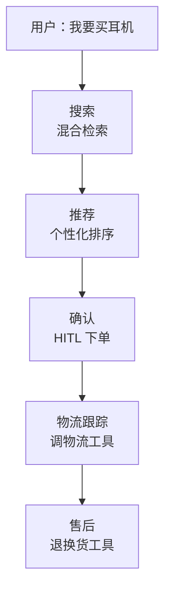
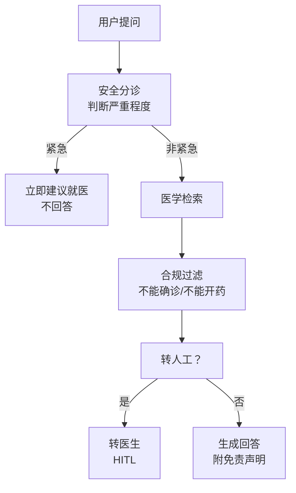
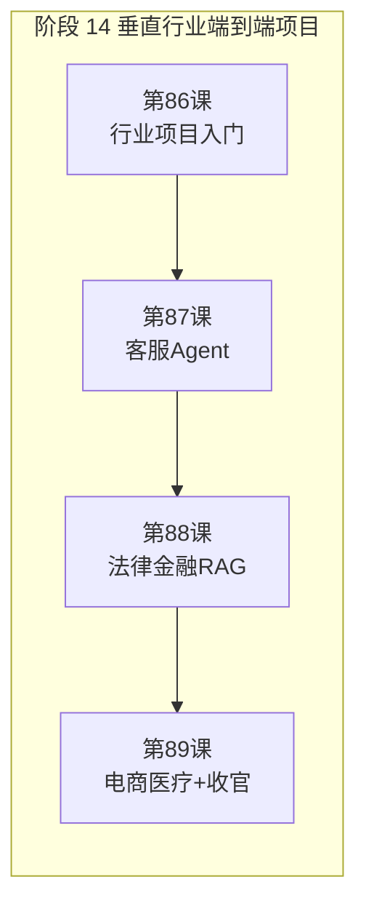
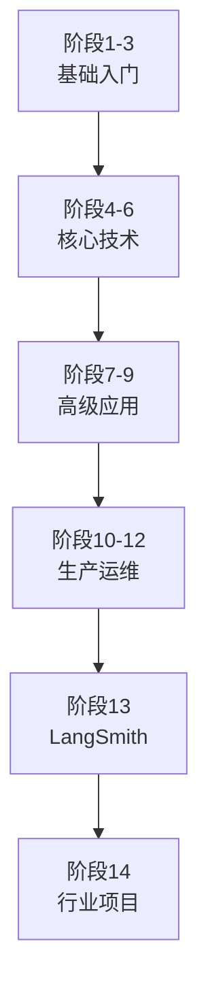

# 第 89课 电商/医疗 Agent 实战与全阶段收官

> 阶段 14·第 4 课。本课做最后两个行业项目（电商购物 + 医疗问答），并完成阶段 14 收官。

---

## 一、电商购物 Agent

### 比喻：一个 24 小时在线的导购员

好导购会：听懂你要什么→搜索→推荐→确认下单→跟踪物流→处理售后。购物 Agent 就是数字化导购。



### 电商 Agent 的关键能力

| 能力 | 做什么 | 技术方案 |
| --- | --- | --- |
| 理解需求 | "便宜一点""有降噪" | 多轮对话 + 意图解析 |
| 混合检索 | 搜商品 | 向量 + 关键词 + 属性过滤 |
| 个性化推荐 | 按用户历史 | 用户画像 + 重排序 |
| HITL 下单 | 确认后才下单 | interrupt + approve/reject |
| 物流跟踪 | 查物流 | 工具调用 |
| 售后处理 | 退换货 | 工具调用 + HITL |

### 下单节点的 HITL 设计

```python
from langgraph.types import interrupt, Command

def order_confirm(state):
    # 展示订单信息
    order_info = format_order(state)
    # 中断，等用户确认
    decision = interrupt({
        "prompt": f"确认下单？\n{order_info}",
        "options": ["approve", "reject", "edit"]
    })
    if decision == "approve":
        state["status"] = "ordered"
    elif decision == "reject":
        state["status"] = "cancelled"
    else:
        state["status"] = "editing"
    return state
```

---

## 二、医疗问答 Agent

### 比喻：一个谨慎的分诊护士

医疗 Agent 不是医生——它是"分诊护士"：判断严重程度→给信息→不能确诊→必要时转医生。安全是红线。



### 医疗 Agent 的安全红线

| 红线 | 规则 | 实现 |
| --- | --- | --- |
| 不能确诊 | 回答不能含诊断结论 | 输出过滤器 |
| 不能开药 | 回答不能含用药建议 | 输出过滤器 |
| 紧急分诊 | 检测到紧急关键词→立即建议就医 | 输入分类器 |
| 隐私脱敏 | 用户输入中的 PII 要脱敏 | 输入脱敏 |
| 免责声明 | 每个回答附"不构成医疗建议" | 生成时追加 |
| 转人工 | 超出范围→转医生 | HITL 中断 |

---

## 三、四个行业对比

| 维度 | 客服 | 法律/金融 | 电商 | 医疗 |
| --- | --- | --- | --- | --- |
| 准确性要求 | 中 | 极高 | 中 | 极高 |
| 安全底线 | 中 | 高 | 中 | 极高 |
| HITL 必要性 | 中 | 高 | 高 | 极高 |
| 合规要求 | 低 | 极高 | 中 | 极高 |
| 数据复杂度 | 中 | 高 | 中 | 高 |
| 部署模式 | Platform | Platform + 私有 | Platform | 私有化 |

---

## 四、阶段 14 全景回顾



| 课 | 核心收获 |
| --- | --- |
| 86 | 五层架构 + 七步法 |
| 87 | 客服 Agent 全流程（意图+RAG+工具+HITL+评测+部署） |
| 88 | 法律按条款分块 + 金融表格验证 + 合规清单 |
| 89 | 电商 HITL 下单 + 医疗安全红线 + 四行业对比 |

---

## 五、结业自测

1. 行业 Agent 的五层架构是哪五层？
2. 从需求到上线的七步法是哪七步？
3. 法律 RAG 和普通 RAG 的三个差异是什么？
4. 金融 RAG 的数值交叉验证为什么重要？
5. 电商 Agent 下单节点为什么要用 HITL？
6. 医疗 Agent 的六条安全红线是什么？
7. 医疗 Agent 为什么不能确诊和开药？
8. 四个行业的 HITL 必要性排序是怎样的？
9. 行业项目与通用项目最大的差异是什么？
10. 如果让你选一个行业做 Agent 项目，你会选哪个？为什么？

---

## 六、全系列 14 阶段知识地图



| 阶段 | 主题 | 课次 |
| --- | --- | --- |
| 1-3 | 基础入门 | 1-13 |
| 4-6 | 核心技术 | 14-37 |
| 7-9 | 高级应用 | 38-53 |
| 10-12 | 生产运维 | 54-77 |
| 13 | LangSmith | 78-85 |
| 14 | 行业项目 | 86-89 |

---

## 小结

- 电商购物 Agent：混合检索 + 个性化推荐 + HITL 下单 + 物流售后；
- 医疗问答 Agent：安全分诊 + 合规过滤 + 不能确诊/不能开药 + 转人工；
- 四行业对比：准确性、安全、合规、HITL 的要求各不相同；
- 14 阶段完整学习路径：基础→核心→高级→生产→LangSmith→行业项目。

> 本阶段 4 课完成。附录 AM/AN 提供行业项目速查手册和代码模板库。