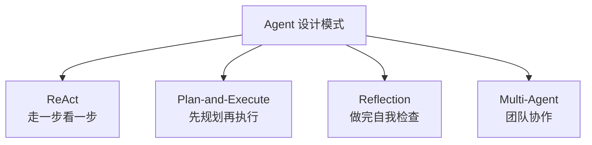
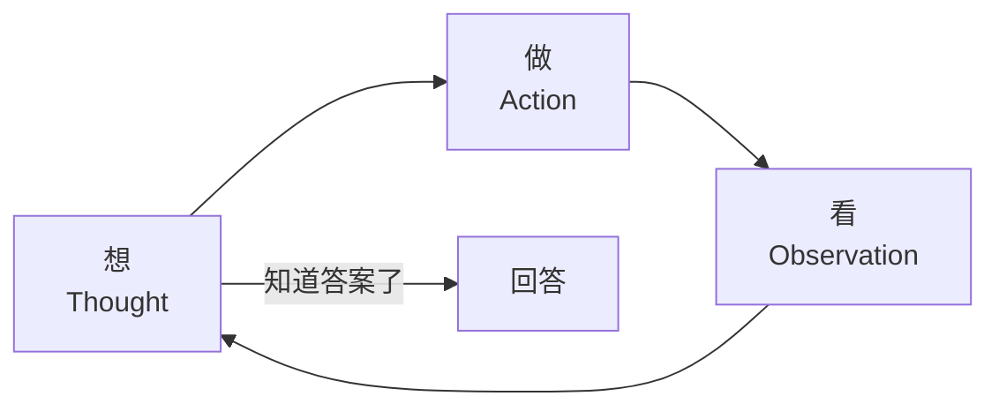
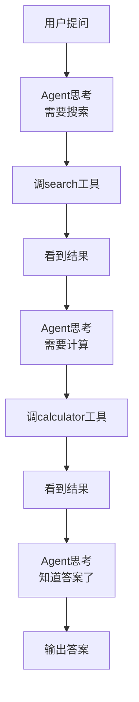

# 第 99 课 Agent 设计模式入门与 ReAct 实战

> 阶段 16·Agent 设计模式大全与实战·第 1 课。本阶段学习四种核心 Agent 设计模式，本课先学第一个：ReAct。

---

## 一、比喻：什么是 Agent 设计模式

设计模式就像武术套路——前人总结的最佳实践。学套路不是死板照做，而是知道"什么情况下用什么招"。



---

## 二、ReAct：最经典的 Agent 模式

### 通俗理解

ReAct = Reasoning + Acting = 推理 + 行动。像人解决问题：想一步→做一步→看结果→再想。



### 实战：用 ReAct 做一个问答 Agent

```python
from langgraph.graph import StateGraph, END
from langgraph.prebuilt import ToolNode
from langchain_openai import ChatOpenAI
from langchain_core.tools import tool
from typing import TypedDict, Annotated

@tool
def search_web(query: str) -> str:
    """搜索网络"""
    return f"关于'{query}'的搜索结果"

@tool
def calculate(expr: str) -> str:
    """数学计算"""
    try:
        return str(eval(expr))
    except:
        return "计算失败"

tools = [search_web, calculate]
llm = ChatOpenAI(model="gpt-4o", temperature=0).bind_tools(tools)

class State(TypedDict):
    messages: Annotated[list, "add_messages"]

def agent(state: State):
    msg = llm.invoke(state["messages"])
    state["messages"].append(msg)
    return state

def route(state: State) -> str:
    last = state["messages"][-1]
    if hasattr(last, "tool_calls") and last.tool_calls:
        return "tools"
    return END

g = StateGraph(State)
g.add_node("agent", agent)
g.add_node("tools", ToolNode(tools))
g.set_entry_point("agent")
g.add_conditional_edges("agent", route, {"tools": "tools", END: END})
g.add_edge("tools", "agent")
app = g.compile()

# 测试
result = app.invoke({"messages": [{"role": "user", "content": "北京到上海多少公里？"}]})
print(result["messages"][-1].content)
```

---

## 三、ReAct 的循环过程



---

## 四、ReAct 的关键控制

| 控制点 | 为什么需要 | 怎么做 |
| --- | --- | --- |
| max_iterations | 防死循环 | 限制循环次数 |
| temperature=0 | 推理要稳定 | 设为 0 |
| 工具描述清晰 | 模型选对工具 | 写清楚功能 |
| 系统提示词 | 界定能力边界 | 明确角色 |

---

## 五、动手任务

1. 用本课代码跑一个 ReAct Agent，问它"3的5次方是多少"；
2. 观察 LangSmith Trace 中的 Thought-Action-Observation 循环；
3. 给 Agent 加一个新工具（如天气查询）；
4. 把 max_iterations 设为 3，看会发生什么。

---

## 小结

- Agent 设计模式有四种：ReAct、Plan-and-Execute、Reflection、Multi-Agent；
- ReAct = 推理+行动循环：想→做→看→重复；
- LangGraph 实现：Agent 节点 + ToolNode + 条件边循环；
- 关键控制：max_iterations 防死循环、temperature=0 保稳定。

> 下一课学 Plan-and-Execute 和 Reflection 两种模式。