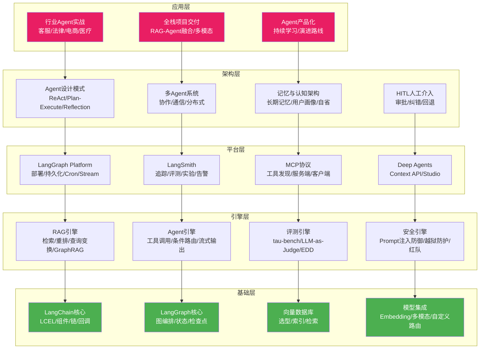
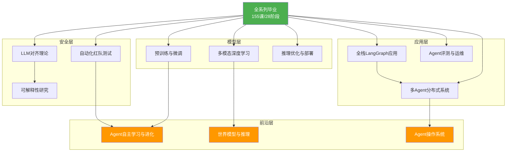

# LangChain/LangGraph 系统学习课程

## 全系列毕业总结与学习地图

---

> **适用对象**：零基础初学者至中高级开发者
> **技术基准**：langchain-core 1.5.3 / langgraph 1.0.7 / CLI 0.4.12 / v0.6 Context API / MCP / Deep Agents / LangSmith Studio / A2A 协议
> **全系列规模**：28 个学习阶段 / 155 课 / 142 篇知识库 / 68 篇附录 / 35 个 README 导读
> **文档版本**：v36.0 毕业收尾版

---

## 一、毕业致辞

恭喜你完成了 LangChain/LangGraph 系统学习课程的全系列学习之旅。

从第 1 课的"什么是 LangChain"出发，到第 155 课的"Agent 流式输出与实时反馈"，你经历了一段从零基础到系统掌握 LLM 应用开发全栈技能的学习旅程。这段旅程覆盖了 28 个学习阶段，累计 155 节课程、142 篇技术知识库、68 篇速查附录与代码模板。

你学到的不仅是 LangChain 和 LangGraph 的 API 用法，更是一整套关于如何设计、构建、部署和运维生产级 LLM 应用的工程方法论。从最基础的 Prompt 工程和链式调用，到复杂的 Agent 记忆系统、多 Agent 协作编排、MCP 协议集成、Human-in-the-Loop 审批工作流，再到生产级监控告警与安全防护——这些知识构成了一名合格 LLM 应用工程师的完整技能树。

本文档是全系列课程的毕业总结，也是你未来回顾与查阅的终极参考手册。它包含以下内容：

- **全系列学习地图**：28 个阶段的完整概览与推荐学习路径
- **核心知识体系全景图**：从基础到高级的知识架构可视化
- **各阶段核心知识点精要**：每阶段 3-5 条关键收获
- **技能清单与自评表**：学完后应具备的全部能力清单
- **推荐进阶实战项目**：基于所学知识的 6 个实战方向
- **进阶学习方向指引**：下一步该学什么
- **全系列完整索引**：所有课程、知识库与附录的完整目录
- **毕业自测题**：20 道综合自测题检验学习成果

让我们一起回顾这段旅程，并为下一阶段的学习做好准备。

---

## 二、全系列学习地图

下图展示了从第 1 阶段到第 28 阶段的完整学习路径，每个阶段都是前一个阶段的自然延伸：

### 学习路径三阶段划分

全系列 28 个阶段可归纳为三大学习板块：

| 学习板块 | 阶段范围 | 核心目标 | 课程数 |
|---------|---------|---------|-------|
| **基础筑基** | 阶段 1-9 | 掌握 LangChain/LangGraph 基础架构、RAG 基础、LCEL 表达式、安全防护、向量数据库、文档解析、Agent 工具集成、高级 RAG 优化、GraphRAG 与代码 Agent | 33 课 |
| **工程进阶** | 阶段 10-21 | 掌握 Agent 安全纵深、幻觉检测、推理优化、多模态、合规治理、多智能体、MCP 协议、多租户架构、企业知识库实战、可观测性、Agent 评测、HITL、LangGraph Platform、LangSmith | 72 课 |
| **高级应用** | 阶段 22-28 | 掌握行业 Agent 实战、Agent 设计模式、论文精读、安全攻防、多模态 Agent、Deep Agents、高级编排、全栈项目交付、Agent 架构演进与记忆系统 | 50 课 |

---

## 三、28 阶段总览表

| 阶段 | 主题 | 知识库范围 | 课程范围 | 核心关键词 |
|:----:|------|:---------:|:-------:|-----------|
| 1 | LangChain 核心架构入门 | KB001-003 | 第1-3课 | 架构总览 / 组件体系 / LCEL基础 |
| 2 | LangGraph 与 API 集成 | KB004-006 | 第4-6课 | 图编排 / API服务 / 生态对比 |
| 3 | LCEL 表达式与高级 RAG | KB007-009 | 第7-9课 | LCEL深入 / 高级RAG / 评估测试 |
| 4 | 安全防护与生产部署 | KB010-013 | 第10-13课 | 内容审核 / 多模态 / 部署 / 最佳实践 |
| 5 | 最佳实践与向量数据库 | KB014-017 | 第14-17课 | 反模式 / 高级模式 / 向量库选型 / RAG架构 |
| 6 | 文档解析与流式处理 | KB018-021 | 第18-21课 | 结构化输出 / Embedding / 多Agent编排 / 流式异步 |
| 7 | Agent 工具与 RAG 优化 | KB022-025 | 第22-25课 | 工具集成 / 记忆系统 / 状态管理 / 重排与查询变换 |
| 8 | 复杂工作流与自定义模型 | KB026-029 | 第26-29课 | 复杂工作流 / Agent评测 / 生产RAG调优 / 自定义模型路由 |
| 9 | GraphRAG 与代码 Agent | KB030-033 | 第30-33课 | GraphRAG / 代码Agent / 时间旅行调试 / AgenticRAG |
| 10 | Agent 安全与幻觉检测 | KB034-037 | 第34-37课 | 安全纵深 / 多租户网关 / 上下文工程 / 幻觉检测 |
| 11 | 推理优化与多模态 Agent | KB038-041 | 第38-41课 | 推理性能 / 微调与RAG协同 / 多模态Agent / 合规隐私 |
| 12 | 合规治理与多智能体框架 | KB042-045 | 第42-45课 | RAG评测RAGAS / 云平台部署 / 多智能体对比 / Agent架构大全 |
| 13 | 新特性与 MCP 生态 | KB046-049 | 第46-49课 | 新特性追踪 / Runtime上下文 / Platform与CLI / MCP协议生态 |
| 14 | 多租户架构与隔离 | KB050-053 | 第50-53课 | 多租户架构 / 数据隔离 / 成本计量配额 / 企业合规运营 |
| 15 | 企业知识库端到端实战 | KB054-057 | 第54-57课 | 知识库搭建 / 文档治理 / 检索问答 / 部署运营 |
| 16 | 可观测性与安全治理 | KB058-061 | 第58-61课 | 可观测性 / 评测CI-CD / 可靠性SLO / 安全成本治理 |
| 17 | MCP 协议深入实战 | KB062-065 | 第62-65课 | MCP握手 / 服务端开发 / 客户端集成 / 鉴权安全部署 |
| 18 | Agent 评测体系 | KB066-069 | 第66-69课 | 评测金字塔 / tau-bench / 自建评测台 / EDD驱动开发 |
| 19 | Human-in-the-Loop | KB070-073 | 第70-73课 | HITL概念 / 审批节点 / 纠错回退 / 生产落地反模式 |
| 20 | LangGraph Platform 与部署 | KB074-077 | 第74-77课 | Platform架构 / 持久化后端 / Cron定时 / Stream Hub |
| 21 | LangSmith 深度解析 | KB078-081 | 第78-81课 | 追踪系统 / 数据集管理 / Playground / 仪表盘告警 |
| 22 | 垂直行业 Agent 实战 | KB082-085 | 第82-85课 | 客服Agent / 法律金融RAG / 电商Agent / 医疗问答 |
| 23 | Agent 设计模式 | KB086-089 | 第86-89课 | ReAct / Plan-and-Execute / Reflection / Multi-Agent协作 |
| 24 | 论文精读与安全攻防 | KB090-097 | 第90-97课 | ReAct/Reflexion/ToT/Self-RAG论文 / Prompt注入 / 越狱 / OWASP / 红队 |
| 25 | 多模态 Agent 与跨模态检索 | KB098-101 | 第98-101课 | 多模态LLM / 图文混排 / 多模态RAG / 语音ASR-TTS |
| 26 | Deep Agents 与评估监控 | KB102-109 | 第102-109课 | DeepAgents / MCP服务 / Context API / Studio / 评估方法 / 评估器 / RAG评估 / 生产监控 |
| 27 | 高级编排与全栈实战 | KB110-125 | 第110-125课 | 高级编排 / HITL / 批处理 / 产品化 / 多Agent系统 / 分布式部署 / Server部署 / 持久化 / 可观测 / 性能调优 / 全栈架构 / RAG-Agent融合 / 多模态Agent / 综合交付 |
| 28 | Agent 架构演进与记忆系统 | KB126-142 | 第126-155课 | 设计模式体系 / 反模式 / 性能优化 / 企业架构 / 生态演进 / 数据平台 / 代码沙箱 / 产品化路径 / 记忆系统 / Store API / 多Agent共享 / 认知架构 / 用户画像 / 条件路由 / 工具集成 / 流式输出 |

---

## 四、核心知识体系全景图

下图展示了全系列课程构建的知识体系架构，从底层基础设施到上层应用的完整技术栈：

---

## 五、各阶段核心知识点精要

### 阶段 1：LangChain 核心架构入门（KB001-003 / 第1-3课）

- LangChain 采用模块化架构：Model I/O、Retrieval、Chains、Agents、Memory、Callbacks 六大组件体系
- LCEL（LangChain Expression Language）是声明式链组合语法，支持流式、异步、批处理和回溯
- 整个生态以 langchain-core 为基座，上层分为 langchain-community（第三方集成）和 langchain-experimental（实验功能）

### 阶段 2：LangGraph 与 API 集成（KB004-006 / 第4-6课）

- LangGraph 将 LLM 应用建模为有向图：节点是处理单元，边是控制流，状态在图中流转
- LangServe 提供 REST API 封装能力，将链和 Agent 暴露为 HTTP 端点
- LangChain 生态与 OpenAI、Anthropic、Google、Cohere 等主流模型提供商深度集成

### 阶段 3：LCEL 表达式与高级 RAG（KB007-009 / 第7-9课）

- LCEL 的核心原语：pipe 操作符 `|`、RunnablePassthrough、RunnableParallel、RunnableLambda
- 高级 RAG 技术栈：多查询检索、上下文压缩、文档分组、父子文档检索
- 评估测试框架：LangSmith 离线评估、LLM-as-Judge 自动评分、人工标注对比

### 阶段 4：安全防护与生产部署（KB010-013 / 第10-13课）

- 内容审核三层防线：输入过滤、过程监控、输出审查
- 多模态模型集成：图像理解、语音识别、视频分析的统一接口
- 生产部署模式：容器化、API 网关、负载均衡、灰度发布
- 最佳实践清单：Prompt 模板管理、错误处理、超时控制、降级策略

### 阶段 5：最佳实践与向量数据库（KB014-017 / 第14-17课）

- 反模式识别：过度嵌套链、硬编码 Prompt、忽略错误处理、缺乏可观测性
- LangGraph 高级模式：子图嵌套、动态图构建、条件分支、循环检测
- 向量数据库选型维度：检索速度、索引类型、过滤能力、扩展性、成本
- RAG 架构模式：Naive RAG / Advanced RAG / Modular RAG 三代演进

### 阶段 6：文档解析与流式处理（KB018-021 / 第18-21课）

- 结构化输出：Pydantic 模型定义、function calling、JSON 模式、输出修复
- Embedding 策略：稠密向量、稀疏向量、多向量检索、ColBERT
- 多 Agent 编排模式：中心化调度、去中心化协作、层级委托、并行扇出
- 流式处理：token 级流式输出、异步编程、背压控制、流式聚合

### 阶段 7：Agent 工具与 RAG 优化（KB022-025 / 第22-25课）

- Agent 工具集成：自定义工具开发、工具描述工程、工具选择策略
- 记忆系统：对话记忆、摘要记忆、向量记忆、实体记忆四种策略
- LangGraph 状态管理：StateGraph 定义、检查点持久化、时间旅行调试
- 高级 RAG 优化：重排序（Cohere Rerank、Cross-Encoder）、查询变换（HyDE、多查询）

### 阶段 8：复杂工作流与自定义模型（KB026-029 / 第26-29课）

- LangGraph 复杂工作流：并行执行、条件路由、子图组合、状态机模式
- Agent 评估框架：任务完成率、工具调用准确率、推理质量、响应延迟
- 生产级 RAG 调优：索引优化、缓存策略、混合检索、查询重写
- 自定义模型集成：模型路由、A/B 测试、回退策略、成本优化

### 阶段 9：GraphRAG 与代码 Agent（KB030-033 / 第30-33课）

- GraphRAG：知识图谱增强检索，实体抽取、关系建模、图谱推理
- 代码 Agent：代码生成、代码执行沙箱、代码审查、自动化测试
- 时间旅行调试：检查点回溯、状态重放、分支调试、对比分析
- AgenticRAG：Agent 自主决策检索策略，动态选择检索源和检索方法

### 阶段 10：Agent 安全与幻觉检测（KB034-037 / 第34-37课）

- Agent 安全纵深防御：输入层、处理层、输出层、基础设施层四层防护
- 多租户 LLM 网关：统一接入、租户隔离、配额管理、审计日志
- 上下文工程：长上下文窗口优化、上下文压缩、上下文窗口管理
- 幻觉检测与可靠性：幻觉分类、检测方法、缓解策略、可靠性工程

### 阶段 11：推理优化与多模态 Agent（KB038-041 / 第38-41课）

- 推理性能优化：KV 缓存、投机解码、批处理、量化压缩
- 微调与 RAG 协同：微调增强检索、RAG 辅助微调、联合优化
- 多模态 Agent：图文理解、视频分析、跨模态推理、统一接口
- LLM 应用合规：隐私保护、数据治理、模型审计、合规框架

### 阶段 12：合规治理与多智能体框架（KB042-045 / 第42-45课）

- RAG 评测体系 RAGAS： faithfulness、answer_relevancy、context_precision、context_recall
- LangGraph 云平台：团队协作、版本管理、实验追踪、模型注册
- 多智能体编排框架对比：LangGraph / AutoGen / CrewAI / MetaGPT
- Agent 架构模式大全：ReAct、Plan-and-Execute、Reflection、Tree of Thoughts

### 阶段 13：新特性与 MCP 生态（KB046-049 / 第46-49课）

- LangChain 新特性全景：Context API、v0.6 变更、弃用迁移指南
- LangGraph Runtime 上下文：运行时配置、依赖注入、上下文传播
- LangGraph Platform 与 CLI：部署模式、配置管理、命令行工具
- MCP（Model Context Protocol）协议：标准化工具发现、能力协商、传输层

### 阶段 14：多租户架构与隔离（KB050-053 / 第50-53课）

- 多租户架构模式：共享数据库隔离、专用数据库、混合隔离
- 租户级数据隔离：行级安全、加密分桶、访问控制列表
- 成本计量配额：Token 用量统计、API 调用计量、配额限流
- 企业级 LLM 平台合规运营：数据驻留、模型治理、审计合规

### 阶段 15：企业知识库端到端实战（KB054-057 / 第54-57课）

- 从零搭建企业知识库问答系统：需求分析、架构设计、技术选型
- 文档治理与数据管线：文档采集、清洗、分块、向量化、索引
- 检索问答链路：混合检索、重排序、答案生成、引用标注
- 系统部署运营：容器化部署、监控告警、持续迭代

### 阶段 16：可观测性与安全治理（KB058-061 / 第58-61课）

- 生产可观测性：日志结构化、指标采集、分布式追踪
- 评测自动化与 CI/CD 门禁：评测流水线、质量门禁、自动回滚
- 可靠性工程：SLO 定义、熔断器、限流、故障注入
- 生产安全与成本治理：安全扫描、成本监控、资源优化

### 阶段 17：MCP 协议深入实战（KB062-065 / 第62-65课）

- MCP 协议深入：JSON-RPC 消息格式、握手流程、能力发现
- MCP 服务端开发：Python SDK、工具注册、资源暴露
- MCP 客户端集成：LangChain/LangGraph 接入 MCP 工具
- MCP 生态实践：鉴权机制、安全策略、生产部署

### 阶段 18：Agent 评测体系（KB066-069 / 第66-69课）

- Agent 评测金字塔：单元测试、集成测试、端到端评测、基准测试
- tau-bench 工具调用评测：评测数据集、运行流程、两阶段评分
- 自建 Agent 评测台：评测集构造、LLM-as-Judge、运行报告
- 评测驱动开发（EDD）：评测先行、CI 门禁、质量拦截

### 阶段 19：Human-in-the-Loop（KB070-073 / 第70-73课）

- HITL 概念全景：人工介入时机、介入方式、恢复策略
- LangGraph 中断恢复机制：interrupt_before、interrupt_after、状态保存
- 工具调用前人工确认：审批节点设计、审批 Prompt、超时处理
- 纠错回退与多轮人机协同：错误检测、回退点设计、多轮交互
- HITL 生产落地反模式：过度依赖人工、审批瓶颈、质量护栏

### 阶段 20：LangGraph Platform 与部署（KB074-077 / 第74-77课）

- LangGraph Platform 架构：三种部署模式（自托管/云托管/Serverless）
- 持久化后端与检查点存储：PostgreSQL、Redis、自定义存储后端
- Cron 定时任务与后台异步任务：调度器、任务队列、异步执行
- Stream Hub 实时流式与 Studio 可视化调试：实时数据流、图可视化

### 阶段 21：LangSmith 深度解析（KB078-081 / 第78-81课）

- LangSmith 追踪系统：trace 树结构、span 分析、性能剖析
- 数据集管理与实验对比：评测数据集、实验版本、A/B 对比
- LangSmith Playground：Prompt 实验、模型对比、参数调优
- 可观测性仪表盘与告警：实时监控、异常检测、告警规则

### 阶段 22：垂直行业 Agent 实战（KB082-085 / 第82-85课）

- 客服 Agent：多轮对话、意图识别、工单创建、知识库检索
- 法律金融 RAG 系统：法规检索、合规审查、风险评估
- 电商购物 Agent：商品搜索、推荐、下单、售后全流程
- 医疗问答 Agent：症状分析、分诊建议、安全合规

### 阶段 23：Agent 设计模式（KB086-089 / 第86-89课）

- ReAct 模式：推理-行动循环、Thought-Action-Observation
- Plan-and-Execute 模式：先规划后执行、任务分解、动态调整
- Reflection 自省模式：自我评估、错误纠正、迭代改进
- Multi-Agent 协作模式：角色分工、消息传递、共识达成

### 阶段 24：论文精读与安全攻防（KB090-097 / 第90-97课）

- ReAct 论文：Reasoning + Acting 的理论基础与代码复现
- Reflexion 论文：自省反馈循环的强化学习框架
- Tree of Thoughts 论文：思维树搜索与回溯
- Self-RAG / CRAG 论文：自适应检索与纠错检索
- Prompt 注入攻击：直接注入、间接注入、防御策略
- 越狱攻击技术：DAN、角色扮演、编码绕过、安全护栏
- OWASP LLM Top 10：系统性安全风险评估框架
- 红队测试方法论：自动化安全测试、漏洞挖掘

### 阶段 25：多模态 Agent 与跨模态检索（KB098-101 / 第98-101课）

- 多模态 LLM 基础架构：视觉编码器、跨模态注意力、视觉问答
- 图文混排处理：版面分析、表格识别、图文融合
- 多模态 RAG 与跨模态检索引擎：CLIP 向量、跨模态对齐
- 语音 ASR-TTS 集成与多模态 Agent：语音输入输出、多模态对话

### 阶段 26：Deep Agents 与评估监控（KB102-109 / 第102-109课）

- Deep Agents 架构：深度推理、长程规划、多层抽象
- MCP 服务器开发与工具集成：服务端实现、工具注册
- Context API 深度解析：上下文传播、状态管理
- LangSmith Studio 可视化调试：图编排可视化、实时调试
- Agent 评估方法论与指标体系：任务完成率、效率、安全
- LangSmith 评估器与自动化测试流水线：批量评测、回归测试
- RAG 评估与检索质量度量：检索准确率、召回率、答案质量
- 生产监控告警与持续改进：实时监控、异常告警、迭代优化

### 阶段 27：高级编排与全栈实战（KB110-125 / 第110-125课）

- LangGraph 高级编排模式：复杂状态机、动态图构建、子图组合
- Human-in-the-Loop 与审批工作流：生产级审批、多级确认
- Agent 批处理与异步任务编排：批量处理、任务调度
- Agent 产品化与工程化最佳实践：版本管理、灰度发布
- 多 Agent 系统架构与通信协议：A2A 协议、消息路由
- LangGraph 多 Agent 编排模式：中心化、去中心化、混合
- 分布式 Agent 部署与远程通信：远程调用、服务发现
- 多 Agent 协作综合应用：协作模式、最佳实践
- LangGraph Server 部署架构与 API 设计：REST API、WebSocket
- 持久化存储与检查点管理：检查点策略、恢复机制
- 可观测性与监控告警体系：全链路追踪、告警分级
- 性能调优与故障排查：性能瓶颈分析、故障定位
- 全栈 LangGraph 应用架构设计：端到端架构
- RAG 与 Agent 融合实战：AgenticRAG 全栈实现
- 多模态 Agent 全栈应用：多模态输入输出、端到端
- 综合项目交付与最佳实践：交付清单、质量保证

### 阶段 28：Agent 架构演进与记忆系统（KB126-142 / 第126-155课）

- Agent 经典设计模式体系：模式目录、适用场景、选型指南
- Agent 架构反模式与避坑指南：常见陷阱、解决方案
- 性能优化与成本控制工程实践：缓存、批处理、模型路由
- 企业级 Agent 架构设计模式：微服务、事件驱动
- LangChain 生态全景与版本演进路线：版本规划、迁移策略
- Agent 与数据平台集成实战：数据管线、ETL
- 代码沙箱与结构化输出深度集成：安全执行、输出验证
- Agent 产品化与持续学习路径：上线运营、持续迭代
- Agent 记忆系统架构与状态持久化：短期/长期记忆、检查点
- LangGraph Store API 高级用法：键值存储、向量检索记忆
- 多 Agent 记忆共享架构与消息路由：共享状态、消息广播
- 记忆系统性能优化与缓存策略：记忆压缩、淘汰策略
- 认知架构设计模式与 Agent 自我反思：元认知、自省循环
- Agent 长期记忆与用户画像系统构建：用户建模、个性化
- LangGraph 条件路由与动态工作流编排：动态分支、路由策略
- Agent 工具集成与动态工具调用策略：工具选择、动态加载
- LangGraph 流式输出与实时反馈系统设计：实时流式、反馈循环

---

## 六、技能清单与自评表

学完全系列 155 课后，你应具备以下能力。请逐项自评（1-5 分）：

### 基础技能（阶段 1-9）

| 序号 | 技能项 | 自评分 |
|:----:|-------|:-----:|
| 1 | 能用 LCEL 语法组合 Runnable 链并理解流式/异步/批处理原理 | /5 |
| 2 | 能用 LangGraph 的 StateGraph 构建有向图工作流 | /5 |
| 3 | 能搭建基础 RAG 系统（文档加载-分块-向量化-检索-生成） | /5 |
| 4 | 能选择合适的向量数据库并配置索引参数 | /5 |
| 5 | 能实现多查询检索、查询变换（HyDE）、重排序等高级 RAG 优化 | /5 |
| 6 | 能开发自定义 Agent 工具并集成到 LangChain 工具体系 | /5 |
| 7 | 能配置对话记忆、摘要记忆、向量记忆等记忆策略 | /5 |
| 8 | 能使用 LangGraph 检查点实现状态持久化与时间旅行调试 | /5 |
| 9 | 能实现 GraphRAG 知识图谱增强检索 | /5 |
| 10 | 能开发代码 Agent 并配置安全执行沙箱 | /5 |

### 工程化技能（阶段 10-21）

| 序号 | 技能项 | 自评分 |
|:----:|-------|:-----:|
| 11 | 能设计 Agent 安全纵深防御方案（输入/处理/输出/基础设施） | /5 |
| 12 | 能检测和缓解 LLM 幻觉问题 | /5 |
| 13 | 能优化推理性能（KV 缓存、批处理、量化） | /5 |
| 14 | 能搭建多租户 LLM 网关并实现租户隔离 | /5 |
| 15 | 能实现企业知识库的端到端数据管线 | /5 |
| 16 | 能搭建生产级可观测性体系（日志/指标/追踪） | /5 |
| 17 | 能用 MCP 协议开发工具服务端并集成到 LangChain | /5 |
| 18 | 能搭建 Agent 评测台并实现 LLM-as-Judge 自动评测 | /5 |
| 19 | 能设计 Human-in-the-Loop 审批工作流 | /5 |
| 20 | 能用 LangGraph Platform 部署应用并配置持久化后端 | /5 |
| 21 | 能用 LangSmith 进行追踪、评测、实验和告警 | /5 |

### 高级应用技能（阶段 22-28）

| 序号 | 技能项 | 自评分 |
|:----:|-------|:-----:|
| 22 | 能开发垂直行业 Agent（客服/法律/电商/医疗） | /5 |
| 23 | 能运用 ReAct/Plan-Execute/Reflection/Multi-Agent 设计模式 | /5 |
| 24 | 能精读并复现 ReAct/Reflexion/ToT/Self-RAG 等论文 | /5 |
| 25 | 能实施 Prompt 注入防御和红队安全测试 | /5 |
| 26 | 能开发多模态 Agent（图文/语音/视频） | /5 |
| 27 | 能设计多 Agent 系统并实现分布式部署 | /5 |
| 28 | 能实现 Agent 记忆系统（Store API/长期记忆/用户画像） | /5 |
| 29 | 能设计认知架构与 Agent 自我反思机制 | /5 |
| 30 | 能实现 LangGraph 条件路由与动态工作流编排 | /5 |
| 31 | 能设计流式输出与实时反馈系统 | /5 |
| 32 | 能交付全栈 LangGraph 应用项目 | /5 |

> **自评标准**：1 分=仅听过概念；2 分=看过代码但没动手；3 分=跟练过示例；4 分=能独立实现；5 分=能优化和教学他人。
> 低于 3 分的项目建议回顾对应阶段的课程和知识库。

---

## 七、推荐进阶实战项目

基于全系列所学知识，推荐以下 6 个进阶实战项目，从易到难排列：

### 项目 1：个人知识助手（难度：中）

**技术栈**：LangChain + RAG + 向量数据库 + 流式输出

**目标**：构建一个能回答个人笔记和文档问题的 RAG 助手

**涉及课程**：第 3-9 课（RAG 基础）、第 25-27 课（高级 RAG）、第 155 课（流式输出）

**关键步骤**：
1. 收集个人文档（笔记、PDF、网页），用文档加载器解析
2. 分块并向量化，存入向量数据库
3. 构建检索-生成链，支持流式输出
4. 加入重排序和查询变换提升检索质量
5. 部署为 Web 服务，支持浏览器访问

### 项目 2：多工具 Agent 助手（难度：中高）

**技术栈**：LangGraph + Agent 工具 + MCP + 记忆系统

**目标**：构建一个能调用多种工具（搜索、代码执行、数据库查询）的智能助手

**涉及课程**：第 22-24 课（工具集成）、第 62-65 课（MCP 协议）、第 147-148 课（记忆系统）

**关键步骤**：
1. 用 MCP 协议开发 2-3 个工具服务（搜索工具、代码执行工具）
2. 在 LangGraph 中构建 Agent 图，集成 MCP 工具
3. 配置对话记忆和长期记忆
4. 加入条件路由实现工具选择策略
5. 用 LangSmith 追踪和评估 Agent 表现

### 项目 3：企业客服 Agent 系统（难度：高）

**技术栈**：LangGraph Platform + RAG + HITL + 多 Agent + 监控

**目标**：构建一个生产级客服 Agent，支持人工转接和知识库检索

**涉及课程**：第 82 课（客服 Agent）、第 70-73 课（HITL）、第 74-77 课（Platform）、第 78-81 课（LangSmith）

**关键步骤**：
1. 设计客服 Agent 架构：意图识别-知识库检索-答案生成-人工转接
2. 用 LangGraph 实现多 Agent 协作（路由 Agent + 检索 Agent + 回答 Agent）
3. 集成 HITL 审批节点：低置信度时转人工
4. 用 LangGraph Platform 部署，配置持久化后端
5. 用 LangSmith 搭建监控告警体系

### 项目 4：多模态文档分析 Agent（难度：高）

**技术栈**：多模态 LLM + RAG + LangGraph + 流式输出

**目标**：构建一个能分析图文混排文档（合同、报告、说明书）的 Agent

**涉及课程**：第 98-101 课（多模态）、第 40 课（多模态 Agent）、第 124 课（多模态全栈）

**关键步骤**：
1. 用多模态 LLM 解析文档版面、表格、图片
2. 构建多模态 RAG 管线：图文联合检索
3. 用 LangGraph 编排分析流程：版面分析-内容提取-理解-摘要
4. 支持用户多模态提问（上传图片 + 文字描述）
5. 流式输出分析结果

### 项目 5：Agent 评测平台（难度：高）

**技术栈**：LangSmith + 评测框架 + tau-bench + CI/CD

**目标**：搭建一个 Agent 评测平台，实现评测驱动开发

**涉及课程**：第 66-69 课（评测体系）、第 106-109 课（评估方法）、第 58-59 课（CI/CD）

**关键步骤**：
1. 设计评测指标体系：任务完成率、工具准确率、响应延迟
2. 构建评测数据集，标注 golden answer
3. 实现 LLM-as-Judge 自动评测
4. 搭建评测流水线，集成到 CI/CD 门禁
5. 可视化评测结果，支持版本对比

### 项目 6：全栈 LangGraph 应用（难度：极高）

**技术栈**：全栈技术 + LangGraph Server + 多 Agent + MCP + 监控 + 安全

**目标**：交付一个生产级全栈 LLM 应用

**涉及课程**：第 122-125 课（全栈实战）、第 118-121 课（Server 部署）、第 94-97 课（安全）

**关键步骤**：
1. 设计端到端架构：前端-网关-Agent 服务-数据层
2. 实现多 Agent 协作系统（A2A 协议）
3. 集成 MCP 工具生态
4. 配置 LangGraph Server 部署、持久化、Cron 任务
5. 搭建完整可观测性、安全防护、成本治理体系
6. 通过红队安全测试和性能压测

---

## 八、进阶学习方向指引

完成本系列课程后，以下方向值得继续深入：

### 方向 1：LLM 训练与微调

本课程聚焦应用层开发，若要深入模型层，建议学习：
- 预训练原理：Transformer 架构、训练数据、Scaling Law
- 指令微调：SFT、LoRA、QLoRA、PEFT
- 对齐训练：RLHF、DPO、PPO
- 推理优化：vLLM、TensorRT-LLM、量化部署

### 方向 2：多模态深度学习

本课程第 25 阶段和阶段 26 涉及多模态基础，若要深入：
- 视觉-语言模型：CLIP、BLIP-2、LLaVA 架构原理
- 视频理解：Video-LLM、时序建模
- 语音模型：Whisper、VALL-E、语音克隆
- 3D 多模态：点云-语言对齐

### 方向 3：Agent 自主学习与进化

本课程第 28 阶段涉及记忆系统，若要深入 Agent 自主进化：
- 自主学习：Agent 自主收集数据、训练、评估
- 元学习：学会学习、快速适应新任务
- 世界模型：环境建模、反事实推理
- Agent 操作系统：多 Agent 资源调度、生命周期管理

### 方向 4：LLM 安全与对齐

本课程第 24 阶段涉及安全攻防，若要深入：
- 对齐理论：Constitutional AI、Scalable Oversight
- 安全评测：AdvBench、HarmBench、自动化红队
- 可解释性：Mechanistic Interpretability、探针分析
- 安全对齐：Constitutional AI、Red Teaming at Scale

### 方向 5：分布式 Agent 系统

本课程第 27 阶段涉及分布式部署，若要深入：
- Agent 编排语言：A2A 协议、Agent 通信标准
- 分布式共识：多 Agent 决策、冲突解决
- Agent 市场：服务发现、定价、交易
- Agent 操作系统：资源管理、隔离、调度

### 技能树发展路径图

---

## 九、全系列完整索引

### 9.1 知识库索引（KB001-KB142）

| 编号 | 标题 | 所属阶段 |
|:----:|------|:-------:|
| KB001 | LangChain核心架构技术参考 | 1 |
| KB002 | LangChain组件详解技术手册 | 1 |
| KB003 | 数据连接与RAG技术手册 | 1 |
| KB004 | LangGraph技术参考 | 2 |
| KB005 | API集成与部署技术参考 | 2 |
| KB006 | 生态对比与模型集成数据表 | 2 |
| KB007 | LCEL表达式语言深入技术参考 | 3 |
| KB008 | 高级RAG与检索策略技术手册 | 3 |
| KB009 | 评估测试与成本优化技术参考 | 3 |
| KB010 | 安全防护与内容审核技术参考 | 4 |
| KB011 | 多模态与高级模型集成技术手册 | 4 |
| KB012 | 生产部署模式与可观测性技术参考 | 4 |
| KB013 | 最佳实践与反模式手册 | 4 |
| KB014 | LangGraph高级模式技术手册 | 5 |
| KB015 | 向量数据库选型与对比技术参考 | 5 |
| KB016 | RAG架构模式技术手册 | 5 |
| KB017 | 文档解析与数据预处理技术参考 | 5 |
| KB018 | 结构化输出与函数调用技术手册 | 6 |
| KB019 | Embedding模型与策略技术参考 | 6 |
| KB020 | 多Agent编排模式技术手册 | 6 |
| KB021 | 流式处理与异步编程技术参考 | 6 |
| KB022 | Agent工具集成与自定义工具开发 | 7 |
| KB023 | 记忆系统架构与策略技术参考 | 7 |
| KB024 | LangGraph状态管理与检查点技术手册 | 7 |
| KB025 | 高级RAG优化:重排与查询变换 | 7 |
| KB026 | LangGraph复杂工作流模式技术手册 | 8 |
| KB027 | Agent评估与测试框架技术参考 | 8 |
| KB028 | 生产级RAG系统调优技术参考 | 8 |
| KB029 | 自定义模型集成与路由技术手册 | 8 |
| KB030 | GraphRAG知识图谱增强检索 | 9 |
| KB031 | 代码Agent开发技术手册 | 9 |
| KB032 | 时间旅行与LangGraph调试 | 9 |
| KB033 | AgenticRAG自主检索技术手册 | 9 |
| KB034 | Agent安全纵深防御技术手册 | 10 |
| KB035 | 多租户LLM网关与统一接入架构 | 10 |
| KB036 | 上下文工程与长上下文优化 | 10 |
| KB037 | 幻觉检测与可靠性工程技术手册 | 10 |
| KB038 | 推理性能优化与延迟工程技术手册 | 11 |
| KB039 | 微调与RAG协同架构技术手册 | 11 |
| KB040 | 多模态Agent与多模态RAG技术手册 | 11 |
| KB041 | LLM应用合规隐私与治理技术手册 | 11 |
| KB042 | RAG评测体系与RAGAS实操 | 12 |
| KB043 | LangGraph云平台与团队协作部署 | 12 |
| KB044 | 多智能体编排框架对比与选型 | 12 |
| KB045 | Agent架构模式大全技术手册 | 12 |
| KB046 | LangChain新特性全景追踪 | 13 |
| KB047 | LangGraph新版Runtime上下文 | 13 |
| KB048 | LangGraph平台与CLI技术手册 | 13 |
| KB049 | MCP协议与新特性生态整合 | 13 |
| KB050 | 多租户架构与隔离策略 | 14 |
| KB051 | 租户级数据隔离与检索安全 | 14 |
| KB052 | 成本计量配额与用量治理 | 14 |
| KB053 | 企业级LLM平台合规运营 | 14 |
| KB054 | 端到端实战:从零搭建企业知识库 | 15 |
| KB055 | 企业知识库的文档治理与数据管线 | 15 |
| KB056 | 检索问答链路实战与质量评测 | 15 |
| KB057 | 系统部署运营与持续迭代 | 15 |
| KB058 | 生产可观测性:日志指标与追踪 | 16 |
| KB059 | 评测自动化与CI/CD门禁 | 16 |
| KB060 | 可靠性工程:SLO熔断与故障演练 | 16 |
| KB061 | 生产安全与成本治理 | 16 |
| KB062 | MCP协议深入:消息握手与工具发现 | 17 |
| KB063 | MCP服务端开发:PythonSDK自建工具 | 17 |
| KB064 | MCP客户端集成:LangChain/LangGraph | 17 |
| KB065 | MCP生态与生产实践:鉴权安全部署 | 17 |
| KB066 | Agent评测全景:金字塔四类基准 | 18 |
| KB067 | tau-bench工具调用评测实战 | 18 |
| KB068 | 自建Agent评测台:评测集与Judge | 18 |
| KB069 | 评测驱动开发EDD与CI门禁 | 18 |
| KB070 | HITL概念全景与中断恢复机制 | 19 |
| KB071 | 工具调用前人工确认与审批节点 | 19 |
| KB072 | 纠错回退与多轮人机协同 | 19 |
| KB073 | HITL生产落地反模式与质量护栏 | 19 |
| KB074 | LangGraph Platform架构与部署模式 | 20 |
| KB075 | 持久化后端与检查点存储实战 | 20 |
| KB076 | Cron定时任务与后台异步任务 | 20 |
| KB077 | Stream Hub实时流式与Studio | 20 |
| KB078 | LangSmith追踪系统深度解析 | 21 |
| KB079 | 数据集管理与实验对比 | 21 |
| KB080 | LangSmith Playground与提示词实验 | 21 |
| KB081 | LangSmith可观测性仪表盘与告警 | 21 |
| KB082 | 客服Agent端到端项目实战 | 22 |
| KB083 | 法律金融行业RAG系统实战 | 22 |
| KB084 | 电商购物Agent全流程实战 | 22 |
| KB085 | 医疗问答Agent安全合规实战 | 22 |
| KB086 | ReAct推理行动模式深度解析 | 23 |
| KB087 | Plan-and-Execute规划执行模式 | 23 |
| KB088 | Reflection自省纠错模式 | 23 |
| KB089 | Multi-Agent协作模式大全 | 23 |
| KB090 | ReAct论文精读与代码复现 | 24 |
| KB091 | Reflexion论文精读与代码复现 | 24 |
| KB092 | Tree-of-Thoughts论文精读与复现 | 24 |
| KB093 | Self-RAG与CRAG论文精读与复现 | 24 |
| KB094 | Prompt注入攻击原理与防御 | 24 |
| KB095 | 越狱攻击技术与安全护栏构建 | 24 |
| KB096 | OWASP LLM Top10与系统化安全评估 | 24 |
| KB097 | 红队测试方法论与自动化安全测试 | 24 |
| KB098 | 多模态LLM基础架构与视觉问答 | 25 |
| KB099 | 图文混排处理与视觉文档解析 | 25 |
| KB100 | 多模态RAG与跨模态检索引擎 | 25 |
| KB101 | 语音ASR-TTS集成与多模态Agent | 25 |
| KB102 | Deep Agents架构原理与核心概念 | 26 |
| KB103 | MCP服务器开发与工具集成 | 26 |
| KB104 | Context API深度解析与状态管理 | 26 |
| KB105 | LangSmith Studio可视化调试与编排 | 26 |
| KB106 | Agent评估方法论与评估指标体系 | 26 |
| KB107 | LangSmith评估器与自动化测试流水线 | 26 |
| KB108 | RAG评估与检索质量度量 | 26 |
| KB109 | 生产监控告警与持续改进 | 26 |
| KB110 | LangGraph高级编排模式与复杂状态机 | 27 |
| KB111 | Human-in-the-loop人工介入与审批 | 27 |
| KB112 | Agent批处理与异步任务编排 | 27 |
| KB113 | Agent产品化与工程化最佳实践 | 27 |
| KB114 | 多Agent系统架构与通信协议 | 27 |
| KB115 | LangGraph多Agent编排模式深度解析 | 27 |
| KB116 | 分布式Agent部署与远程通信 | 27 |
| KB117 | 多Agent协作综合应用与最佳实践 | 27 |
| KB118 | LangGraph Server部署架构与API设计 | 27 |
| KB119 | 持久化存储与检查点管理 | 27 |
| KB120 | 可观测性与监控告警体系 | 27 |
| KB121 | 性能调优与故障排查 | 27 |
| KB122 | 全栈LangGraph应用架构设计 | 27 |
| KB123 | RAG与Agent融合实战 | 27 |
| KB124 | 多模态Agent全栈应用 | 27 |
| KB125 | 综合项目交付与最佳实践 | 27 |
| KB126 | Agent经典设计模式体系详解 | 28 |
| KB127 | Agent架构反模式与避坑指南 | 28 |
| KB128 | 性能优化与成本控制工程实践 | 28 |
| KB129 | 企业级Agent架构设计模式 | 28 |
| KB130 | LangChain生态全景与版本演进路线 | 28 |
| KB131 | Agent与数据平台集成实战 | 28 |
| KB132 | 代码沙箱与结构化输出深度集成 | 28 |
| KB133 | Agent产品化与持续学习路径 | 28 |
| KB134 | Agent记忆系统架构与状态持久化 | 28 |
| KB135 | LangGraph Store API高级用法 | 28 |
| KB136 | 多Agent记忆共享架构与消息路由 | 28 |
| KB137 | 记忆系统性能优化与缓存策略 | 28 |
| KB138 | 认知架构设计模式与Agent自我反思 | 28 |
| KB139 | Agent长期记忆与用户画像系统 | 28 |
| KB140 | LangGraph条件路由与动态工作流编排 | 28 |
| KB141 | Agent工具集成与动态工具调用策略 | 28 |
| KB142 | LangGraph流式输出与实时反馈系统 | 28 |

### 9.2 学习课程索引（第1-155课）

| 阶段 | 课程范围 | 核心主题 |
|:----:|:-------:|---------|
| 1 | 第1-3课 | LangChain 核心架构：模块组件、链式调用、Runnable 体系 |
| 2 | 第4-6课 | LangGraph 图编排、API 部署、生态对比 |
| 3 | 第7-9课 | LCEL 表达式深入、高级 RAG 检索、评估测试入门 |
| 4 | 第10-13课 | 安全防护、多模态集成、生产部署、最佳实践 |
| 5 | 第14-17课 | 反模式识别、LangGraph 高级模式、向量库选型、RAG 架构 |
| 6 | 第18-21课 | 结构化输出、Embedding 策略、多 Agent 编排、流式处理 |
| 7 | 第22-25课 | Agent 工具开发、记忆系统、状态管理、RAG 重排与查询变换 |
| 8 | 第26-29课 | 复杂工作流、Agent 评估、RAG 调优、自定义模型路由 |
| 9 | 第30-33课 | GraphRAG、代码 Agent、时间旅行调试、AgenticRAG |
| 10 | 第34-37课 | Agent 安全纵深、多租户网关、上下文工程、幻觉检测 |
| 11 | 第38-41课 | 推理性能优化、微调 RAG 协同、多模态 Agent、合规隐私 |
| 12 | 第42-45课 | RAGAS 评测、云平台部署、多智能体对比、Agent 架构大全 |
| 13 | 第46-49课 | 新特性追踪、Runtime 上下文、Platform/CLI、MCP 协议生态 |
| 14 | 第50-53课 | 多租户架构、数据隔离、成本配额、企业合规运营 |
| 15 | 第54-57课 | 企业知识库搭建、文档治理、检索问答、部署运营 |
| 16 | 第58-61课 | 可观测性、CI/CD 评测门禁、可靠性 SLO、安全成本治理 |
| 17 | 第62-65课 | MCP 协议深入、服务端开发、客户端集成、鉴权安全部署 |
| 18 | 第66-69课 | 评测金字塔、tau-bench 实战、自建评测台、EDD 驱动开发 |
| 19 | 第70-73课 | HITL 概念、审批节点、纠错回退、生产落地反模式 |
| 20 | 第74-77课 | Platform 架构、持久化后端、Cron 定时、Stream Hub |
| 21 | 第78-81课 | LangSmith 追踪、数据集管理、Playground、仪表盘告警 |
| 22 | 第82-85课 | 客服 Agent、法律金融 RAG、电商 Agent、医疗问答 |
| 23 | 第86-89课 | ReAct 模式、Plan-Execute 模式、Reflection 模式、Multi-Agent |
| 24 | 第90-97课 | ReAct/Reflexion/ToT/Self-RAG 论文、Prompt 注入、越狱、OWASP、红队 |
| 25 | 第98-101课 | 多模态 LLM、图文混排、多模态 RAG、语音 ASR-TTS |
| 26 | 第102-109课 | Deep Agents、MCP 服务、Context API、Studio、评估方法、评估器、RAG 评估、生产监控 |
| 27 | 第110-125课 | 高级编排、HITL、批处理、产品化、多 Agent 系统、分布式部署、Server 部署、持久化、可观测、性能调优、全栈架构、RAG-Agent 融合、多模态全栈、综合交付 |
| 28 | 第126-155课 | 设计模式体系、反模式、性能优化、企业架构、生态演进、数据平台、代码沙箱、产品化路径、记忆系统、Store API、多 Agent 共享、认知架构、用户画像、条件路由、工具集成、流式输出 |

### 9.3 附录索引（附录A-附录BP）

| 编号 | 标题 | 类型 |
|:----:|------|------|
| 附录A | 环境搭建与快速入门指南 | 速查手册 |
| 附录B | 术语表与API速查卡 | 速查手册 |
| 附录C | 常见错误与故障排除速查手册 | 速查手册 |
| 附录D | 实战项目模板代码集 | 代码模板 |
| 附录E | 端到端项目实战:企业知识库问答系统 | 实战指南 |
| 附录F | LangChain生态地图与集成指南 | 生态导航 |
| 附录G | Prompt工程工具箱:模板与模式 | 代码模板 |
| 附录H | LangSmith与可观测性深度指南 | 深度指南 |
| 附录I | LangChain Callbacks与事件系统指南 | 深度指南 |
| 附录J | LangChain版本迁移与升级指南 | 迁移指南 |
| 附录K | LangServe与API服务部署指南 | 部署指南 |
| 附录L | LangChain测试策略与最佳实践 | 最佳实践 |
| 附录M | 前端集成指南 | 集成指南 |
| 附录N | 数据库Agent与Text-to-SQL深入指南 | 深度指南 |
| 附录O | 生产监控与告警体系指南 | 运维指南 |
| 附录P | 企业知识库建设与治理指南 | 治理指南 |
| 附录Q | 生产上线检查清单 | 速查手册 |
| 附录R | 进阶学习路线与资源导航 | 学习导航 |
| 附录S | RAG故障诊断速查手册 | 速查手册 |
| 附录T | LLM应用架构蓝图与组件速查 | 速查手册 |
| 附录U | 版本升级迁移速查手册 | 速查手册 |
| 附录V | 新特性更新日志导读与生态导航 | 生态导航 |
| 附录W | 多租户架构选型速查手册 | 速查手册 |
| 附录X | 租户运营指标与SLA速查 | 速查手册 |
| 附录Y | 端到端实战速查卡:命令配置与检查清单 | 速查手册 |
| 附录Z | 全系列知识地图与自测题 | 知识地图 |
| 附录AA | 生产运行命令速查与检查清单 | 速查手册 |
| 附录AB | 故障演练剧本与复盘模板 | 运维模板 |
| 附录AC | MCP消息格式与命令速查手册 | 速查手册 |
| 附录AD | MCP服务部署与安全检查清单 | 速查手册 |
| 附录AE | Agent评测基准速查手册 | 速查手册 |
| 附录AF | 评测集构造与Judge提示词模板库 | 代码模板 |
| 附录AG | Human-in-the-Loop速查手册 | 速查手册 |
| 附录AH | HITL代码模板与审批提示词库 | 代码模板 |
| 附录AI | LangGraph Platform速查手册 | 速查手册 |
| 附录AJ | LangGraph Platform部署配置模板库 | 代码模板 |
| 附录AK | LangSmith速查手册 | 速查手册 |
| 附录AL | LangSmith追踪与实验代码模板库 | 代码模板 |
| 附录AM | 垂直行业Agent项目速查手册 | 速查手册 |
| 附录AN | 垂直行业Agent代码模板库 | 代码模板 |
| 附录AO | Agent设计模式速查手册 | 速查手册 |
| 附录AP | Agent设计模式代码模板库 | 代码模板 |
| 附录AQ | AI Agent论文阅读指南与必读清单 | 论文指南 |
| 附录AR | 论文复现代码模板库 | 代码模板 |
| 附录AS | LLM安全检查清单与防御速查手册 | 速查手册 |
| 附录AT | 安全攻防代码模板库 | 代码模板 |
| 附录AU | 多模态开发速查手册与模型选型指南 | 速查手册 |
| 附录AV | 多模态代码模板库 | 代码模板 |
| 附录AW | Deep Agents与MCP速查手册 | 速查手册 |
| 附录AX | Deep Agents代码模板库 | 代码模板 |
| 附录AY | Agent评估与监控速查手册 | 速查手册 |
| 附录AZ | 评估测试与监控代码模板库 | 代码模板 |
| 附录BA | 高级编排与HITL速查手册 | 速查手册 |
| 附录BB | 编排与批处理代码模板库 | 代码模板 |
| 附录BC | 多Agent系统速查手册 | 速查手册 |
| 附录BD | 多Agent编排代码模板库 | 代码模板 |
| 附录BE | 生产部署速查手册 | 速查手册 |
| 附录BF | 生产部署代码模板库 | 代码模板 |
| 附录BG | 全栈项目模板库 | 代码模板 |
| 附录BH | 全系列知识地图与速查手册 | 知识地图 |
| 附录BI | Agent设计模式代码模板库 | 代码模板 |
| 附录BJ | 工程化检查清单与反模式速查 | 速查手册 |
| 附录BK | 生态前沿代码模板与配置参考 | 代码模板 |
| 附录BL | 产品化检查清单与学习资源速查 | 速查手册 |
| 附录BM | 记忆系统代码模板与配置参考 | 代码模板 |
| 附录BN | 记忆系统调试工具与性能指标速查 | 速查手册 |
| 附录BO | 路由与工具集成代码速查 | 速查手册 |
| 附录BP | 流式输出与前端集成速查 | 速查手册 |

### 附录类型统计

| 类型 | 数量 | 说明 |
|------|:----:|------|
| 速查手册 | 28 | 命令/配置/参数速查 |
| 代码模板 | 21 | 可复制粘贴的代码模板库 |
| 深度指南 | 5 | 特定主题的深入讲解 |
| 实战指南 | 3 | 端到端项目实战 |
| 运维指南 | 2 | 生产运维相关 |
| 知识地图 | 2 | 全系列知识地图与自测 |
| 迁移指南 | 2 | 版本升级迁移 |
| 部署指南 | 2 | 部署相关 |
| 生态导航 | 2 | 生态地图与资源导航 |
| 治理指南 | 1 | 知识库治理 |
| **合计** | **68** | |

---

## 十、毕业自测题

以下 20 道综合自测题覆盖全系列核心知识点，检验你的学习成果：

### 基础篇（阶段 1-9）

**第 1 题**：请描述 LCEL 的 pipe 操作符 `|` 的工作原理，并说明它相比传统函数调用链的优势。

**第 2 题**：LangGraph 中的 StateGraph 与传统的 LangChain Chain 有什么本质区别？请举一个适合用 StateGraph 而不适合用普通 Chain 的场景。

**第 3 题：** 在 RAG 系统中，文档分块的 chunk_size 和 chunk_overlap 参数如何影响检索质量？你会如何选择合适的值？

**第 4 题**：请解释 LangGraph 检查点（Checkpoint）的作用，并说明"时间旅行调试"是如何基于检查点实现的。

**第 5 题**：GraphRAG 与传统向量 RAG 在检索机制上有什么根本区别？各自适合什么场景？

### 工程化篇（阶段 10-21）

**第 6 题**：设计一个 Agent 安全纵深防御方案，要求覆盖输入层、处理层和输出层。

**第 7 题**：在多租户 LLM 网关中，如何实现租户间的数据隔离？请描述至少两种隔离方案及其优缺点。

**第 8 题**：什么是 MCP 协议？它解决了 Agent 工具集成的什么痛点？请描述 MCP 客户端发现工具的流程。

**第 9 题**：请设计一个 Agent 评测流水线，要求包含评测集构造、自动评测、CI 门禁三个环节。

**第 10 题**：LangGraph 的 interrupt_before 和 interrupt_after 有什么区别？请举一个需要人工审批的 Agent 工作流场景。

**第 11 题**：LangSmith 的 trace 树结构是什么？如何用 trace 数据定位 Agent 的性能瓶颈？

### 高级应用篇（阶段 22-28）

**第 12 题**：ReAct 模式的 Thought-Action-Observation 循环是如何工作的？它相比直接调用 LLM 有什么优势？

**第 13 题**：请描述 Prompt 注入攻击的两种主要类型（直接注入和间接注入），并给出各自的防御策略。

**第 14 题**：多模态 RAG 系统如何实现跨模态检索？请描述 CLIP 向量在跨模态对齐中的作用。

**第 15 题**：Deep Agents 与普通 Agent 的核心区别是什么？Context API 在其中扮演什么角色？

**第 16 题**：在多 Agent 系统中，A2A（Agent-to-Agent）通信协议需要解决哪些关键问题？

**第 17 题**：LangGraph Store API 如何实现长期记忆？它与检查点持久化有什么区别？

**第 18 题**：请描述用户画像系统的数据模型，并说明 Agent 如何利用用户画像实现个性化响应。

**第 19 题**：条件路由与静态路由在 LangGraph 工作流中有什么区别？请举一个需要条件路由的场景。

**第 20 题**：流式输出对用户体验有什么影响？请描述 LangGraph 中实现流式输出的技术方案。

### 自测评分标准

| 答对题数 | 评级 | 建议 |
|:-------:|:----:|------|
| 18-20 | 优秀 | 具备独立开发生产级 LLM 应用的能力，可挑战高级项目 |
| 14-17 | 良好 | 基础扎实，建议针对薄弱阶段进行专项复习 |
| 10-13 | 合格 | 已掌握核心概念，建议动手实践巩固理解 |
| 6-9 | 需加强 | 建议回顾对应阶段的课程和知识库，重点动手实践 |
| 0-5 | 需重学 | 建议从阶段 1 重新开始，配合代码实践逐步推进 |

---

## 十一、全系列数据统计

### 内容规模

| 指标 | 数量 |
|------|:----:|
| 学习阶段 | 28 |
| 学习课程 | 155 课 |
| 知识库 | 142 篇 |
| 附录 | 68 篇 |
| README 导读 | 35 篇 |
| Mermaid 图表（嵌入） | 300+ 张 |
| 双格式文件（DOCX+PDF） | 800+ 份 |

### 技术覆盖

| 技术领域 | 覆盖阶段 | 核心技术 |
|---------|:-------:|---------|
| LangChain 核心 | 1-3, 13 | LCEL、Runnable、组件体系、Callbacks |
| LangGraph 编排 | 2, 5, 8, 20, 27, 28 | StateGraph、检查点、条件路由、流式输出 |
| RAG 系统 | 1, 3, 5-9, 15, 25, 27 | 文档解析、向量检索、重排序、GraphRAG、AgenticRAG |
| Agent 架构 | 7, 12, 23, 26-28 | ReAct、Plan-Execute、Reflection、Multi-Agent、Deep Agents |
| 安全防护 | 4, 10, 24 | 纵深防御、Prompt注入、越狱、OWASP、红队测试 |
| 评测体系 | 3, 8, 18, 26 | tau-bench、LLM-as-Judge、EDD、CI门禁 |
| HITL | 19, 27 | 中断恢复、审批节点、纠错回退 |
| MCP 协议 | 13, 17, 26 | 握手、服务端、客户端、生态实践 |
| 多模态 | 4, 11, 25, 27 | 视觉问答、图文混排、跨模态检索、语音集成 |
| 生产部署 | 4, 12, 14, 16, 20, 27 | 容器化、Platform、持久化、可观测性、性能调优 |
| 记忆系统 | 7, 28 | 对话记忆、Store API、长期记忆、用户画像、认知架构 |

### 版本演进历程

| 版本 | 里程碑 | 课程数 | 阶段数 |
|------|--------|:------:|:------:|
| v1.0 | 项目启动 | 0 | 0 |
| v27.0 | 阶段1-24完成 | 118 | 24 |
| v30.0 | 阶段25完成 | 130 | 25 |
| v33.0 | 阶段26完成 | 142 | 26 |
| v34.0 | 阶段27完成 | 146 | 27 |
| v35.0 | 阶段28第1批 | 147 | 28 |
| v35b | 阶段28第2批 | 151 | 28 |
| v35c | 阶段28第3批 | 155 | 28 |
| **v36.0** | **毕业收尾** | **155** | **28** |

---

## 十二、结语

### 你已经走了多远

回顾这段学习旅程，你从零开始，系统掌握了：

- **LangChain 全栈技术**：从 LCEL 表达式到组件体系，从链式调用到 Agent 编排
- **LangGraph 图编排引擎**：从基础 StateGraph 到复杂状态机、条件路由、流式输出
- **RAG 全链路工程**：从文档解析到向量检索，从基础 RAG 到 GraphRAG、AgenticRAG
- **Agent 设计模式**：从 ReAct 到 Plan-Execute，从单 Agent 到多 Agent 协作
- **生产级工程实践**：从安全防护到可观测性，从评测体系到 CI/CD 门禁
- **前沿技术生态**：从 MCP 协议到 Deep Agents，从多模态到认知架构

### 这不是终点

技术永远在演进。LangChain 和 LangGraph 的版本会持续更新，新的 Agent 架构模式会不断涌现，MCP 生态会持续扩展。这份毕业总结不是学习的终点，而是你进入更深层次探索的起点。

保持以下习惯：
1. **持续动手实践**——每学一个新概念，立刻写代码验证
2. **关注版本更新**——LangChain/LangGraph 迭代频繁，定期查看更新日志
3. **参与社区讨论**——GitHub Issues、Discord、技术博客是最好的学习资源
4. **构建自己的项目**——把所学知识整合成一个完整的个人项目
5. **分享与教学**——最好的学习方式是教别人

### 致谢

感谢你完成了这 155 课的学习旅程。每一篇知识库、每一节课程、每一张图表，都是为了让你从零基础成长为一名合格的 LLM 应用工程师。

愿你在 AI 工程的道路上，持续精进，构建出改变世界的产品。

---

> **文档版本**：v36.0 毕业收尾版
> **生成日期**：2026-08-31
> **全系列累计**：28 阶段 / 155 课 / 142 知识库 / 68 附录 / 35 README
> **技术基准**：langchain-core 1.5.3 / langgraph 1.0.7 / CLI 0.4.12 / v0.6 Context API / MCP / Deep Agents / LangSmith Studio / A2A 协议
> **适用对象**：零基础初学者至中高级开发者
> **双格式交付**：本文档同时提供 DOCX 与 PDF 两种格式

---

*LangChain/LangGraph 系统学习课程 — 全系列毕业总结*
