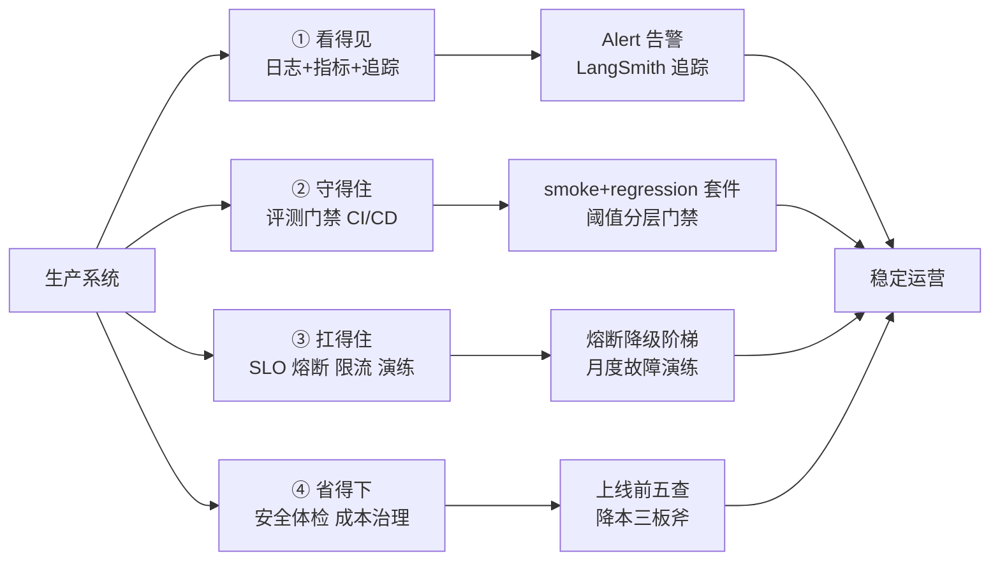

# 附录 AA 生产运行命令速查与检查清单

> 定位：工程工具。配套知识库 58-61 与学习课程 62-65，汇总生产运营中最常用的命令、端口、配置与检查清单，贴在工位上随时翻。

本文档覆盖生产运营四大支柱：看得见（可观测性）、守得住（评测门禁）、扛得住（可靠性）、省得下（安全与成本）。一张图看懂：



---

## 1. 可观测性命令速查

| 用途 | 命令/配置 | 说明 |
| --- | --- | --- |
| 启动指标端点 | `start_http_server(9100)` | Prometheus 指标端口 |
| 查看指标 | `curl -s localhost:9100/metrics \| grep qa_` | 过滤本项目指标 |
| 查询延迟分位 | `curl -s localhost:9100/metrics \| grep qa_latency_seconds` | 有 histogram 桶 |
| 开启 LangSmith 追踪 | `export LANGCHAIN_TRACING_V2=true` | 自动上报链路 |
| 手动链路计时 | 记录 `retrieve_ms` / `llm_ms` | 定位慢在哪一环 |
| 结构化日志格式 | JSON + `trace_id` + `event` | 机器可检索 |

常用指标命名约定：

```text
<app>_requests_total        # 请求总量，带 status label
<app>_latency_seconds       # Histogram 延迟
<app>_tokens_total          # token 消耗计数
<app>_errors_total          # 错误计数，带 type label
```

---

## 2. 评测门禁命令速查

| 用途 | 命令 | 说明 |
| --- | --- | --- |
| 跑冒烟集 | `python gate.py --suite evals/smoke.json --pass-rate 0.9` | 快、严 |
| 跑回归集 | `python gate.py --suite evals/regression.json --pass-rate 0.8` | 全、宽 |
| 查看退出码 | `echo $?` | 0=通过，1=拦截 |
| CI 触发条件 | `paths: ["src/**", "prompts/**", "evals/**"]` | 减少无效跑 |

评测集分层标准：

| 分层 | 规模 | 用途 | 通过阈值建议 |
| --- | --- | --- | --- |
| 冒烟 | 10-20 题 | 提交即检 | ≥ 0.9 |
| 回归 | 50-200 题 | 变更必检 | ≥ 0.8 |
| 冠军 | 20-50 题 | 上线把关 | ≥ 0.85 |

---

## 3. 可靠性命令速查

| 用途 | 方案 | 参数建议 |
| --- | --- | --- |
| 超时 | 客户端超时 | 首次 10-30s |
| 重试 | tenacity 指数退避 | 最多 2-3 次，max 4s |
| 熔断 | CircuitBreaker | 连续 5 次失败打开，30s 后探测 |
| 限流 | TokenBucket | 按配额 5 rps / 桶 10 |
| 降级阶梯 | 完整→摘要→关键词→固定语 | 逐级兜底 |

```text
可用性换算（每月）：
99.9%  ≈ 43 分钟停机
99.95% ≈ 21 分钟
99.99% ≈ 4.3 分钟
```

---

## 4. 安全与成本检查清单

### 4.1 上线前安全五查

- [ ] Prompt 注入测试：输入"忽略之前指令…"不泄露系统提示
- [ ] 越权访问测试：他人账号无法读他人数据
- [ ] 密钥扫描：代码/日志/环境变量无明文 key
- [ ] 非法内容输入有拒绝机制
- [ ] 依赖漏洞扫描（`pip-audit`）高危清零

### 4.2 成本公式速记

```text
单请求成本 ≈ (输入K词元 × 输入单价 + 输出K词元 × 输出单价) / 1000
```

降本三板斧：**高频问答缓存 → 模型分级 → 压缩上下文**；预算告警三级：60% 提醒 / 80% 告警 / 100% 封顶。

---

## 5. 一次发布最小命令序列

```bash
# 1. 评测门禁
python gate.py --suite evals/smoke.json --pass-rate 0.9
python gate.py --suite evals/regression.json --pass-rate 0.8

# 2. 构建镜像
docker build -t qa-system:$(git rev-parse --short HEAD) .

# 3. 预发灰度（小流量）
docker run -d --name qa-pre -p 8080:8080 qa-system:$(git rev-parse --short HEAD)

# 4. 观察指标 1 小时
curl -s localhost:9100/metrics | grep qa_requests_total

# 5. 全量切换并核对监控告警
curl -s localhost:9100/metrics | grep qa_errors_total
```

---

## 6. 常用检查频率

| 事项 | 频率 | 负责人 |
| --- | --- | --- |
| 指标/日志巡检 | 每日 | 值班 |
| 错误预算回顾 | 每周 | 负责人 |
| 评测集扩充 | 每两周 | 迭代 |
| 安全扫描 | 每次发布 | CI |
| 故障演练 | 每月 | 团队 |

**配套资料**：知识库 58《生产可观测性实战》、59《评测自动化与 CICD 门禁实战》、60《可靠性工程实战》、61《生产安全与成本治理实战》；学习课程 62-65；附录 AB 故障演练剧本。