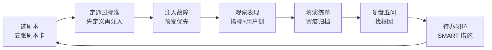

# 附录 AB 故障演练剧本与复盘模板

> 定位：工程工具。拿来即用的故障演练剧本（含注入方式与预期表现）、演练单模板、复盘五问与报告模板。配套知识库 60 与学习课程 64。

一次完整演练是一个闭环，缺一环下次就还在原地：



---

## 1. 五张演练剧本卡

### 剧本 1：模型 API 超时

| 项目 | 内容 |
| --- | --- |
| 目标 | 验证重试与熔断链路 |
| 注入方式 | Mock 层给 LLM 调用注入 10s 延迟 |
| 预期表现 | 客户端超时 → 指数退避重试 → 连续失败触发熔断 → 降级文案返回 |
| 通过标准 | 用户侧 5s 内得到降级响应，无白屏 |
| 风险 | 高（影响线上）→ 建议在预发演练 |

### 剧本 2：检索服务宕机

| 项目 | 内容 |
| --- | --- |
| 目标 | 验证缓存与降级 |
| 注入方式 | 停掉向量库连接 |
| 预期表现 | 热缓存命中直接回答；未命中走关键词降级 |
| 通过标准 | 无 5xx 大规模爆发，错误率 < 0.5% |

### 剧本 3：突发流量

| 项目 | 内容 |
| --- | --- |
| 目标 | 验证令牌桶限流 |
| 注入方式 | 并发 50 请求（配额 5 rps） |
| 预期表现 | 大部分返回 429/降级文案，服务不崩溃 |
| 通过标准 | 服务进程存活，指标可访问 |

### 剧本 4：单节点宕机

| 项目 | 内容 |
| --- | --- |
| 目标 | 验证多副本容灾 |
| 注入方式 | 杀一个 worker 进程 |
| 预期表现 | 其余节点接管，客户端无明显错误 |
| 通过标准 | 错误日志无新增，恢复时间 < 1 分钟 |

### 剧本 5：断网

| 项目 | 内容 |
| --- | --- |
| 目标 | 验证全链路降级 |
| 注入方式 | 拔掉出口网络 |
| 预期表现 | 所有外部依赖失败 → 统一降级文案 |
| 通过标准 | 请求都能得到"系统繁忙"可读响应 |

---

## 2. 演练单模板（每次演练填一页）

```text
演练编号：DR-2026-____
演练日期：____-____-____
演练场景：□ API超时 □ 检索宕机 □ 突发流量 □ 单点宕机 □ 断网 □ 其他____
演练环境：□ 预发 □ 生产（____%流量）
参与人：____

一、演练前基线
正常延迟 P95：____ms    当前错误率：____%

二、注入方式与时间点
方式：____    开始：____    结束：____

三、实测结果
首次发现时间：____
系统自动恢复？□ 是（____秒） □ 否（人工介入）
用户侧表现：□ 正常 □ 降级文案 □ 白屏/报错
熔断是否生效：□ 是 □ 否    限流是否生效：□ 是 □ 否

四、问题暴露
1. ____
2. ____

五、待办
| 编号 | 待办事项 | 负责人 | 期限 |
| --- | --- | --- | --- |
| 1 |  |  |  |
| 2 |  |  |  |
```

---

## 3. 复盘五问（每次演练后必答）

1. **发现够快吗？** 故障发生后多久被指标或告警发现？（目标 < 5 分钟）
2. **恢复靠谁？** 是系统自动恢复，还是靠人排查？（目标：愈自动愈好）
3. **用户看到了什么？** 白屏 / 报错 / 降级文案？（目标：始终可读响应）
4. **保护机制生效了吗？** 熔断、限流、降级是否按预期动作？
5. **下次怎么更快？** 改进告警阈值？提前预演？补缓存？

---

## 4. 复盘报告模板（沉淀到文档）

```text
# 故障复盘：<场景>（<日期>）

## 一、时间线
| 时刻 | 事件 |
| --- | --- |
| 00:00 | 注入故障 |
| 00:01 | 指标异常 |
| 00:03 | 熔断打开，降级生效 |
| 00:05 | 恢复 |

## 二、根因分析
<一句话说清>

## 三、影响面
- 错误率峰值：____%
- 受影响请求：____
- 成本影响：____

## 四、改进措施（SMART）
1. ____
2. ____

## 五、责任人与期限
| 措施 | 责任人 | 截止 |
| --- | --- | --- |
|  |  |  |
```

---

## 5. 月度可靠性例行

| 周次 | 动作 |
| --- | --- |
| 第 1 周 | 复盘上月故障，更新剧本库 |
| 第 2 周 | 预发环境演练 1 个剧本 |
| 第 3 周 | 检查 SLO 与错误预算余量 |
| 第 4 周 | 全员 review 演练单与待办闭环 |

---

## 6. 演练纪律（务必遵守）

- 优先在**预发/低峰**演练，确需生产演练须走变更审批；
- 先定**通过标准**再注入，防止"练完不知成败"；
- 每次演练留痕：演练单 + 复盘报告 2 份文档归档；
- 发现保护机制失效，先修复再复演，不带着问题睡觉。

**配套资料**：知识库 60《可靠性工程实战 SLO 熔断与故障演练》；学习课程 64《给过山车装保险丝》；附录 AA 命令速查第 3 节。