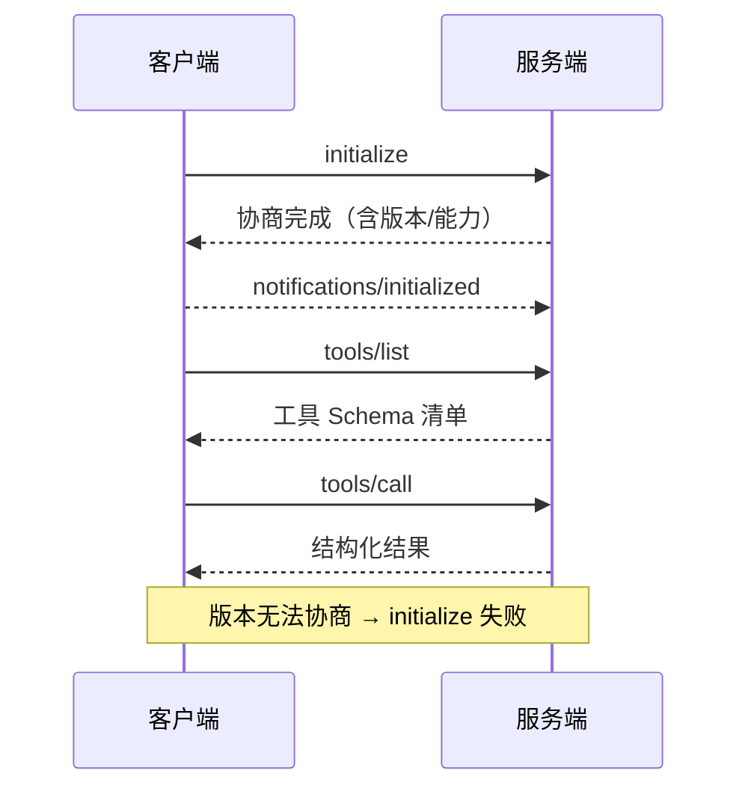

# 附录 AC MCP 消息格式与命令速查手册

> 定位：工程工具。写 MCP 服务/客户端时贴在旁边的速查卡：消息信封、生命周期时序、核心方法、SDK 命令、常见错误码。配套知识库 62-65 与学习课程 66-69。

---

## 1. 消息信封（HTTP 传输）

```text
POST /mcp HTTP/1.1
Content-Type: application/json
Mcp-Protocol-Version: 2026-03-26
Authorization: Bearer <token>          # 需鉴权时
Content-Length: ...

{"jsonrpc":"2.0","id":1,"method":"tools/list","params":{}}
```

| 头/体 | 说明 |
| --- | --- |
| Mcp-Protocol-Version | 客户端声明协议版本 |
| Mcp-Session-Id | 服务端会话标识（可选会话管理时） |
| jsonrpc | 固定 "2.0" |
| id | request 必有且唯一；notification 禁止携带 |

---

## 2. 生命周期握手时序



---

## 3. 核心方法速查

| 方法 | 方向 | 载荷要点 |
| --- | --- | --- |
| initialize | C→S | protocolVersion, capabilities, clientInfo |
| notifications/initialized | C→S | 无参数 |
| ping | 双向 | 无参数，保活 |
| tools/list | C→S | 可选 cursor 分页 |
| tools/call | C→S | name + arguments |
| resources/list | C→S | 可选 cursor |
| resources/read | C→S | uri |
| prompts/list | C→S | 可选 cursor |
| prompts/get | C→S | name + arguments |
| logging/setLevel | C→S | level |
| completion/complete | C→S | ref + argument |

---

## 4. 工具调用返回结构

```json
{
  "content": [
    {"type": "text", "text": "北京 26°C 晴"},
    {"type": "image", "data": "<base64>", "mimeType": "image/png"}
  ],
  "isError": false,
  "structuredContent": {"temp": 26, "cond": "sunny"}
}
```

| 字段 | 说明 |
| --- | --- |
| content | 文本/图像/资源 列表，LLM 可直接消费 |
| isError | true 表示执行失败但协议正常返回 |
| structuredContent | 可选的结构化数据（便于程序消费） |

---

## 5. SDK 命令速查

```bash
# 安装（Python）
pip install "mcp[cli]"

# 运行服务（stdio 默认）
python weather_server.py

# 启动 HTTP 服务
python -m uvicorn weather_app:app --host 0.0.0.0 --port 8000

# 客户端侧命令行直调
python -m mcp.cli tools/list
python -m mcp.cli tools/call get_weather '{"city": "北京"}'

# 图形化调试
npx @modelcontextprotocol/inspector python weather_server.py

# 常用包
pip install "mcp[cli]" langchain-mcp-adapters
```

---

## 6. 常见错误与排查

| 症状 | 可能原因 | 排查 |
| --- | --- | --- |
| initialize 超时 | 服务未启动/端口错 | 先跑 tools/list 裸调 |
| 401 | 缺 Token/OAuth 未走 | 检查 Authorization 头 |
| 404 on /mcp | 路由挂错 | FastMCP 挂 /mcp 路径 |
| Schema 与实际不符 | 参数名/类型不一致 | 手压一次 call 对比 |
| 工具调用一直失败 | 服务端异常未捕获 | 改 isError + 可读信息 |
| 版本不兼容 | 协议版本差异过大 | 客户端降级/服务端升级 |

---

## 7. 部署命令速查

```bash
# 容器内健康检查
curl -s http://localhost:8000/mcp -H "Content-Type: application/json" \
  -d '{"jsonrpc":"2.0","id":1,"method":"tools/list","params":{}}'

# 日志里捞 trace
grep '"trace_id":"' /var/log/mcp/server.log | tail

# 指标端点（prometheus_client）
curl -s localhost:9100/metrics | grep mcp_
```

> 使用顺序：装依赖 → 起服务 → tools/list → 手压 call → 接 Agent 自动决策 → 五查上线。

**配套**：附录 AD（部署与安全检查清单）、知识库 65（生产实践）。