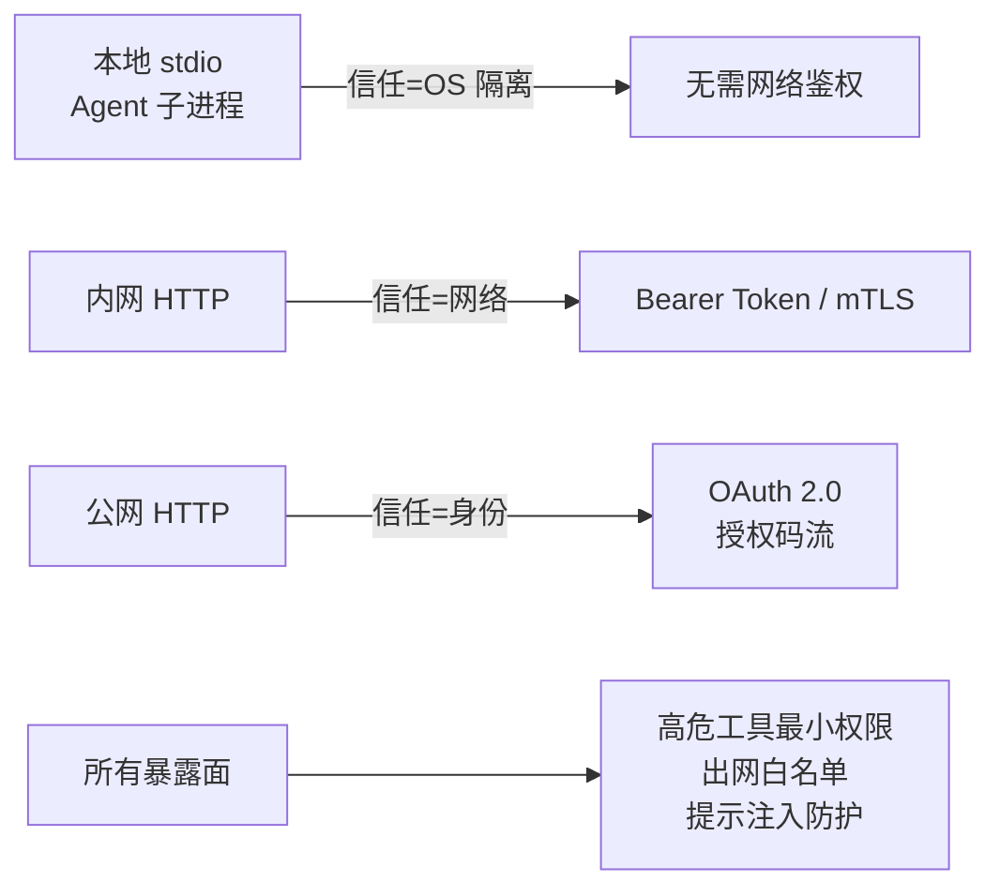
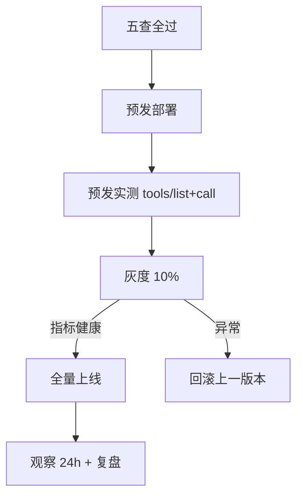

# 附录 AD MCP 服务部署与安全检查清单

> 定位：工程工具。MCP 服务"敢上线"的逐项核对表：安全边界、鉴权部署、可靠性、可观测、文档。上线前逐项打勾，缺一项就打回。配套知识库 65 与学习课程 69。

---

## 1. 三种暴露面的安全边界图



---

## 2. 上线前检查清单（打勾用）

### A. 功能

- [ ] `tools/list` 实测返回正确 Schema
- [ ] 每个工具 `tools/call` 手压通过
- [ ] 参数类型、必填项与真实行为一致
- [ ] 错误路径返回 `isError=true` + 可读信息
- [ ] 服务端上报版本号（initialize 响应）

### B. 安全

- [ ] 无硬编码密钥（用环境变量/密钥管理）
- [ ] 读写类工具最小授权（默认只读）
- [ ] 文件工具白名单目录
- [ ] 不出网/禁内网跳转（防 SSRF）
- [ ] 工具结果按"数据"处理，明确提示注入防护
- [ ] 高危动作（删改、发信）有人工确认

### C. 鉴权与网络

- [ ] 非 localhost 无明文 HTTP
- [ ] Bearer Token / OAuth / mTLS 已启用
- [ ] 令牌有有效期与轮换机制
- [ ] 会话失效有明确错误，不静默挂起
- [ ] 网络策略：只开必要端口

### D. 可靠性

- [ ] 工具调用有超时（如 5s）
- [ ] 外部依赖有重试（指数退避）
- [ ] 连续失败触发熔断/降级
- [ ] 服务崩溃可自动重启（supervisor/容器重启策略）
- [ ] 并发峰值限流配额生效

### E. 可观测与治理

- [ ] 每次调用日志含 trace_id、耗时、出参摘要
- [ ] 指标：调用量/成功率/p95/工具级错误计数
- [ ] 与 LangSmith/OTel 链路打通
- [ ] 告警接入值班（按 SLO）
- [ ] 多租户场景：按租户计量与配额

### F. 文档与交付

- [ ] 工具 docstring 与 Schema 同步最新
- [ ] README 写明：启动参数、权限要求、示例调用
- [ ] 部署拓扑图与端口清单
- [ ] 演练一次"服务宕机-恢复"留痕

---

## 3. 高危工具处置矩阵

| 工具类别 | 默认动作 | 必须满足的条件 |
| --- | --- | --- |
| 文件写入 | 拒绝 | 白名单目录 + 内容审计 |
| 命令执行 | 拒绝 | 参数白名单 + 无拼接 + 双人确认 |
| 数据外发 | 限制 | 域名白名单 + 出参脱敏 |
| 凭据/密钥读取 | 拒绝 | 独立密钥服务 + 服务端隔离 |
| 数据库写 | 只读 | 读写分离 + 变更走审批 |

---

## 4. 部署基线（容器）

```yaml
# docker-compose 片段
services:
  mcp-server:
    build: .
    ports: ["8000:8000"]
    environment:
      - WEATHER_API_KEY=${WEATHER_API_KEY}   # 不写死在镜像
    healthcheck:
      test: ["CMD", "curl", "-f", "http://localhost:8000/mcp"]
      interval: 30s
      retries: 3
    restart: unless-stopped
    read_only: true                           # 只读文件系统
    security_opt: ["no-new-privileges:true"]
```

---

## 5. 发布流程



---

## 6. 复盘模板（每次事故后）

```text
# MCP 服务事故复盘 <日期>
一、时间线：____
二、根因：____
三、影响：受影响调用 ____，错误率峰值 ____
四、暴露缺口：（对照上文 A-F 清单勾出缺失项）
五、改进措施（SMART）：____
六、复演计划：____（下次演练哪个剧本）
```

> 使用顺序：写服务 → 本地调通 → 预发五查 → 灰度 → 全量 → 观测固化。

**配套**：附录 AC（命令速查）、知识库 65（生产实践）、学习课程 69（收官课）。