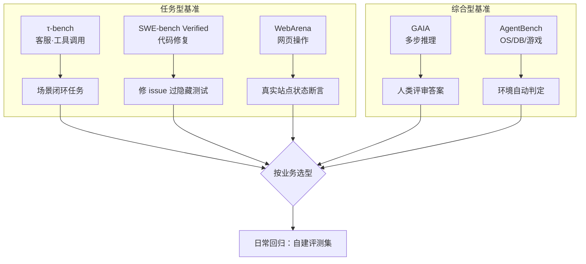

# 附录 AE Agent 评测基准速查手册

> 定位：工程工具。选基准、读报告、跑命令时贴在旁边的速查卡：主流基准一览、核心指标公式、执行命令、报告段模板。配套知识库 66-69 与学习课程 70-73。

---

## 0. 基准全景速查图



---

## 1. 主流基准一览

| 基准 | 类型 | 任务 | 成功判定 | 谁在测 |
| --- | --- | --- | --- | --- |
| GAIA | 现实多步推理 | 查资料+计算+结论 | 人类评审答案 | 通用 Agent |
| τ-bench | 工具调用 | 客服任务闭环 | reward×constraint | 客服/工具 Agent |
| SWE-bench | 代码修复 | 修 issue 过测试 | 隐藏测试 | 代码 Agent |
| SWE-bench Verified | 代码修复 | 人工精选子集 | 隐藏测试 | 代码 Agent |
| WebArena | 网页操作 | 网站内任务 | 状态断言 | 网页 Agent |
| AgentBench | 多环境 | OS/DB/KG/游戏等 | 环境判定 | 通用 Agent |

> 选型：客服用 τ-bench、代码用 SWE-bench Verified、网页用 WebArena、通用打底用 GAIA/AgentBench。

---

## 2. 核心指标速查

| 指标 | 公式/含义 | 用途 |
| --- | --- | --- |
| TSR | 成功任务数 ÷ 总任务数 | 总览分 |
| τ-score | reward × constraint | 工具型总分 |
| constraint | 合规调用 ÷ 总调用 | 过程合规 |
| Pass@k | k 次采样至少 1 过 | 代码型 |
| Violation Rate | 违规调用 ÷ 总调用 | 红线监控 |
| Cost/task | 总 token 成本 ÷ 任务数 | 成本预算 |
| Latency p95 | 任务耗时 95 分位 | 体验 |

---

## 3. 执行命令速查

```bash
# τ-bench（SierraResearch/tau-bench）
pip install -e .
python -m tau_bench.cli --env retail --model gpt-4o-mini --num-trials 40
# 输出: reward / constraint / tau_score

# SWE-bench Verified（自建评测跑）
# 常用方案：swebench 库 + 本地 docker 环境
pip install swebench
python -m swebench.harness.run_evaluation \
  --model_name gpt-4o --dataset_name princeton-nlp/SWE-bench_Verified --max_workers 4

# GAIA（官方验证端，跑前需申请）
# 提交格式：JSON Lines，每条含 task_id + final_answer

# 自建回归池（本书推荐起步）
python eval/run.py --suite smoke        # L1
python eval/run.py --suite regression   # L2
python eval/run.py --suite regression --gate   # 门禁模式
```

---

## 4. 报告四段式（模板）

```text
# Agent 评测报告 <版本号> <日期>
一、总结：总分 __% | 分场景 __/__（附与基线 ±pp）
二、失败 Top5：
| id | 场景 | 失败原因标签 | 片段摘要 |
三、运行指标：违规率 __% | p95 __s | 成本/任务 __$
四、行动项：1)__ 2)__
基线与阈值：TSR≥基线-2pp；违规率≤5%
```

---

## 5. 评测分层速查

| 层 | 题量 | 耗时 | 时机 | 用途 |
| --- | --- | --- | --- | --- |
| L1 Smoke | 10 | 秒 | 本地 | 快速反馈 |
| L2 Regression | 100+ | 分钟 | PR | 发布门禁 |
| L3 Nightly | 300+ | 小时 | 夜间 | 趋势/成本 |

---

## 6. 门禁阈值参考

| 指标 | 放行 | 禁止 |
| --- | --- | --- |
| TSR | ≥ 基线-2pp 且 ≥60% | <60% |
| 工具违规率 | ≤5% | >5% |
| 成本/任务 | ≤预算 1.2× | >1.2× 警告 |
| p95 延迟 | ≤基线 1.3× | >2× |

---

## 7. 常见解读错误

| 错误 | 正确做法 |
| --- | --- |
| 10 条样本下结论 | ≥40 条有效样本 |
| 只看 tau_score | 拆 reward 与 constraint |
| 无基线对比 | 每次留档基线版本 |
| Judge 与考生同模型 | 换模型当考官 |
| 门禁可随意跳过 | 结果进发布审批 |

> 使用顺序：选基准（公开卷打底）→ 建自回归池 → 定阈值 → 接 CI --gate → 每版留档趋势。

**配套**：附录 AF（模板库）、知识库 69（EDD 与门禁）、课程 73（收官）。