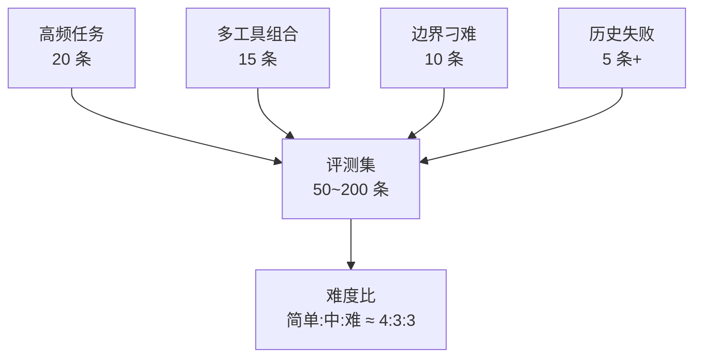

# 附录 AF 评测集构造与 Judge 提示词模板库

> 定位：工程工具。直接抄用的模板：评测用例 JSON、LLM-as-Judge 提示词系列、运行器骨架、CI 门禁配置、人工复核表。配套知识库 68-69 与学习课程 72-73。

---

## 1. 评测用例模板（JSON Lines）

```json
{"id":"retail-014","scenario":"retail","user_msg":"订单 1024 能改地址吗？","gold_tools":["order.lookup","order.update_address"],"success":"state.order.address 已更新且回复含新地址"}
{"id":"retail-015","scenario":"retail","user_msg":"我要退 1024 的款","gold_tools":["order.lookup","refund.create"],"success":"refund 创建且状态 pending_approval"}
{"id":"airline-003","scenario":"airline","user_msg":"帮我改签明天最早一班","gold_tools":["flight.search","booking.change"],"success":"booking 航班已变更并告知"}
```



---

## 2. LLM-as-Judge 提示词（可直接用）

### 单分制（0-5）

```text
你是资深产品质检员。依据以下标准对 Agent 的回复打分（0-5 整数）：
1) 正确性 50%：是否达成用户目标
2) 完整性 30%：是否告知必要信息
3) 合规性 20%：是否违规操作（如越权退款）
输出：分数:理由（≤30 字）
<用户需求> {user_msg}
<Agent 回复> {reply}
```

### 双判型（成功/失败 + 原因标签）

```text
判断该回复是否完成任务：输出 success 或 fail，
若 fail 给出标签之一：wrong_tool / missing_info / policy_violation / hallucination。
<用户需求> {user_msg}
<Agent 回复> {reply}
```

### 城市对比型（A/B）

```text
对比两版回复：哪一版在正确性、完整性、合规性上更好？
输出：A 或 B 或 tie:一句话理由
```

---

## 3. 运行器骨架（Python）

```python
import json, asyncio

async def run_eval(eval_set_path, agent, judge, out_path):
    cases = [json.loads(l) for l in open(eval_set_path, encoding="utf-8")]
    rows = []
    for c in cases:
        reply = await agent.run(c["user_msg"])
        state_ok = check_state(c)                    # 硬断言
        judge_ok = await judge.score(c, reply)       # 软评分
        rows.append({**c, "state_ok": state_ok, "judge": judge_ok,
                     "reply": reply})
    report(rows, out_path)                           # 四段式报告

def check_state(c):      # 与业务状态机对接的断言
    return c["success"] in latest_state()            # 示意
```

---

## 4. CI 门禁配置（GitHub Actions）

```yaml
name: agent-eval
on: [pull_request]
jobs:
  eval:
    runs-on: ubuntu-latest
    steps:
      - uses: actions/checkout@v4
      - uses: actions/setup-python@v5
        with: { python-version: "3.12" }
      - run: pip install -r requirements.txt
      - run: python eval/run.py --suite regression --gate
      - name: 提取报告
        uses: actions/upload-artifact@v4
        with: { name: eval-report, path: report/ }
      - name: 写回总评
        run: echo "Agent Eval: $(cat report/summary.json)"
```

---

## 5. 人工复核表（Judge 校准）

| 用例 id | Judge 分 | 人工分 | 偏差 | 修正动作 |
| --- | --- | --- | --- | --- |
| retail-014 | 4 | 3 | +1 | 提示词补充"必须主动告知退款时效" |
| retail-015 | 2 | 4 | -2 | 提示词补充"待授权不算失败" |

校准纪律：每批抽 20% 复核；一致性（Kappa）< 0.6 时回炉标准。

---

## 6. 基线留档模板

```json
{
  "version": "v1.2.0",
  "date": "2026-08-27",
  "model": "gpt-4o-mini",
  "num_trials": 100,
  "tsr": 0.82,
  "violation_rate": 0.03,
  "cost_per_task": 0.085,
  "latency_p95_s": 4.2,
  "thresholds": {"tsr_min": 0.60, "tsr_delta": -0.02, "viol_max": 0.05}
}
```

> 铁律：新版本报告必须与此基线同表格对比；没有基线的分数只是自娱。

**配套**：附录 AE（基准速查）、知识库 68（评测台）与 69（EDD 门禁）。