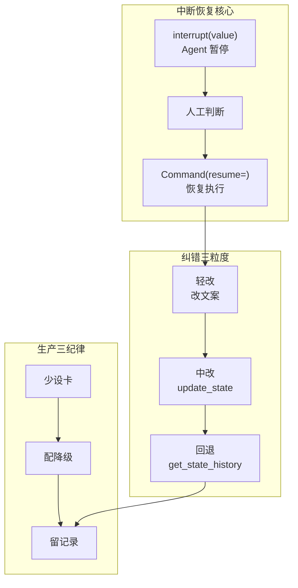

# 附录 AG Human-in-the-Loop 速查手册

> 定位：工程工具。用到 HITL 时贴在旁边的速查卡：API 速查、中断点决策、纠错方式选择、反模式速查、上线检查清单。配套知识库 70-73 与学习课程 74-77。

---

## 0. HITL 全景速查图

---

## 1. API 速查

| API | 作用 | 谁调用 |
| --- | --- | --- |
| `interrupt(value)` | 暂停图执行，把 value 抛给调用方 | 图节点内 |
| `Command(resume=answer)` | 恢复执行，注入人工结果 | 调用方 |
| `get_state(config)` | 读取当前状态与下一步节点 | 中断后、恢复前 |
| `update_state(config, values)` | 人工覆盖状态字段 | 中改纠错 |
| `invoke(None, config)` | 从当前断点继续 | 中改后 |
| `get_state_history(config)` | 列出历史检查点 | 回退前选目标 |

---

## 2. 中断点决策表

| 场景 | 风险 | 要不要 interrupt |
| --- | --- | --- |
| 发邮件/转账/删数据 | 高（不可逆） | 强制 interrupt |
| 金额超阈值的操作 | 中 | 按置信度 interrupt |
| 检索结果置信度低 | 中 | interrupt 让人定夺 |
| 只读查询/计算器 | 低 | 放行 |
| 幂等操作 | 低 | 放行，仅记日志 |

> 口诀：不可逆必拦、低置信可拦、可逆放行。

---

## 3. 人工动作三分法

| 动作 | 含义 | 状态处理 |
| --- | --- | --- |
| approve | 同意原参数 | 放行 tool_calls |
| reject | 拒绝执行 | 清空 tool_calls，返回原因 |
| edit | 修改参数后执行 | 用新参数替换 tool_calls |

> edit 最容易被忽略却最有用：人发现参数错了改一下再走，比非黑即白地批准/拒绝更实际。

---

## 4. 纠错方式选择

| 错误类型 | 方式 | API | 成本 |
| --- | --- | --- | --- |
| 表面表述不准 | 轻改文案 | 直接改输出 | 低 |
| 中间某步错 | 中改后继续 | `update_state` + `invoke(None)` | 中 |
| 方向性错误 | 回退重跑 | `get_state_history` + `invoke(None, target.config)` | 高 |

> 口诀：能轻改不中改、能中改不回退。

---

## 5. 超时降级速查

| 风险 | 超时阈值 | 降级动作 |
| --- | --- | --- |
| 高（不可逆） | 不设超时 / 转备班 | 必须人工 |
| 中 | 30~60 分钟 | 超时拒绝并告知 |
| 低 | 5~10 分钟 | 超时放行 |

---

## 6. 反模式速查

| 反模式 | 后果 | 正解 |
| --- | --- | --- |
| 万能兜底（什么都审） | 审批疲劳 | 只在高风险设卡 |
| 阻塞无降级 | 人工不在就卡死 | 配超时降级 |
| 中断值缺上下文 | 人瞎批 | 带待审批内容+上下文 |
| 恢复值不校验 | 脏数据注入 | resume 先 schema 校验 |
| 审批不记录 | 无法复盘 | 每次落审计日志 |
| 纠错不沉淀 | 同类错重犯 | 纠错转评测用例 |

---

## 7. 上线检查清单

- [ ] 每个高风险工具有 interrupt 点与风险登记
- [ ] 中断值含待审批内容 + 触发上下文
- [ ] 恢复值有 schema 校验
- [ ] 中风险以上配超时阈值与降级动作
- [ ] 审批进队列，有积压告警
- [ ] 每次审批（含自动降级）落审计日志
- [ ] 人工纠错定期转评测用例
- [ ] 审批疲劳指标纳入监控（通过率/耗时）
- [ ] 高风险场景有备班兜底

---

## 8. 质量护栏协同

| 护栏 | 比喻 | 何时 |
| --- | --- | --- |
| 评测门禁（KB69） | 出厂质检 | 发版前 |
| 可观测性（KB58） | 行车记录仪 | 运行中 |
| HITL（KB70-73） | 紧急制动 | 执行前 |
| 审计沉淀 | 事故复盘 | 事后 |

> 飞轮：HITL 拦下的偏差 → 审计记录 → 沉淀评测用例 → 下次门禁更严 → 系统越跑越稳。

**配套**：知识库 70-73、学习课程 74-77、附录 AH（模板库）。