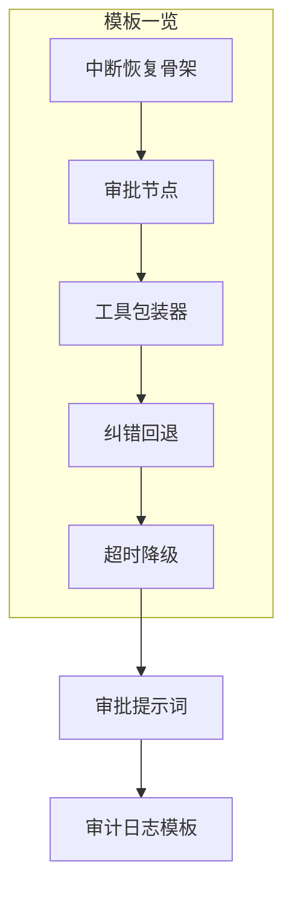

# 附录 AH HITL 代码模板与审批提示词库

> 定位：工程工具。直接抄用的模板：中断恢复骨架、审批节点、工具包装器、纠错回退、超时降级、审批提示词、审计日志模板。配套知识库 70-73 与附录 AG。

---

## 0. 模板总览



---

## 1. 中断恢复骨架（最小可用）

```python
from langgraph.types import interrupt, Command
from langgraph.graph import StateGraph, START, END
from langgraph.checkpoint.memory import MemorySaver
from typing import TypedDict

class State(TypedDict):
    task: str
    result: str
    approved: bool

def work_node(state: State):
    result = do_something(state["task"])
    # 中断：把结果抛给人确认
    decision = interrupt({"ask": "确认这个结果吗？", "result": result})
    return {"result": result, "approved": decision == "yes"}

def finish_node(state: State):
    if state["approved"]:
        return {"result": "已确认: " + state["result"]}
    return {"result": "已取消"}

g = StateGraph(State)
g.add_node("work", work_node)
g.add_node("finish", finish_node)
g.add_edge(START, "work")
g.add_edge("work", "finish")
g.add_edge("finish", END)
app = g.compile(checkpointer=MemorySaver())

# ---- 调用方 ----
cfg = {"configurable": {"thread_id": "session-1"}}
app.invoke({"task": "生成报告"}, cfg)          # 在 work 处中断
app.invoke(Command(resume="yes"), cfg)         # 人工确认后继续
```

---

## 2. 审批节点（approve/reject/edit 三分支）

```python
HIGH_RISK_TOOLS = {"send_email", "delete_record", "transfer_money"}

def approval_gate(state):
    calls = state.get("tool_calls", [])
    risky = [c for c in calls if c["name"] in HIGH_RISK_TOOLS]
    if not risky:
        return {"approved_calls": calls}   # 低风险放行

    decision = interrupt({
        "need_approval": risky,
        "context": state.get("messages", [])[-1:]
    })
    action = decision.get("action", "reject")
    if action == "approve":
        return {"approved_calls": risky}
    elif action == "edit":
        return {"approved_calls": decision["edited_calls"]}
    else:
        return {"approved_calls": [], "reject_reason": decision.get("reason", "")}
```

---

## 3. 工具包装器（工具内部自管 interrupt）

```python
def send_email(to: str, subject: str, body: str) -> str:
    """发邮件前自动拦截，等人工确认"""
    decision = interrupt({
        "to": to, "subject": subject, "body": body,
        "ask": "确认发送这封邮件吗？"
    })
    action = decision.get("action", "reject")
    if action == "approve":
        return smtp_send(to, subject, body)
    elif action == "edit":
        return smtp_send(decision["to"], decision["subject"], decision["body"])
    else:
        return f"已取消: {decision.get('reason', '用户拒绝')}"
```

---

## 4. 纠错回退模板

```python
# === 中改：改一步后继续 ===
state = app.get_state(cfg)
print("当前状态:", state.values)
print("下一步:", state.next)

# 人工覆盖某字段
app.update_state(cfg, {"result": "修正后的结果"})
# 从当前断点继续
app.invoke(None, cfg)

# === 回退：退到历史检查点重跑 ===
history = list(app.get_state_history(cfg))
print("历史检查点数:", len(history))
# 退到第 3 个检查点
target = history[3]
app.invoke(None, target.config)   # 从那一刻继续，生成新分支
```

---

## 5. 超时降级模板

```python
import time

TIMEOUT = {"high": None, "mid": 3600, "low": 600}
DEGRADE = {"high": "escalate", "mid": "reject", "low": "approve"}

def check_timeout_and_degrade(app, cfg, risk_level, interrupted_at):
    """检查中断是否超时，超时则自动降级"""
    timeout = TIMEOUT[risk_level]
    if timeout is None:
        return None  # 高风险不自动降级
    elapsed = time.time() - interrupted_at
    if elapsed > timeout:
        app.invoke(Command(resume={
            "action": DEGRADE[risk_level],
            "reason": f"auto-degrade: timeout {elapsed:.0f}s"
        }), cfg)
        return "degraded"
    return None
```

---

## 6. 多轮交互式修正

```python
MAX_ROUNDS = 5

def draft_node(state):
    draft = llm.invoke(state["task"]).content
    round_n = state.get("round", 0)
    feedback = interrupt({"draft": draft, "round": round_n})

    if feedback.get("done") or round_n >= MAX_ROUNDS:
        return {"result": draft, "done": True}
    return {"task": state["task"] + "\n修改意见:" + feedback["comment"],
            "round": round_n + 1}
```

---

## 7. 审批提示词模板

### 给人工看的审批卡片（JSON）

```json
{
  "approval_id": "apr-001",
  "timestamp": "2026-08-27T14:30:00Z",
  "risk_level": "high",
  "tool": "send_email",
  "args": {"to": "客户@example.com", "subject": "合同确认", "body": "..."},
  "trigger_context": "用户要求发送合同确认邮件",
  "deadline": "2026-08-27T15:00:00Z",
  "actions": ["approve", "reject", "edit"]
}
```

### LLM 辅助审批（让 LLM 先给建议，人做最终决定）

```text
你是审批助手。根据以下信息给出建议（approve/reject/edit）和理由：
工具: {tool}
参数: {args}
风险等级: {risk}
触发上下文: {context}
输出: 建议:理由（≤50字）
```

---

## 8. 审计日志模板

```json
{
  "approval_id": "apr-001",
  "timestamp": "2026-08-27T14:32:00Z",
  "thread_id": "session-1",
  "tool": "send_email",
  "risk_level": "high",
  "action": "approve",
  "reviewer": "user-001",
  "review_duration_s": 45,
  "auto_degraded": false,
  "original_args": {"to": "客户@example.com"},
  "final_args": {"to": "客户@example.com"},
  "result": "sent"
}
```

> 纪律：每次审批（含自动降级）都必须落审计。`auto_degraded=true` 的记录要特别关注，说明人工没及时响应。

---

## 9. 风险登记表模板

```json
[
  {"tool": "send_email", "risk": "high", "intercept": "always", "timeout": null},
  {"tool": "search_kb", "risk": "low", "intercept": "never", "timeout": null},
  {"tool": "query_db", "risk": "mid", "intercept": "confidence<0.7", "timeout": 600},
  {"tool": "delete_record", "risk": "high", "intercept": "always", "timeout": null},
  {"tool": "calculator", "risk": "low", "intercept": "never", "timeout": null}
]
```

> 实操：维护这份 `tool_risk_registry.json`，每上线新工具就登记一行，审批策略跟着清单走。

---

## 10. 纠错转评测用例模板

```json
{
  "source": "hitl_correction",
  "thread_id": "session-1",
  "correction_time": "2026-08-27T14:35:00Z",
  "original_output": "Agent 把收件人填成了张三",
  "corrected_output": "应为李四",
  "root_cause": "Agent 从记忆中取了过时的联系人",
  "eval_case": {
    "id": "hitl-001",
    "user_msg": "帮我把合同发给李四",
    "gold_tool": "send_email",
    "gold_args": {"to": "李四"},
    "success": "收件人为李四且邮件已发送"
  }
}
```

> 铁律：每次纠错都按这个模板记一条，定期批量导入回归评测集（附录 AF），让门禁（KB69）拦住下次同类错误。

**配套**：知识库 70-73、附录 AG（速查）、附录 AF（评测集模板）。