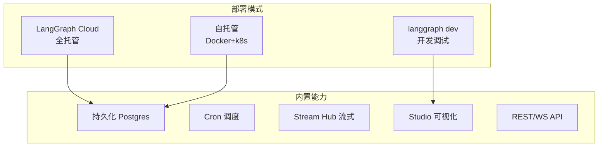

# 附录 AI LangGraph Platform 速查手册

> 定位：工程工具。用 Platform 部署/调试/运维时贴旁边的速查卡：部署模式选型、CLI 命令、API 端点、stream_mode 对比、Cron 表达式、常见问题。配套知识库 74-77 与学习课程 78-81。

---

## 0. Platform 全景速查图

---

## 1. 部署模式选型

| 模式 | 命令 | 适合 | 运维 |
| --- | --- | --- | --- |
| 开发 | `langgraph dev` | 调试 | 无 |
| Cloud | `langgraph deploy` | 快速上线 | 平台管 |
| 自托管 | `langgraph build` + docker | 私有化 | 自己管 |

---

## 2. CLI 命令速查

| 命令 | 作用 |
| --- | --- |
| `langgraph init --path X` | 初始化项目 |
| `langgraph dev` | 启动开发服务器（含 Studio） |
| `langgraph build -t name:tag` | 构建 Docker 镜像 |
| `langgraph login` | 登录 Cloud |
| `langgraph deploy` | 部署到 Cloud |

---

## 3. API 端点速查

| 端点 | 方法 | 作用 |
| --- | --- | --- |
| `/ok` | GET | 健康检查 |
| `/threads/&#123;id&#125;/runs` | POST | 发起 Run（同步/后台） |
| `/threads/&#123;id&#125;/runs/stream` | POST | 发起流式 Run（SSE） |
| `/threads/&#123;id&#125;/runs/&#123;run_id&#125;/state` | GET | 查 Run 状态 |
| `/threads/&#123;id&#125;/state` | GET | 查 Thread 状态 |
| `/threads/&#123;id&#125;/history` | GET | 查检查点历史 |

---

## 4. stream_mode 对比

| mode | 流什么 | 粒度 | 事件名 |
| --- | --- | --- | --- |
| `values` | 每步完整状态 | 粗 | `values` |
| `updates` | 每步增量 | 中 | `updates` |
| `messages` | LLM token | 细 | `messages/partial` `messages/complete` |
| `custom` | 自定义事件 | 灵活 | `custom` |
| 多模式 | 同时多种 | — | `stream_mode=["updates","messages"]` |

---

## 5. 持久化后端对比

| 后端 | 数据存哪 | 重启 | 适合 |
| --- | --- | --- | --- |
| MemorySaver | 内存 | 丢 | 开发 |
| SQLiteSaver | 本地文件 | 保留 | 单机 |
| PostgresSaver | Postgres | 保留 | 生产 |
| RedisSaver | Redis | 保留 | 高频 |

---

## 6. Cron 表达式速查

| cron | 含义 |
| --- | --- |
| `0 2 * * *` | 每天凌晨 2 点 |
| `*/30 * * * *` | 每 30 分钟 |
| `0 0 * * 1` | 每周一 0 点 |
| `0 9-18 * * 1-5` | 工作日每小时 |
| `*/1 * * * *` | 每分钟（调试用） |

> 五段格式：分 时 日 月 周

---

## 7. Postgres 表结构速查

| 表 | 存什么 |
| --- | --- |
| checkpoints | 检查点元数据（thread_id, checkpoint_id, 父节点） |
| checkpoint_blobs | 状态序列化 blob |
| checkpoint_writes | 节点写入记录 |
| writes_table | 运行写入流（审计） |

---

## 8. Studio 功能速查

| 功能 | 作用 |
| --- | --- |
| 图结构可视化 | 看 Graph 节点与边 |
| 断点 | 在某节点暂停 |
| 状态检查 | 看每步状态值 |
| 时间旅行 | 回退到历史检查点 |
| HITL 模拟 | 断点处注入值 |
| Replay | 重放历史 Run |

---

## 9. 常见问题排查

| 症状 | 可能原因 | 排查 |
| --- | --- | --- |
| 重启后状态丢 | 用了 MemorySaver | 换 PostgresSaver |
| 中断恢复找不到 | thread_id 不一致 | 检查调用方 id |
| Cron 没触发 | cron 表达式写错 | 用 `*/1 * * * *` 验证 |
| 流式不出字 | stream_mode 选错 | 用 `messages` |
| Studio 打不开 | dev 没启动 | 访问 localhost:1634 |
| 镜像太大 | 没用多阶段构建 | 优化 Dockerfile |

---

## 10. 上线检查清单

- [ ] PostgresSaver 配好并 `setup()` 过
- [] 开发/生产靠环境变量切换 checkpointer
- [ ] `langgraph.json` 配置正确（graphs/dependencies/env）
- [ ] Cron 任务配了失败告警
- [ ] 流式输出用 `messages` mode 体验好
- [ ] 检查点留存策略已定（防表膨胀）
- [ ] 健康检查 `/ok` 可访问
- [ ] Studio 用于开发调试已验证

**配套**：知识库 74-77、学习课程 78-81、附录 AJ（部署模板库）。