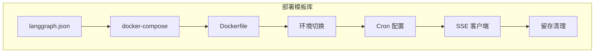
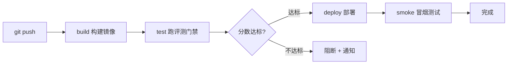

# 附录 AJ LangGraph Platform 部署配置模板库

> 定位：工程工具。直接抄用的模板：langgraph.json、docker-compose、Dockerfile、环境变量切换、Cron 配置、SSE 客户端、留存清理脚本。配套知识库 74-77 与附录 AI。

---

## 0. 模板总览



---

## 1. langgraph.json 配置模板

```json
{
  "dependencies": ["./pyproject.toml"],
  "graphs": {
    "agent": "./src/agent/graph.py:graph",
    "rag": "./src/rag/graph.py:graph"
  },
  "env": ".env",
  "cron": {
    "schedules": [
      {
        "graph": "agent",
        "cron": "0 2 * * *",
        "input": {"task": "daily_scan"},
        "config": {"configurable": {"mode": "batch"}}
      },
      {
        "graph": "rag",
        "cron": "0 0 * * 1",
        "input": {"task": "weekly_reindex"}
      }
    ]
  }
}
```

---

## 2. docker-compose.yml 模板

```yaml
services:
  langgraph-api:
    build: .
    ports:
      - "8000:8000"
    environment:
      - POSTGRES_URI=postgresql://lguser:lgpass@db:5432/langgraph
      - REDIS_URI=redis://redis:6379
      - ENV=production
      - OPENAI_API_KEY=${OPENAI_API_KEY}
    depends_on:
      db:
        condition: service_healthy
      redis:
        condition: service_started
    restart: unless-stopped

  db:
    image: postgres:16
    environment:
      POSTGRES_DB: langgraph
      POSTGRES_USER: lguser
      POSTGRES_PASSWORD: lgpass
    volumes:
      - pgdata:/var/lib/postgresql/data
    healthcheck:
      test: ["CMD-SHELL", "pg_isready -U lguser"]
      interval: 5s
      timeout: 3s
      retries: 5

  redis:
    image: redis:7
    volumes:
      - redisdata:/data

volumes:
  pgdata:
  redisdata:
```

---

## 3. Dockerfile 模板（多阶段构建）

```dockerfile
FROM python:3.12-slim AS builder
WORKDIR /app
COPY pyproject.toml ./
RUN pip install --no-cache-dir langgraph-cli && pip install -e .

FROM python:3.12-slim
WORKDIR /app
COPY --from=builder /usr/local/lib/python3.12/site-packages /usr/local/lib/python3.12/site-packages
COPY --from=builder /usr/local/bin /usr/local/bin
COPY . .
EXPOSE 8000
CMD ["langgraph-api", "--host", "0.0.0.0", "--port", "8000"]
```

---

## 4. 环境变量切换 checkpointer

```python
import os
from langgraph.checkpoint.memory import MemorySaver
from langgraph.checkpoint.postgres import PostgresSaver

def get_checkpointer():
    """按环境变量自动切换持久化后端"""
    if os.getenv("ENV") == "production":
        db_uri = os.getenv("DB_URI", "postgresql://localhost/langgraph")
        cp = PostgresSaver.from_conn_string(db_uri)
        cp.setup()  # 首次建表（幂等）
        return cp
    return MemorySaver()

# 使用
graph = builder.compile(checkpointer=get_checkpointer())
```

---

## 5. Cron 配置模板

```json
{
  "cron": {
    "schedules": [
      {
        "graph": "agent",
        "cron": "0 2 * * *",
        "input": {"task": "daily_scan"},
        "config": {"configurable": {"mode": "batch"}}
      },
      {
        "graph": "rag",
        "cron": "*/30 * * * *",
        "input": {"task": "process_queue"}
      },
      {
        "graph": "agent",
        "cron": "0 0 * * 1",
        "input": {"task": "weekly_reindex"}
      }
    ]
  }
}
```

| cron | 含义 |
| --- | --- |
| `0 2 * * *` | 每天凌晨 2 点巡检 |
| `*/30 * * * *` | 每 30 分钟处理队列 |
| `0 0 * * 1` | 每周一重嵌入 |

---

## 6. 后台任务触发模板（Python）

```python
import httpx

BASE = "http://localhost:8000"

def trigger_background_run(thread_id, input_data, assistant_id="agent"):
    """触发后台任务，立即返回 run_id"""
    resp = httpx.post(
        f"{BASE}/threads/{thread_id}/runs",
        json={
            "assistant_id": assistant_id,
            "input": input_data,
        },
        timeout=10
    )
    return resp.json()["run_id"]

def check_run_status(thread_id, run_id):
    """查询后台任务状态"""
    resp = httpx.get(
        f"{BASE}/threads/{thread_id}/runs/{run_id}/state",
        timeout=10
    )
    return resp.json()

# 用法
run_id = trigger_background_run("t1", {"task": "summarize_pdf", "doc_id": "123"})
# ... 干别的去 ...
status = check_run_status("t1", run_id)
```

---

## 7. SSE 流式客户端模板

```python
import httpx
import json

def stream_run(thread_id, user_msg, assistant_id="agent"):
    """订阅流式输出，打字机效果"""
    with httpx.stream(
        "POST",
        f"http://localhost:8000/threads/{thread_id}/runs/stream",
        json={
            "assistant_id": assistant_id,
            "input": {"messages": [{"role": "user", "content": user_msg}]},
            "stream_mode": ["updates", "messages"],
        },
        timeout=120
    ) as resp:
        for line in resp.iter_lines():
            if not line or not line.startswith("data: "):
                continue
            event = json.loads(line[6:])
            etype = event.get("event")
            if etype == "messages/partial":
                content = event["data"].get("content", "")
                print(content, end="", flush=True)
            elif etype == "updates":
                print(f"\n[状态更新] {event['data']}")
            elif etype == "end":
                print("\n[完成]")
                break
```

---

## 8. 检查点留存清理脚本

```python
import psycopg2
from datetime import datetime, timedelta

def cleanup_old_checkpoints(db_uri, days=30):
    """删除超过 N 天的检查点，防止表膨胀"""
    conn = psycopg2.connect(db_uri)
    cur = conn.cursor()
    cutoff = datetime.utcnow() - timedelta(days=days)
    cur.execute("""
        DELETE FROM checkpoints
        WHERE checkpoint_id < %s
        AND thread_id NOT IN (
            SELECT DISTINCT thread_id FROM checkpoints
            WHERE checkpoint_id >= %s
        )
    """, (cutoff, cutoff))
    deleted = cur.rowcount
    conn.commit()
    cur.close()
    conn.close()
    print(f"Cleaned up {deleted} old checkpoints (> {days} days)")

# 用法：每月跑一次
# cleanup_old_checkpoints("postgresql://...", days=30)
```

---

## 9. 健康检查与验证脚本

```python
import httpx

BASE = "http://localhost:8000"

def health_check():
    """部署后验证"""
    # 1. 健康检查
    r = httpx.get(f"{BASE}/ok", timeout=5)
    assert r.json()["status"] == "ok", "健康检查失败"
    print("1. 健康检查 OK")

    # 2. 发起 Run
    r = httpx.post(
        f"{BASE}/threads/smoke-test/runs",
        json={"assistant_id": "agent",
              "input": {"messages": [{"role": "user", "content": "ping"}]}},
        timeout=30
    )
    assert r.status_code == 200, "Run 失败"
    print("2. Run 发起 OK")

    # 3. 查状态（验证持久化）
    r = httpx.get(f"{BASE}/threads/smoke-test/state", timeout=5)
    assert r.status_code == 200, "状态查询失败"
    print("3. 状态持久化 OK")

    print("全部验证通过")

health_check()
```

---

## 10. .env 模板

```env
# 运行环境
ENV=production

# Postgres
DB_URI=postgresql://lguser:lgpass@db:5432/langgraph

# Redis
REDIS_URI=redis://redis:6379

# LLM API Keys（按需填）
OPENAI_API_KEY=sk-xxx
ANTHROPIC_API_KEY=

# 可观测性（对接第 62 课）
LANGSMITH_API_KEY=ls-xxx
LANGSMITH_TRACING=true
```

> 铁律：`.env` 文件不提交到 git，生产密钥用环境变量或密钥管理服务注入，代码里只读 `os.getenv`。

---

## 11. CI/CD 流水线模板（GitHub Actions）

> 把第 59/63 课的评测门禁接进 CI/CD：提交代码→构建镜像→跑评测→达标才部署。以下模板可直接放入 `.github/workflows/`。



```yaml
# .github/workflows/deploy-agent.yml
name: Build & Deploy Agent

on:
  push:
    branches: [main]
  pull_request:
    branches: [main]

jobs:
  build:
    runs-on: ubuntu-latest
    steps:
      - uses: actions/checkout@v4
      - name: Set up Docker
        uses: docker/setup-buildx-action@v3
      - name: Build image
        run: docker build -t my-agent:${{ github.sha }} .
      - name: Export image
        run: docker save my-agent:${{ github.sha }} -o agent.tar
      - uses: actions/upload-artifact@v4
        with:
          name: agent-image
          path: agent.tar

  eval-gate:
    needs: build
    runs-on: ubuntu-latest
    steps:
      - uses: actions/checkout@v4
      - uses: actions/download-artifact@v4
        with:
          name: agent-image
      - name: Load image
        run: docker load -i agent.tar
      - name: Start test stack
        run: docker-compose -f docker-compose.test.yml up -d
        env:
          OPENAI_API_KEY: ${{ secrets.OPENAI_API_KEY }}
          LANGSMITH_API_KEY: ${{ secrets.LANGSMITH_API_KEY }}
      - name: Wait for API
        run: |
          for i in $(seq 1 30); do
            curl -sf http://localhost:8000/ok && break
            sleep 2
          done
      - name: Run eval gate
        run: python scripts/run_eval_gate.py --threshold 0.75
      - name: Check threshold
        run: |
          SCORE=$(cat eval_results.json | python -c "import sys,json; print(json.load(sys.stdin)['score'])")
          echo "Eval score: $SCORE"
          python -c "import sys; sys.exit(0 if float('$SCORE') >= 0.75 else 1)"

  deploy:
    needs: eval-gate
    runs-on: ubuntu-latest
    if: github.ref == 'refs/heads/main' && success()
    steps:
      - uses: actions/checkout@v4
      - name: Deploy to production
        env:
          SSH_KEY: ${{ secrets.DEPLOY_SSH_KEY }}
        run: |
          mkdir -p ~/.ssh
          echo "$SSH_KEY" > ~/.ssh/deploy_key
          chmod 600 ~/.ssh/deploy_key
          ssh -i ~/.ssh/deploy_key deploy@prod-server \
            "docker pull my-agent:latest && docker-compose up -d"
      - name: Smoke test
        run: python scripts/smoke_test.py --url http://prod-server:8000
```

### CI/CD 关键参数速查

| 参数 | 推荐值 | 说明 |
| --- | --- | --- |
| eval 阈值 | 0.75 起步 | 不达标阻断部署，逐步收紧 |
| 等待 API 超时 | 60s（30×2s） | docker-compose 启动需要时间 |
| Secrets | OPENAI_API_KEY, DEPLOY_SSH_KEY | 不写死在 yml 里 |
| 触发条件 | main 分支 push | PR 只跑 build + eval，不部署 |
| 冒烟测试 | 健康检查 + 发起 Run | 部署后自动验证 |

---

## 12. 评测门禁脚本模板

> 配合 CI/CD 流水线使用的评测脚本：加载评测集→批量跑→算分→输出 JSON。

```python
#!/usr/bin/env python3
"""评测门禁脚本：跑评测集 → 算分 → 不达标退出 1"""
import json, httpx, sys

BASE_URL = "http://localhost:8000"
THRESHOLD = 0.75

# 评测集（参考附录 AF 评测集模板）
EVAL_CASES = [
    {"input": "帮我查一下北京天气", "expected_keywords": ["北京", "天气"]},
    {"input": "总结这篇文章的要点", "expected_keywords": ["总结", "要点"]},
    {"input": "帮我预订明天上午的会议室", "expected_keywords": ["预订", "会议室"]},
]

def run_single_case(case):
    """跑单个用例，返回是否命中关键词"""
    resp = httpx.post(
        f"{BASE_URL}/threads/eval/runs",
        json={"assistant_id": "agent",
              "input": {"messages": [{"role": "user", "content": case["input"]}]}},
        timeout=60
    )
    result = resp.json()
    # 取最后一条 AI 回复
    messages = result.get("messages", [])
    if not messages:
        return 0
    reply = messages[-1].get("content", "")
    hits = sum(1 for kw in case["expected_keywords"] if kw in reply)
    return hits / len(case["expected_keywords"])

def main():
    scores = []
    for case in EVAL_CASES:
        score = run_single_case(case)
        scores.append(score)
        print(f"  {case['input'][:20]}... → {score:.2f}")

    avg_score = sum(scores) / len(scores)
    result = {"score": round(avg_score, 4), "cases": len(scores), "threshold": THRESHOLD}
    with open("eval_results.json", "w") as f:
        json.dump(result, f, ensure_ascii=False, indent=2)

    print(f"\n平均分: {avg_score:.4f} (阈值: {THRESHOLD})")
    if avg_score >= THRESHOLD:
        print("PASS — 允许部署")
        sys.exit(0)
    else:
        print("FAIL — 阻断部署")
        sys.exit(1)

if __name__ == "__main__":
    main()
```

> 与第 63 课的 CI/CD 门禁、附录 AF 评测集模板配套使用。

---

## 13. 冒烟测试脚本模板

> 部署后自动跑：健康检查→发起 Run→验证持久化→验证流式。

```python
#!/usr/bin/env python3
"""部署后冒烟测试"""
import httpx, sys, uuid

BASE_URL = sys.argv[-1] if len(sys.argv) > 1 else "http://localhost:8000"

def smoke_test():
    errors = []
    
    # 1. 健康检查
    r = httpx.get(f"{BASE_URL}/ok", timeout=5)
    if r.json().get("status") != "ok":
        errors.append("健康检查失败")
    print("1. 健康检查 OK")
    
    # 2. 发起 Run
    thread_id = f"smoke-{uuid.uuid4().hex[:8]}"
    r = httpx.post(
        f"{BASE_URL}/threads/{thread_id}/runs",
        json={"assistant_id": "agent",
              "input": {"messages": [{"role": "user", "content": "ping"}]}},
        timeout=30
    )
    if r.status_code != 200:
        errors.append("Run 发起失败")
    print("2. Run 发起 OK")
    
    # 3. 验证持久化
    r = httpx.get(f"{BASE_URL}/threads/{thread_id}/state", timeout=5)
    if r.status_code != 200:
        errors.append("状态查询失败")
    print("3. 状态持久化 OK")
    
    # 4. 验证流式
    with httpx.stream("POST", f"{BASE_URL}/threads/{thread_id}/runs/stream",
                      json={"assistant_id": "agent",
                            "input": {"messages": [{"role": "user", "content": "hello"}]},
                            "stream_mode": ["messages"]},
                      timeout=30) as resp:
        got_chunk = False
        for line in resp.iter_lines():
            if line.startswith("data: "):
                got_chunk = True
                break
        if not got_chunk:
            errors.append("流式输出无数据")
    print("4. 流式输出 OK")
    
    if errors:
        print(f"\n冒烟测试失败: {errors}")
        sys.exit(1)
    else:
        print("\n冒烟测试全部通过")
        sys.exit(0)

smoke_test()
```

---

**配套**：知识库 74-77、学习课程 78-81、附录 AI（速查）。