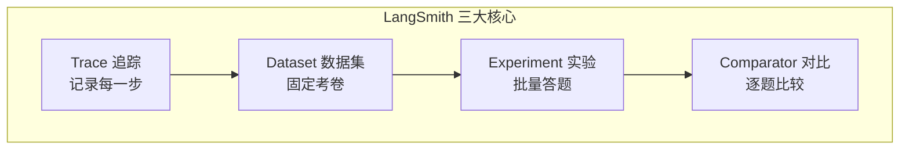

# 附录 AK LangSmith 速查手册

> 定位：工程工具。LangSmith 核心概念、API、CLI 命令、环境变量速查。配套知识库 78-81 与附录 AL。

---

## 1. 概念速查



| 概念 | 一句话 | 详见 |
| --- | --- | --- |
| Run | 一次可追踪的执行单元 | KB78 |
| Run Tree | Run 组成的父子树 | KB78 |
| run_type | Run 类型(llm/chain/tool/embedding/retriever) | KB78 |
| @traceable | 把普通函数变成可追踪 | KB78 |
| Dataset | 固定的评测考卷 | KB79 |
| Example | Dataset 中的一道题 | KB79 |
| Experiment | 在 Dataset 上批量跑 | KB79 |
| Comparator | 两个实验逐题对比 | KB79 |
| Playground | 交互式 prompt 调试器 | KB80 |
| Prompt Hub | prompt 版本管理 | KB80 |
| Dashboard | trace 聚合的指标视图 | KB81 |
| Alert | 指标超阈值时通知 | KB81 |

---

## 2. 环境变量

| 变量 | 必需 | 说明 |
| --- | --- | --- |
| `LANGSMITH_TRACING` | 是 | 设为 `true` 开启追踪 |
| `LANGSMITH_API_KEY` | 是 | API 密钥 |
| `LANGSMITH_PROJECT` | 否 | 项目名（默认 "default"） |
| `LANGSMITH_ENDPOINT` | 否 | 自托管时设为本地地址 |
| `LANGSMITH_SAMPLE_RATE` | 否 | 采样率 0.0-1.0（线上高量时可降采样） |

---

## 3. Python SDK 速查

```python
from langsmith import Client
client = Client()

# === 追踪 ===
# 自动追踪：设好环境变量即可
# 手动追踪：
from langsmith import traceable

@traceable(run_type="tool")
def my_function(x): ...

# === 查询 Run ===
runs = client.list_runs(
    project_name="my-agent-prod",
    run_type="chain",        # 可选
    error=False,             # 只看成功的
    limit=20,
    order_by="-start_time"
)

# === Dataset ===
dataset = client.create_dataset(name="eval-v1", description="...")

client.create_example(
    inputs={"q": "什么是RAG?"},
    outputs={"a": "检索增强生成"},
    dataset_id=dataset.id,
    metadata={"difficulty": "easy"}
)

# 从 trace 创建样例
client.create_example(
    inputs=run.inputs,
    outputs=run.outputs,
    dataset_id=dataset.id
)

# === 实验 ===
experiment = client.run_on_dataset(
    dataset_name="eval-v1",
    llm_or_chain_factory=my_agent_fn,
    experiment_name="exp-v1"
)

# === Prompt Hub ===
prompt = client.pull_prompt("my-prompt", label="production")
client.push_prompt(name="my-prompt", object=chat_prompt)
```

---

## 4. 评估器速查

| 评估器 | 导入 | 说明 |
| --- | --- | --- |
| LLM 评估 | `RunEvalConfig.LLMEvalString` | LLM 判断对错 |
| 字符串相似 | `RunEvalConfig.StringDistance` | 编辑距离 |
| 嵌入相似 | `RunEvalConfig.EmbeddingDistance` | 向量距离 |
| 自定义 | `RunEvalConfig(custom_evaluators=[...])` | 你的函数 |

```python
from langchain.evaluation import RunEvalConfig

eval_config = RunEvalConfig(
    evaluators=[
        RunEvalConfig.LLMEvalString({
            "prediction_key": "output",
            "input_key": "input",
            "eval_name": "correctness"
        })
    ],
    custom_evaluators=[MyEvaluator()]
)
```

---

## 5. 指标速查

| 指标 | 计算 | 告警阈值 |
| --- | --- | --- |
| 评估分均值 | 实验 results 取均值 | < 0.75 |
| 错误率 | error Runs / total | > 5% |
| P50 延迟 | latencies 排序取中位数 | > 5s |
| P99 延迟 | latencies 取 99 分位 | > 15s |
| 日均 token | 24h 内所有 llm Run token 之和 | > 预算 |
| 单次成本 | tokens × 模型单价 | > $0.05 |

---

## 6. CLI 命令

| 命令 | 说明 |
| --- | --- |
| `langsmith login` | 登录并缓存 API Key |
| `langsmith dataset list` | 列出所有数据集 |
| `langsmith dataset download <name>` | 下载某数据集为 JSON |
| `langsmith experiment list` | 列出实验 |
| `langsmith trace list -p <project>` | 列出 trace |
| `langsmith trace view <run_id>` | 查看某个 trace |

---

## 7. 常见问题

| 问题 | 原因 | 解决 |
| --- | --- | --- |
| Trace 没出现 | 环境变量没设 | 检查 `LANGSMITH_TRACING=true` |
| Run 不完整 | 异常退出 | try/finally 确保 Run 关闭 |
| Token 为空 | 模型不返回 usage | 确保模型支持 usage |
| trace 太大 | 输入输出太大 | 设 `max_payload_bytes` |
| 实验失败 | 函数签名不对 | 确保 `llm_or_chain_factory` 返回 Runnable |
| Dataset 为空 | 没加样例 | 用 `create_example` |

---

## 8. 与既有附录的衔接

| 附录 | 主题 | 与 LangSmith 的关系 |
| --- | --- | --- |
| 附录 M | RAGAS 评测 | RAGAS 评测可在 LangSmith 实验中跑 |
| 附录 AE | 评测基准速查 | LangSmith Dataset = 评测考卷 |
| 附录 AF | 评测集模板 | LangSmith Example = 考卷中的题 |
| 附录 AI | Platform 速查 | LangSmith 是 Platform 的观测层 |
| 附录 AJ | 部署配置模板 | CI/CD 中跑 LangSmith 回归测试 |

---

**配套**：知识库 78-81、学习课程 82-85、附录 AL（代码模板）。