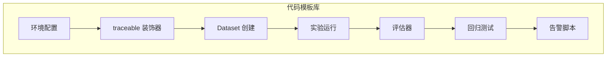

# 附录 AL LangSmith 追踪与实验代码模板库

> 定位：工程工具。可直接抄用的代码模板：环境配置、@traceable、Dataset 创建、实验运行、评估器、回归测试、告警脚本。配套知识库 78-81 与附录 AK。

---

## 0. 模板总览



---

## 1. 环境配置模板

```python
# langsmith_config.py
import os

def setup_langsmith(project_name="my-agent-prod"):
    """LangSmith 环境配置"""
    os.environ["LANGSMITH_TRACING"] = "true"
    os.environ["LANGSMITH_API_KEY"] = os.getenv("LANGSMITH_API_KEY", "")
    os.environ["LANGSMITH_PROJECT"] = project_name
    
    # 线上高量时可降采样
    if os.getenv("ENV") == "production":
        os.environ["LANGSMITH_SAMPLE_RATE"] = "0.1"  # 10% 采样
    else:
        os.environ["LANGSMITH_SAMPLE_RATE"] = "1.0"  # 开发环境全量

# 使用
setup_langsmith("my-agent-prod")
```

---

## 2. @traceable 追踪模板

```python
# traceable_template.py
from langsmith import traceable
from openai import OpenAI

client = OpenAI()

@traceable(run_type="llm", name="llm_call")
def call_llm(prompt: str, model: str = "gpt-4o") -> str:
    """LLM 调用（自动追踪）"""
    response = client.chat.completions.create(
        model=model,
        messages=[{"role": "user", "content": prompt}]
    )
    return response.choices[0].message.content

@traceable(run_type="tool", name="search")
def search_docs(query: str, k: int = 3) -> list:
    """搜索工具（自动追踪）"""
    # 你的检索逻辑
    results = [{"content": f"关于 {query} 的内容", "score": 0.9}]
    return results

@traceable(run_type="chain", name="agent")
def answer_question(question: str) -> str:
    """Agent 主流程（自动追踪子 Run）"""
    docs = search_docs(question)               # 子 Run: tool
    context = "\n".join(d["content"] for d in docs)
    answer = call_llm(f"基于以下内容回答：{context}\n问题：{question}")  # 子 Run: llm
    return answer

# 执行后自动在 LangSmith 生成 trace 树
```

---

## 3. Dataset 创建模板

```python
# create_dataset.py
from langsmith import Client

client = Client()

def create_eval_dataset():
    """创建评测数据集"""
    dataset = client.create_dataset(
        name="qa-eval-v1",
        description="问答系统评测集 v1"
    )
    
    # 手动添加样例
    examples = [
        {"q": "什么是 RAG?", "a": "检索增强生成", 
         "keywords": ["检索", "增强", "生成"], "difficulty": "easy"},
        {"q": "怎么选向量库?", "a": "根据规模延迟成本选型", 
         "keywords": ["规模", "延迟", "成本"], "difficulty": "medium"},
        {"q": "什么是 MCP?", "a": "模型上下文协议", 
         "keywords": ["协议", "上下文"], "difficulty": "medium"},
    ]
    
    for ex in examples:
        client.create_example(
            inputs={"question": ex["q"]},
            outputs={"answer": ex["a"], "keywords": ex["keywords"]},
            dataset_id=dataset.id,
            metadata={"difficulty": ex["difficulty"]}
        )
    
    return dataset

def add_from_traces(project_name, dataset_id, limit=50):
    """从 trace 中挑样例加入数据集"""
    runs = list(client.list_runs(
        project_name=project_name,
        run_type="chain",
        error=False,
        limit=limit
    ))
    
    added = 0
    for run in runs:
        if run.outputs and len(str(run.outputs)) > 50:
            client.create_example(
                inputs=run.inputs,
                outputs=run.outputs,
                dataset_id=dataset_id,
                metadata={"source": "trace", "run_id": str(run.id)}
            )
            added += 1
    
    print(f"从 trace 添加了 {added} 条样例")
```

---

## 4. 实验运行模板

```python
# run_experiment.py
from langsmith import Client
from langchain_openai import ChatOpenAI
from langchain_core.prompts import ChatPromptTemplate

client = Client()

def run_ab_experiment(dataset_name="qa-eval-v1"):
    """A/B 实验对比两个 prompt"""
    
    prompt_v1 = ChatPromptTemplate.from_messages([
        ("system", "你是一个助手。"),
        ("user", "{question}")
    ])
    
    prompt_v2 = ChatPromptTemplate.from_messages([
        ("system", "你是专业技术助手，回答简洁准确。"),
        ("user", "{question}")
    ])
    
    for name, prompt in [("prompt-v1", prompt_v1), ("prompt-v2", prompt_v2)]:
        client.run_on_dataset(
            dataset_name=dataset_name,
            llm_or_chain_factory=prompt | ChatOpenAI(model="gpt-4o"),
            experiment_name=name
        )
    
    print("实验完成，在 LangSmith UI 用 Comparator 对比")
```

---

## 5. 自定义评估器模板

```python
# custom_evaluator.py
from langchain.evaluation import RunEvalConfig

class KeywordHitEvaluator:
    """关键词命中率评估器"""
    
    def evaluate(self, run, example):
        output = str(run.outputs.get("output", ""))
        keywords = example.outputs.get("keywords", [])
        
        if not keywords:
            return {"key": "keyword_hit", "score": 0, "comment": "无关键词"}
        
        hits = sum(1 for kw in keywords if kw in output)
        score = hits / len(keywords)
        
        return {
            "key": "keyword_hit",
            "score": score,
            "comment": f"命中 {hits}/{len(keykeywords)}: {keywords}"
        }

class LengthEvaluator:
    """回复长度评估器"""
    
    def evaluate(self, run, example):
        output = str(run.outputs.get("output", ""))
        length = len(output)
        
        # 太短或太长都扣分
        if length < 50:
            score = 0.3
        elif length < 200:
            score = 1.0
        elif length < 500:
            score = 0.7
        else:
            score = 0.5
        
        return {
            "key": "length_check",
            "score": score,
            "comment": f"长度 {length} 字"
        }

# 使用
eval_config = RunEvalConfig(
    custom_evaluators=[KeywordHitEvaluator(), LengthEvaluator()]
)

client.run_on_dataset(
    dataset_name="qa-eval-v1",
    llm_or_chain_factory=answer_question,
    evaluation=eval_config,
    experiment_name="exp-with-custom-eval"
)
```

---

## 6. 回归测试模板

```python
# regression_test.py
#!/usr/bin/env python3
"""CI/CD 中的回归测试脚本"""
import os, sys, json
from langsmith import Client

client = Client()
BASELINE_SCORE = 0.75  # 上线时的基线分

def run_regression():
    """跑回归测试，不达标退出 1"""
    experiment = client.run_on_dataset(
        dataset_name="qa-eval-v1",
        llm_or_chain_factory=current_agent_fn,
        evaluation=RunEvalConfig(
            custom_evaluators=[KeywordHitEvaluator()]
        ),
        experiment_name=f"regression-{os.getenv('GIT_SHA', 'local')[:8]}"
    )
    
    results = list(client.list_experiment_results(experiment.id))
    scores = [r.score for r in results if r.score is not None]
    avg = sum(scores) / len(scores) if scores else 0
    
    print(f"回归测试: {avg:.4f} (基线: {BASELINE_SCORE})")
    
    # 写入结果文件供 CI 使用
    with open("eval_results.json", "w") as f:
        json.dump({"score": round(avg, 4), "baseline": BASELINE_SCORE}, f)
    
    if avg < BASELINE_SCORE:
        print(f"FAIL: {avg:.4f} < {BASELINE_SCORE}")
        sys.exit(1)
    else:
        print(f"PASS: {avg:.4f} >= {BASELINE_SCORE}")
        sys.exit(0)

run_regression()
```

---

## 7. 告警脚本模板

```python
# alert_monitor.py
#!/usr/bin/env python3
"""LangSmith 指标监控告警（配合 cron 每小时跑）"""
import os, sys
from datetime import datetime, timedelta
from langsmith import Client
import httpx

client = Client()

def check_metrics():
    """检查过去 1 小时的指标"""
    end = datetime.now()
    start = end - timedelta(hours=1)
    
    runs = list(client.list_runs(
        project_name="my-agent-prod",
        start_time={"gte": start, "lte": end},
        run_type="chain"
    ))
    
    total = len(runs)
    if total == 0:
        print("无运行")
        return
    
    errors = sum(1 for r in runs if r.status == "error")
    error_rate = errors / total
    
    latencies = [(r.end_time - r.start_time).total_seconds() 
                 for r in runs if r.end_time]
    latencies.sort()
    p99 = latencies[int(len(latencies)*0.99)] if latencies else 0
    
    alerts = []
    if error_rate > 0.05:
        alerts.append(f"错误率 {error_rate:.1%} > 5%")
    if p99 > 15:
        alerts.append(f"P99 {p99:.1f}s > 15s")
    
    if alerts:
        msg = f"Agent 告警 ({total} runs):\n" + "\n".join(alerts)
        webhook = os.getenv("SLACK_WEBHOOK_URL")
        if webhook:
            httpx.post(webhook, json={"text": msg})
        print(f"ALERT: {msg}")
        sys.exit(1)
    else:
        print(f"OK: {total} runs, error={error_rate:.1%}, p99={p99:.1f}s")

check_metrics()
```

---

## 8. SLO 周报模板

```python
# slo_report.py
#!/usr/bin/env python3
"""生成 SLO 周报"""
from datetime import datetime, timedelta
from langsmith import Client

client = Client()

def generate_weekly_report():
    end = datetime.now()
    start = end - timedelta(days=7)
    
    runs = list(client.list_runs(
        project_name="my-agent-prod",
        start_time={"gte": start, "lte": end}
    ))
    
    total = len(runs)
    errors = sum(1 for r in runs if r.status == "error")
    availability = (1 - errors/total) * 100 if total else 0
    
    latencies = [(r.end_time - r.start_time).total_seconds() 
                 for r in runs if r.end_time]
    latencies.sort()
    p50 = latencies[len(latencies)//2] if latencies else 0
    p99 = latencies[int(len(latencies)*0.99)] if latencies else 0
    
    print(f"""
    SLO 周报 ({start.date()} ~ {end.date()})
    ================================
    总运行: {total}
    可用性: {availability:.2f}% (目标 99.5%) {'PASS' if availability >= 99.5 else 'FAIL'}
    P50: {p50:.1f}s (目标 <3s) {'PASS' if p50 < 3 else 'FAIL'}
    P99: {p99:.1f}s (目标 <10s) {'PASS' if p99 < 10 else 'FAIL'}
    """)

generate_weekly_report()
```

---

## 9. Prompt 动态拉取模板

```python
# dynamic_prompt.py
from langsmith import Client
from langchain_core.prompts import ChatPromptTemplate

client = Client()

def get_production_prompt(name="my-agent-prompt"):
    """从 LangSmith Hub 拉取生产 prompt"""
    try:
        return client.pull_prompt(name, label="production")
    except Exception:
        # Fallback: 用本地默认 prompt
        return ChatPromptTemplate.from_messages([
            ("system", "你是助手。"),
            ("user", "{question}")
        ])

def push_new_prompt(name, prompt, description=""):
    """推送新版本 prompt 到 Hub"""
    client.push_prompt(
        name=name,
        object=prompt,
        description=description,
        is_public=False
    )
    print(f"Prompt {name} 已推送")
```

---

**配套**：知识库 78-81、学习课程 82-85、附录 AK（速查）。