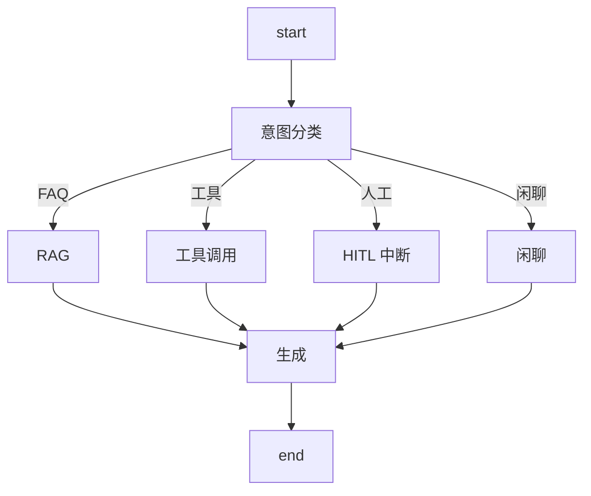
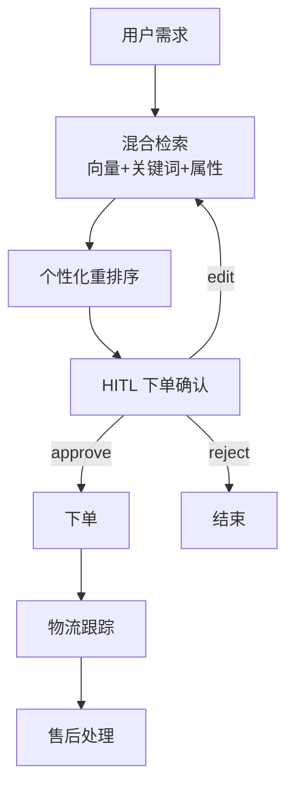

# 附录 AM 垂直行业 Agent 项目速查手册

> 本附录汇总阶段 14 四个行业项目的核心架构、关键参数、合规清单和踩坑要点，供项目实施时快速查阅。

---

## 一、四行业核心参数对比

| 参数 | 客服 | 法律 | 金融 | 电商 | 医疗 |
| --- | --- | --- | --- | --- | --- |
| 分块策略 | 500 字 | 按条款 | 表格+文本 | 属性+文本 | 按段落 |
| 检索方式 | 向量+关键词 | 精确+语义 | 结构化+语义 | 混合+属性过滤 | 语义+关键词 |
| Top-K | 5 | 3 | 5 | 10 | 5 |
| 重排序 | 可选 | 必须 | 必须 | 必须 | 必须 |
| HITL 触发 | 投诉/退款 | 全量审核 | 大额操作 | 下单/退换 | 全量审核 |
| 合规等级 | 低 | 极高 | 极高 | 中 | 极高 |
| 部署模式 | Platform | 私有化 | 私有化 | Platform | 私有化 |

---

## 二、客服 Agent 架构速查

| 组件 | 推荐方案 | 备注 |
| --- | --- | --- |
| 意图分类 | LLM 分类 + few-shot | 200 条标注集 |
| RAG | 语义 + BM25 混合 | Top-5 |
| 工具 | 物流/退款/订单 | 50 条测试用例 |
| HITL | interrupt + approve/reject | 投诉/退款触发 |
| 评测 | 意图准确率 + 回答正确率 | 100+200 条 |
| 监控 | LangSmith Trace + SLO | P95 < 3s |

---

## 三、法律/金融 RAG 速查

### 法律 RAG

| 维度 | 方案 |
| --- | --- |
| 分块 | 按条款编号，不按字数 |
| 引用 | metadata 记录法条编号 |
| 检索 | 精确匹配 + 语义重排 |
| 输出 | 必须附引用出处 |
| 免责 | 生成时追加免责声明 |

### 金融 RAG

| 维度 | 方案 |
| --- | --- |
| 分块 | 文本 + 表格分离提取 |
| 表格 | 结构化提取（行列保留） |
| 验证 | 多源数值交叉检查 |
| 脱敏 | 输出前 PII 过滤 |
| 审计 | 每次调用记录日志 |

---

## 四、电商购物 Agent 速查

| 组件 | 推荐方案 | 备注 |
| --- | --- | --- |
| 检索 | 向量 + BM25 + 属性过滤 | Top-10 |
| 推荐 | 用户画像 + 重排序 | 冷启动用热门 |
| HITL | 下单前 interrupt | approve/reject/edit |
| 物流 | 物流 API 工具 | 实时查询 |
| 售后 | 退换货工具 + HITL | 需人工确认 |

---

## 五、医疗问答 Agent 速查

| 安全红线 | 规则 | 实现 |
| --- | --- | --- |
| 不能确诊 | 回答不含诊断结论 | 输出过滤器 |
| 不能开药 | 回答不含用药建议 | 输出过滤器 |
| 紧急分诊 | 紧急关键词→建议就医 | 输入分类器 |
| 隐私脱敏 | 用户输入 PII 脱敏 | 输入脱敏 |
| 免责声明 | 每回答附声明 | 生成时追加 |
| 转人工 | 超出范围→转医生 | HITL 中断 |

---

## 六、通用七步法检查清单

| 步骤 | 检查项 | 完成 |
| --- | --- | --- |
| 1 需求分析 | 痛点列表 + 成功标准 | ☐ |
| 2 数据准备 | 数据源 + 治理流程 | ☐ |
| 3 架构设计 | 状态图 + 组件选型 | ☐ |
| 4 原型开发 | MVP 跑通 | ☐ |
| 5 评测建立 | 数据集 + 门禁 | ☐ |
| 6 安全加固 | HITL + 合规 + 脱敏 | ☐ |
| 7 部署运营 | Platform + LangSmith | ☐ |

---

## 七、常见踩坑

| 坑 | 症状 | 解法 |
| --- | --- | --- |
| 意图分类太粗 | FAQ 和工具混淆 | 增加分类类别 + few-shot |
| 分块切断法条 | 引用不完整 | 按条款分块 |
| 表格压扁 | 数值丢失 | 结构化提取 |
| 下单无确认 | 误下单 | HITL interrupt |
| 医疗可确诊 | 安全事故 | 输出过滤器 |
| 无审计日志 | 合规不过 | 每次调用记录 |
| 无免责声明 | 法律风险 | 生成时追加 |

---

## 八、各行业部署模式建议

| 行业 | 模式 | 原因 |
| --- | --- | --- |
| 客服 | Platform Cloud | 数据不敏感 |
| 法律 | 私有化 | 客户数据保密 |
| 金融 | 私有化 | 合规要求 |
| 电商 | Platform Cloud / Hybrid | 混合可行 |
| 医疗 | 私有化 | 病人隐私 |

> 配合附录 AN 代码模板库使用。