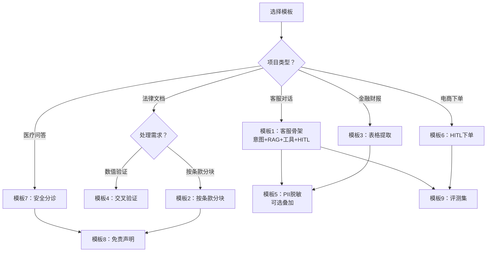

# 附录 AN 垂直行业 Agent 代码模板库

> 本附录提供阶段 14 四个行业项目的可直接复用代码模板。所有模板均基于 LangChain 0.3 + LangGraph 0.2，Python 3.11+。

---

## 模板选用决策图



| 模板 | 行业 | 用途 |
| --- | --- | --- |
| 1-9 | 客服/法律/金融/电商/医疗 | 见底部说明表 |

---

## 模板 1：客服 Agent 完整骨架

```python
"""客服 Agent 完整骨架——意图分类 + RAG + 工具 + HITL"""
from typing import TypedDict, Literal
from langgraph.graph import StateGraph, END
from langgraph.types import interrupt, Command
from langchain_core.prompts import ChatPromptTemplate
from langchain_openai import ChatOpenAI
from langchain_community.vectorstores import FAISS
from langchain_openai import OpenAIEmbeddings

class State(TypedDict):
    query: str
    intent: str
    retrieved: list
    answer: str
    needs_human: bool

# 1. 意图分类节点
def classify(state: State) -> State:
    prompt = ChatPromptTemplate.from_template("""
    判断用户意图，只返回以下之一：faq, tool, human, chat
    用户输入：{query}
    """)
    llm = ChatOpenAI(temperature=0)
    result = (prompt | llm).invoke({"query": state["query"]})
    state["intent"] = result.content.strip().lower()
    return state

# 2. RAG 检索节点
def rag_search(state: State) -> State:
    embeddings = OpenAIEmbeddings()
    # 实际使用时加载预构建的向量库
    # vectorstore = FAISS.load_local("faq_index", embeddings)
    # docs = vectorstore.similarity_search(state["query"], k=5)
    state["retrieved"] = ["示例文档1", "示例文档2"]
    state["answer"] = "基于 FAQ 的回答"
    return state

# 3. 工具调用节点
def tool_call(state: State) -> State:
    # 调用物流/退款/订单 API
    state["answer"] = "工具调用结果"
    return state

# 4. HITL 中断节点
def human_handoff(state: State) -> State:
    decision = interrupt({
        "prompt": f"需要人工处理：{state['query']}",
        "options": ["approve", "reject"]
    })
    if decision == "approve":
        state["answer"] = "人工已处理"
    else:
        state["answer"] = "人工已拒绝"
    return state

# 5. 闲聊节点
def chat(state: State) -> State:
    state["answer"] = "您好，有什么可以帮您？"
    return state

def route(state: State) -> str:
    return state["intent"]

# 6. 构建图
g = StateGraph(State)
g.add_node("classify", classify)
g.add_node("faq", rag_search)
g.add_node("tool", tool_call)
g.add_node("human", human_handoff)
g.add_node("chat", chat)
g.set_entry_point("classify")
g.add_conditional_edges("classify", route, {
    "faq": "faq",
    "tool": "tool",
    "human": "human",
    "chat": "chat",
})
g.add_edge("faq", END)
g.add_edge("tool", END)
g.add_edge("human", END)
g.add_edge("chat", END)

app = g.compile()
```

---

## 模板 2：法律 RAG 按条款分块

```python
"""法律文档按条款分块——保持法条完整性"""
import re
from langchain_core.documents import Document

def chunk_by_clause(text: str, law_name: str) -> list:
    """按条款编号分块"""
    # 匹配"第X条"模式
    pattern = r'第[一二三四五六七八九十百千零\d]+条'
    clauses = re.split(pattern, text)
    headings = re.findall(pattern, text)
    
    docs = []
    for i, clause_text in enumerate(clauses[1:]):  # 跳过第一段（条款前内容）
        heading = headings[i] if i < len(headings) else f"第{i+1}条"
        docs.append(Document(
            page_content=f"{heading} {clause_text.strip()}",
            metadata={
                "law_name": law_name,
                "clause_no": heading,
                "source": f"{law_name} {heading}"
            }
        ))
    return docs

# 使用示例
with open("合同法.txt", encoding="utf-8") as f:
    text = f.read()
docs = chunk_by_clause(text, "中华人民共和国民法典")
print(f"分块数：{len(docs)}")
for d in docs[:3]:
    print(f"[{d.metadata['clause_no']}] {d.page_content[:50]}...")
```

---

## 模板 3：金融表格结构化提取

```python
"""金融财报表格提取——保留行列结构"""
import pandas as pd
from langchain_core.documents import Document

def extract_tables_from_excel(path: str) -> list:
    """从 Excel 提取所有表为 Document"""
    xls = pd.ExcelFile(path)
    docs = []
    for sheet in xls.sheet_names:
        df = pd.read_excel(path, sheet_name=sheet)
        # 转为 Markdown 表格文本
        table_text = df.to_markdown(index=False)
        docs.append(Document(
            page_content=table_text,
            metadata={
                "type": "table",
                "sheet": sheet,
                "rows": len(df),
                "cols": len(df.columns)
            }
        ))
    return docs

def extract_tables_from_pdf(path: str) -> list:
    """从 PDF 提取表格（需 pdfplumber）"""
    import pdfplumber
    docs = []
    with pdfplumber.open(path) as pdf:
        for i, page in enumerate(pdf.pages):
            tables = page.extract_tables()
            for j, table in enumerate(tables):
                df = pd.DataFrame(table[1:], columns=table[0])
                docs.append(Document(
                    page_content=df.to_markdown(index=False),
                    metadata={"type": "table", "page": i+1, "table_no": j+1}
                ))
    return docs
```

---

## 模板 4：金融数值交叉验证

```python
"""数值交叉验证——多源核对关键数字"""
def cross_validate_numbers(
    answer: str,
    sources: list,
    threshold: float = 0.95
) -> dict:
    """检查答案中的数字是否与来源一致"""
    import re
    # 提取答案中的数字
    numbers_in_answer = re.findall(r'[\d.]+[%亿元万元]?', answer)
    
    verified = []
    for num in numbers_in_answer:
        found = False
        for src in sources:
            if num in src:
                found = True
                break
        verified.append({"number": num, "verified": found})
    
    pass_rate = sum(1 for v in verified if v["verified"]) / max(len(verified), 1)
    return {
        "pass": pass_rate >= threshold,
        "pass_rate": pass_rate,
        "details": verified
    }

# 使用示例
answer = "公司2024年营收15.3亿元，同比增长20%"
sources = ["2024年营收15.3亿元", "同比增长20%", "净利润3.1亿元"]
result = cross_validate_numbers(answer, sources)
print(f"验证结果：{'通过' if result['pass'] else '未通过'} ({result['pass_rate']:.0%})")
```

---

## 模板 5：PII 脱敏过滤器

```python
"""PII 脱敏——过滤手机号/身份证号/银行卡号"""
import re

PII_PATTERNS = {
    "phone": (r'1[3-9]\d{9}', lambda m: m.group()[:3] + "****" + m.group()[-4:]),
    "id_card": (r'\d{17}[\dXx]', lambda m: m.group()[:6] + "********" + m.group()[-4:]),
    "bank_card": (r'\d{16,19}', lambda m: m.group()[:4] + " **** **** " + m.group()[-4:]),
    "email": (r'[\w.]+@[\w.]+', lambda m: m.group()[0] + "***" + m.group()[-10:]),
}

def mask_pii(text: str) -> str:
    """脱敏文本中的 PII"""
    for pii_type, (pattern, replacer) in PII_PATTERNS.items():
        text = re.sub(pattern, replacer, text)
    return text

# 使用示例
text = "联系人张三，手机13812345678，身份证110101199001011234"
masked = mask_pii(text)
print(masked)
# 输出：联系人张三，手机138****5678，身份证110101********1234
```

---

## 模板 6：电商 HITL 下单确认

```python
"""电商下单 HITL 确认——approve/reject/edit"""
from langgraph.types import interrupt
from typing import TypedDict

class OrderState(TypedDict):
    query: str
    products: list
    order_info: str
    status: str

def format_order(state: OrderState) -> str:
    """格式化订单信息"""
    lines = []
    for p in state["products"]:
        lines.append(f"  - {p['name']} x{p['qty']} = ¥{p['price']*p['qty']}")
    total = sum(p['price']*p['qty'] for p in state["products"])
    return f"订单明细：\n" + "\n".join(lines) + f"\n合计：¥{total}"

def order_confirm(state: OrderState) -> OrderState:
    """下单确认节点——HITL"""
    order_text = format_order(state)
    decision = interrupt({
        "prompt": f"请确认下单：\n{order_text}",
        "options": ["approve", "reject", "edit"]
    })
    if decision == "approve":
        state["status"] = "ordered"
        # 调用下单 API
    elif decision == "reject":
        state["status"] = "cancelled"
    elif decision == "edit":
        state["status"] = "editing"
        # 返回编辑流程
    return state
```

---

## 模板 7：医疗安全分诊

```python
"""医疗安全分诊——紧急关键词检测"""
from typing import TypedDict

EMERGENCY_KEYWORDS = [
    "胸痛", "呼吸困难", "大出血", "昏迷", "抽搐",
    "过敏休克", "中毒", "高烧不退", "剧烈腹痛",
    "意识不清", "心脏骤停", "中风", "急症"
]

class TriageState(TypedDict):
    query: str
    is_emergency: bool
    answer: str

def safety_triage(state: TriageState) -> TriageState:
    """紧急分诊——检测到紧急关键词立即建议就医"""
    state["is_emergency"] = any(
        kw in state["query"] for kw in EMERGENCY_KEYWORDS
    )
    if state["is_emergency"]:
        state["answer"] = (
            "您描述的症状可能属于紧急情况，"
            "请立即就医或拨打120急救电话。"
            "本回答不构成医疗建议。"
        )
    return state

def medical_disclaimer(answer: str) -> str:
    """添加医疗免责声明"""
    disclaimer = "\n\n---\n本回答仅供参考，不构成医疗诊断或治疗建议。"
    "如有健康问题，请咨询专业医生。"
    return answer + disclaimer
```

---

## 模板 8：合规免责声明生成器

```python
"""合规免责声明生成器——按行业追加"""
 DISCLAIMERS = {
    "legal": "\n\n免责声明：本回答仅供参考，不构成法律意见。"
             "具体法律问题请咨询专业律师。",
    "finance": "\n\n免责声明：本回答仅供参考，不构成投资建议。"
               "投资有风险，决策需谨慎。",
    "medical": "\n\n免责声明：本回答仅供参考，不构成医疗诊断或治疗建议。"
               "如有健康问题，请咨询专业医生。",
    "general": "",
}

def add_disclaimer(answer: str, industry: str) -> str:
    """按行业追加免责声明"""
    return answer + DISCLAIMERS.get(industry, DISCLAIMERS["general"])

# 使用示例
legal_answer = add_disclaimer("根据民法典第XX条...", "legal")
medical_answer = add_disclaimer("该症状可能是...", "medical")
```

---

## 模板 9：行业评测数据集构造

```python
"""行业评测数据集构造模板"""
import json

def build_eval_dataset(industry: str, samples: list) -> dict:
    """
    构造评测数据集
    samples: [{"query": "...", "expected_intent": "...", "expected_answer_contains": ["关键词"]}]
    """
    dataset = {
        "industry": industry,
        "version": "1.0",
        "sample_count": len(samples),
        "samples": samples,
        "metrics": ["intent_accuracy", "answer_correctness", "safety_pass_rate"]
    }
    return dataset

# 客服评测集示例
customer_service_samples = [
    {"query": "我的订单到哪了", "expected_intent": "tool",
     "expected_answer_contains": ["物流", "订单"]},
    {"query": "退款多久到账", "expected_intent": "faq",
     "expected_answer_contains": ["退款", "到账"]},
    {"query": "我要投诉", "expected_intent": "human",
     "expected_answer_contains": ["人工", "客服"]},
]
dataset = build_eval_dataset("customer_service", customer_service_samples)
with open("eval_customer_service.json", "w", encoding="utf-8") as f:
    json.dump(dataset, f, ensure_ascii=False, indent=2)
print(f"构造评测集：{dataset['sample_count']} 条")
```

---

## 模板使用说明

| 模板 | 用途 | 对应行业 |
| --- | --- | --- |
| 1 客服骨架 | 完整客服 Agent | 客服 |
| 2 按条款分块 | 法律文档处理 | 法律 |
| 3 表格提取 | 金融财报处理 | 金融 |
| 4 数值验证 | 金融准确性 | 金融 |
| 5 PII 脱敏 | 多行业隐私保护 | 金融/医疗 |
| 6 HITL 下单 | 电商下单确认 | 电商 |
| 7 安全分诊 | 医疗紧急检测 | 医疗 |
| 8 免责声明 | 合规声明 | 法律/金融/医疗 |
| 9 评测集构造 | 行业评测 | 通用 |

> 所有模板均可直接复制使用，替换实际数据源和 API 后即可运行。