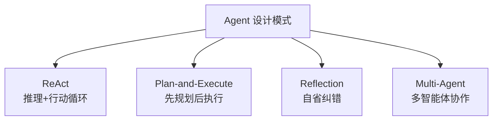
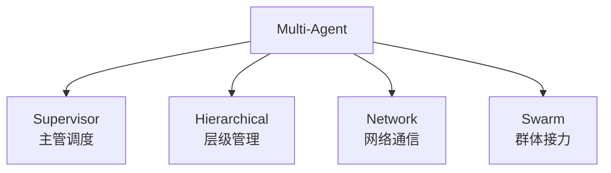
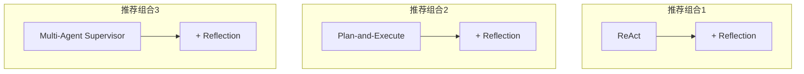

# 附录 AO：Agent 设计模式速查手册

> 阶段 16 配套附录。四种 Agent 设计模式的核心要点、代码模板与选型指南一页通查。

---

## 一、四种模式一览



---

## 二、ReAct 速查

### 核心循环

Thought → Action → Observation → 重复 → Answer

### LangGraph 最小实现

```python
from langgraph.graph import StateGraph, END
from langgraph.prebuilt import ToolNode

g = StateGraph(State)
g.add_node("agent", agent_node)       # LLM 决策
g.add_node("tools", ToolNode(tools))  # 工具执行
g.set_entry_point("agent")
g.add_conditional_edges("agent", route_fn, {"tools": "tools", END: END})
g.add_edge("tools", "agent")
app = g.compile()
```

### 关键参数

| 参数 | 推荐值 | 说明 |
| --- | --- | --- |
| temperature | 0 | 推理要稳定 |
| max_iterations | 5-10 | 防死循环 |
| 工具描述 | 详细 | 模型选对工具 |

### 适用场景

- 问答 + 搜索
- 简单工具调用
- 2-3 步任务

---

## 三、Plan-and-Execute 速查

### 三组件

Planner（规划器）→ Executor（执行器）→ Replanner（重规划器）

### LangGraph 最小实现

```python
g = StateGraph(State)
g.add_node("planner", planner_node)
g.add_node("executor", executor_node)
g.add_node("summarize", summarize_node)
g.set_entry_point("planner")
g.add_edge("planner", "executor")
g.add_conditional_edges("executor", should_continue,
    {"executor": "executor", "summarize": "summarize"})
g.add_edge("summarize", END)
```

### 关键参数

| 参数 | 推荐值 | 说明 |
| --- | --- | --- |
| 步骤数上限 | 5-10 | 防过多 |
| Replanner | 可选 | 纠正偏差 |

### 适用场景

- 研究报告
- 多步骤复杂任务
- 需要全局视角

---

## 四、Reflection 速查

### 双循环

Generator（生成）→ Reflector（评审）→ 条件路由

### LangGraph 最小实现

```python
g = StateGraph(State)
g.add_node("generator", generator_node)
g.add_node("reflector", reflector_node)
g.set_entry_point("generator")
g.add_edge("generator", "reflector")
g.add_conditional_edges("reflector", route_fn,
    {"generator": "generator", END: END})
app = g.compile()
```

### 关键参数

| 参数 | 推荐值 | 说明 |
| --- | --- | --- |
| retry_count | 2-3 | 防无限重做 |
| 评审标准 | 明确 | LLM-as-Judge |

### 适用场景

- 代码生成
- 高质量写作
| 数学推理

---

## 五、Multi-Agent 速查

### 四种子模式



### Supervisor 最小实现

```python
g = StateGraph(State)
g.add_node("supervisor", supervisor_node)
g.add_node("agent_a", agent_a_node)
g.add_node("agent_b", agent_b_node)
g.set_entry_point("supervisor")
g.add_conditional_edges("supervisor", route_fn,
    {"agent_a": "agent_a", "agent_b": "agent_b", END: END})
g.add_edge("agent_a", "supervisor")
g.add_edge("agent_b", "supervisor")
app = g.compile()
```

### 关键参数

| 参数 | 推荐值 | 说明 |
| --- | --- | --- |
| Agent 数量 | 2-5 | 太多成本高 |
| Supervisor | 必需 | 防混乱 |
| 共享 State | 是 | 防丢上下文 |

### 适用场景

- 内容创作流水线
- 多专业领域协作
| 大型复杂项目

---

## 六、模式选型决策表

| 条件 | 推荐模式 |
| --- | --- |
| 步骤 1-3、简单 | ReAct |
| 步骤 4+、需规划 | Plan-and-Execute |
| 质量要求高 | Reflection |
| 多专业领域 | Multi-Agent |
| 简单+高质量 | ReAct + Reflection |
| 复杂+高质量 | Plan-and-Execute + Reflection |
| 多人+高质量 | Multi-Agent + Reflection |

---

## 七、组合模式推荐



---

## 八、常见反模式

| 反模式 | 问题 | 正确做法 |
| --- | --- | --- |
| 无 max_iterations | 死循环 | 加循环上限 |
| 工具描述模糊 | 选错工具 | 详细描述 |
| Agent 互相推任务 | 踢皮球 | Supervisor 强制路由 |
| 每步都调 LLM | 成本高 | 简单逻辑用代码 |
| 不共享 State | 上下文丢失 | 统一 State |

---

## 九、调试技巧

1. 用 LangSmith Trace 看每步输入输出；
2. 先单独测试每个节点；
3. 把复杂图拆成子图分别调试；
4. 用 `app.get_graph().draw_mermaid()` 看图结构。

---

> 本速查手册可与知识库 86-89 和课程 99-102 配合使用。