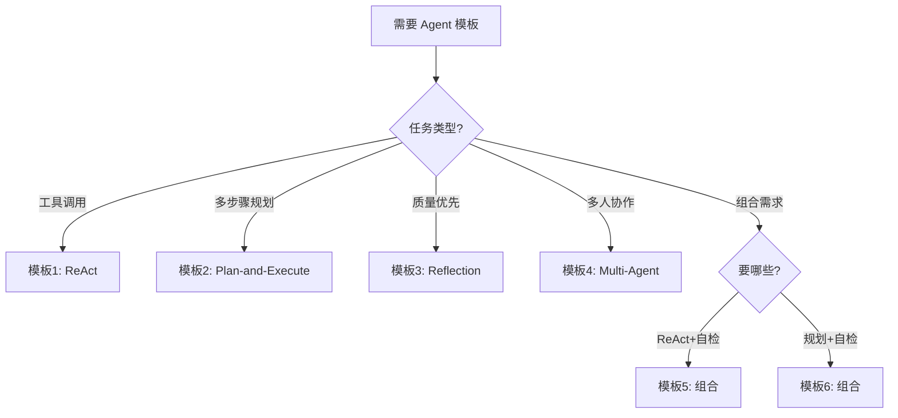

# 附录 AP：Agent 设计模式代码模板库

> 阶段 16 配套附录。四种 Agent 设计模式的可直接复用代码模板，含完整注释。

---

## 一、模板选用指南



---

## 二、模板 1：ReAct Agent

```python
"""
ReAct Agent 模板
用途：推理+行动循环，适合工具调用类任务
依赖：langgraph, langchain-openai
"""
from langgraph.graph import StateGraph, END
from langgraph.prebuilt import ToolNode
from langchain_openai import ChatOpenAI
from langchain_core.tools import tool
from typing import TypedDict, Annotated
from langgraph.graph.message import add_messages

# === 1. 定义工具 ===
@tool
def search(query: str) -> str:
    """搜索网络信息"""
    # 替换为实际搜索实现
    return f"搜索结果: {query}"

@tool
def calculate(expression: str) -> str:
    """数学计算"""
    try:
        return str(eval(expression))
    except Exception:
        return "计算错误"

tools = [search, calculate]

# === 2. 配置模型 ===
llm = ChatOpenAI(model="gpt-4o", temperature=0).bind_tools(tools)

# === 3. 定义状态 ===
class State(TypedDict):
    messages: Annotated[list, add_messages]

# === 4. 定义节点 ===
def agent_node(state: State):
    system = "你是一个有用的助手，可以使用工具回答问题。"
    messages = [{"role": "system", "content": system}] + state["messages"]
    response = llm.invoke(messages)
    state["messages"].append(response)
    return state

def route(state: State) -> str:
    last = state["messages"][-1]
    if hasattr(last, "tool_calls") and last.tool_calls:
        return "tools"
    return END

# === 5. 构建图 ===
graph = StateGraph(State)
graph.add_node("agent", agent_node)
graph.add_node("tools", ToolNode(tools))
graph.set_entry_point("agent")
graph.add_conditional_edges("agent", route, {"tools": "tools", END: END})
graph.add_edge("tools", "agent")
app = graph.compile()

# === 6. 使用 ===
if __name__ == "__main__":
    result = app.invoke({
        "messages": [{"role": "user", "content": "3的5次方是多少？"}]
    })
    print(result["messages"][-1].content)
```

---

## 三、模板 2：Plan-and-Execute Agent

```python
"""
Plan-and-Execute Agent 模板
用途：先规划再执行，适合复杂多步骤任务
"""
from langgraph.graph import StateGraph, END
from langchain_openai import ChatOpenAI
from typing import TypedDict, List

llm = ChatOpenAI(model="gpt-4o", temperature=0)

class State(TypedDict):
    question: str
    plan: List[str]
    results: List[str]
    answer: str

def planner(state: State):
    prompt = f"""把以下问题拆成3-5个步骤，编号列表格式：
    {state['question']}"""
    resp = llm.invoke(prompt)
    steps = [s.strip().lstrip('0123456789.') for s in resp.content.split('\n') if s.strip()]
    state["plan"] = steps
    state["results"] = []
    return state

def executor(state: State):
    idx = len(state["results"])
    if idx >= len(state["plan"]):
        return state
    resp = llm.invoke(f"执行此步骤: {state['plan'][idx]}")
    state["results"].append(resp.content)
    return state

def should_continue(state: State) -> str:
    if len(state["results"]) < len(state["plan"]):
        return "executor"
    return "summarize"

def summarize(state: State):
    parts = "\n".join(f"步骤{i+1}: {r}" for i, r in enumerate(state["results"]))
    resp = llm.invoke(f"基于以下结果回答问题:\n{parts}\n问题: {state['question']}")
    state["answer"] = resp.content
    return state

graph = StateGraph(State)
graph.add_node("planner", planner)
graph.add_node("executor", executor)
graph.add_node("summarize", summarize)
graph.set_entry_point("planner")
graph.add_edge("planner", "executor")
graph.add_conditional_edges("executor", should_continue,
    {"executor": "executor", "summarize": "summarize"})
graph.add_edge("summarize", END)
app = graph.compile()
```

---

## 四、模板 3：Reflection Agent

```python
"""
Reflection Agent 模板
用途：生成-评审-重做循环，适合高质量任务
"""
from langgraph.graph import StateGraph, END
from langchain_openai import ChatOpenAI
from typing import TypedDict

llm = ChatOpenAI(model="gpt-4o", temperature=0)

class State(TypedDict):
    question: str
    answer: str
    critique: str
    retry_count: int

def generator(state: State):
    prev = f"\n上次评审意见: {state['critique']}" if state.get("retry_count", 0) > 0 else ""
    resp = llm.invoke(f"认真回答: {state['question']}{prev}")
    state["answer"] = resp.content
    return state

def reflector(state: State):
    prompt = f"""评审回答:
    问题: {state['question']}
    回答: {state['answer']}
    合格则只说'通过'，不合格说明问题。"""
    resp = llm.invoke(prompt)
    state["critique"] = resp.content
    state["retry_count"] = state.get("retry_count", 0) + 1
    return state

def route(state: State) -> str:
    if "通过" in state.get("critique", "") or state["retry_count"] >= 3:
        return END
    return "generator"

graph = StateGraph(State)
graph.add_node("generator", generator)
graph.add_node("reflector", reflector)
graph.set_entry_point("generator")
graph.add_edge("generator", "reflector")
graph.add_conditional_edges("reflector", route,
    {"generator": "generator", END: END})
app = graph.compile()
```

---

## 五、模板 4：Multi-Agent（Supervisor）

```python
"""
Multi-Agent Supervisor 模板
用途：主管调度多个专业Agent
"""
from langgraph.graph import StateGraph, END
from langchain_openai import ChatOpenAI
from typing import TypedDict

llm = ChatOpenAI(model="gpt-4o", temperature=0)

class State(TypedDict):
    task: str
    next: str
    research: str
    draft: str
    final: str

def supervisor(state: State):
    if not state.get("research"):
        state["next"] = "researcher"
    elif not state.get("draft"):
        state["next"] = "writer"
    else:
        state["next"] = "done"
    return state

def researcher(state: State):
    resp = llm.invoke(f"研究主题: {state['task']}，列出3个关键信息。")
    state["research"] = resp.content
    return state

def writer(state: State):
    resp = llm.invoke(f"基于资料写200字:\n{state['research']}\n主题: {state['task']}")
    state["draft"] = resp.content
    state["final"] = state["draft"]
    return state

def route(state: State) -> str:
    nxt = state.get("next", "done")
    return {"researcher": "researcher", "writer": "writer"}.get(nxt, END)

graph = StateGraph(State)
graph.add_node("supervisor", supervisor)
graph.add_node("researcher", researcher)
graph.add_node("writer", writer)
graph.set_entry_point("supervisor")
graph.add_conditional_edges("supervisor", route,
    {"researcher": "researcher", "writer": "writer", END: END})
graph.add_edge("researcher", "supervisor")
graph.add_edge("writer", "supervisor")
app = graph.compile()
```

---

## 六、模板 5：ReAct + Reflection 组合

```python
"""
ReAct + Reflection 组合模板
先做 ReAct 推理，再做 Reflection 质检
"""
from langgraph.graph import StateGraph, END
from langchain_openai import ChatOpenAI
from typing import TypedDict

llm = ChatOpenAI(model="gpt-4o", temperature=0)

class State(TypedDict):
    question: str
    react_answer: str
    critique: str
    final_answer: str
    retry_count: int

def react_agent(state: State):
    prev = f"\n上次意见: {state['critique']}" if state.get("retry_count", 0) > 0 else ""
    resp = llm.invoke(f"用推理方式回答: {state['question']}{prev}")
    state["react_answer"] = resp.content
    return state

def reflector(state: State):
    prompt = f"问题: {state['question']}\n回答: {state['react_answer']}\n合格说'通过'，不合格说明问题。"
    resp = llm.invoke(prompt)
    state["critique"] = resp.content
    state["retry_count"] = state.get("retry_count", 0) + 1
    return state

def route(state: State) -> str:
    if "通过" in state.get("critique", "") or state["retry_count"] >= 3:
        state["final_answer"] = state["react_answer"]
        return END
    return "react"

graph = StateGraph(State)
graph.add_node("react", react_agent)
graph.add_node("reflector", reflector)
graph.set_entry_point("react")
graph.add_edge("react", "reflector")
graph.add_conditional_edges("reflector", route, {"react": "react", END: END})
app = graph.compile()
```

---

## 七、模板 6：Plan-and-Execute + Reflection 组合

```python
"""
Plan-and-Execute + Reflection 组合模板
先规划执行，再质检总结
"""
from langgraph.graph import StateGraph, END
from langchain_openai import ChatOpenAI
from typing import TypedDict, List

llm = ChatOpenAI(model="gpt-4o", temperature=0)

class State(TypedDict):
    question: str
    plan: List[str]
    results: List[str]
    draft: str
    critique: str
    final: str
    retry_count: int

def planner(state: State):
    resp = llm.invoke(f"拆成3-5步: {state['question']}")
    steps = [s.strip().lstrip('0123456789.') for s in resp.content.split('\n') if s.strip()]
    state["plan"] = steps
    state["results"] = []
    return state

def executor(state: State):
    idx = len(state["results"])
    if idx < len(state["plan"]):
        resp = llm.invoke(f"执行: {state['plan'][idx]}")
        state["results"].append(resp.content)
    return state

def should_continue(state: State) -> str:
    if len(state["results"]) < len(state["plan"]):
        return "executor"
    return "summarize"

def summarize(state: State):
    parts = "\n".join(state["results"])
    resp = llm.invoke(f"基于结果写回答:\n{parts}\n问题: {state['question']}")
    state["draft"] = resp.content
    return state

def reflector(state: State):
    prompt = f"问题: {state['question']}\n回答: {state['draft']}\n合格说'通过'，不合格说明问题。"
    resp = llm.invoke(prompt)
    state["critique"] = resp.content
    state["retry_count"] = state.get("retry_count", 0) + 1
    return state

def route(state: State) -> str:
    if "通过" in state.get("critique", "") or state["retry_count"] >= 3:
        state["final"] = state["draft"]
        return END
    return "summarize"

graph = StateGraph(State)
graph.add_node("planner", planner)
graph.add_node("executor", executor)
graph.add_node("summarize", summarize)
graph.add_node("reflector", reflector)
graph.set_entry_point("planner")
graph.add_edge("planner", "executor")
graph.add_conditional_edges("executor", should_continue,
    {"executor": "executor", "summarize": "summarize"})
graph.add_edge("summarize", "reflector")
graph.add_conditional_edges("reflector", route,
    {"summarize": "summarize", END: END})
app = graph.compile()
```

---

## 八、使用说明

| 模板 | 复制后需修改 | 注意事项 |
| --- | --- | --- |
| 模板1 ReAct | 工具函数实现 | max_iterations 防死循环 |
| 模板2 Plan-Execute | 规划提示词 | 步骤数上限 |
| 模板3 Reflection | 评审标准 | retry_count 上限 |
| 模板4 Multi-Agent | 子Agent逻辑 | Agent数量2-5 |
| 模板5 组合 | React提示词 | 两段重试上限一致 |
| 模板6 组合 | 规划+评审 | 比单模式耗Token |

---

> 本模板库可复制即用，配合附录 AO 速查手册使用效果更佳。