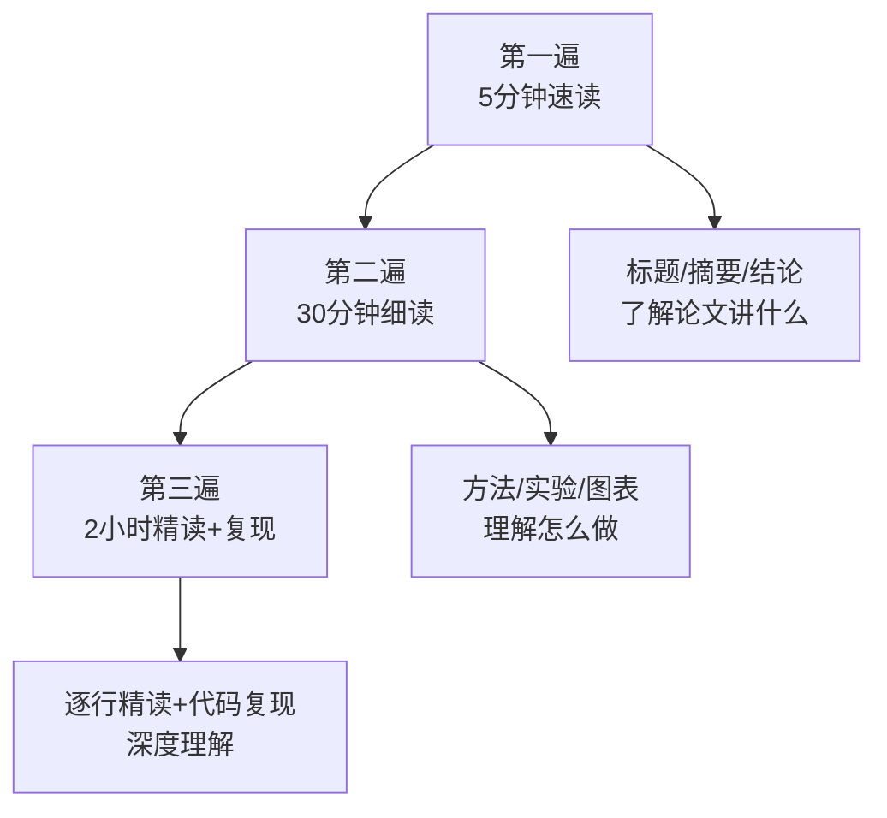
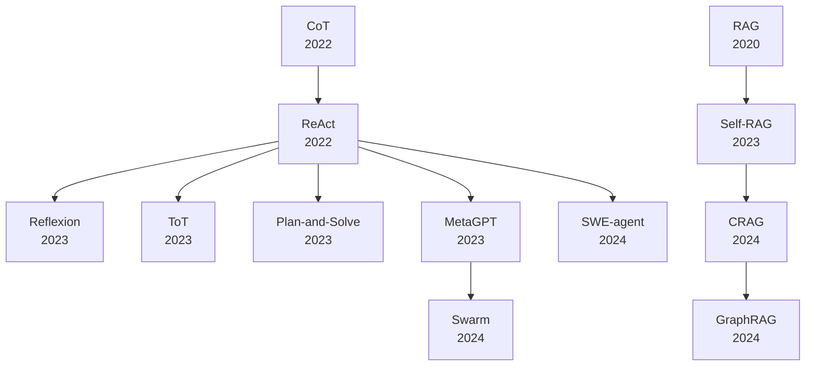
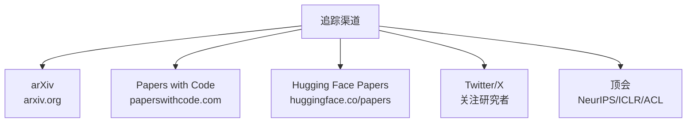
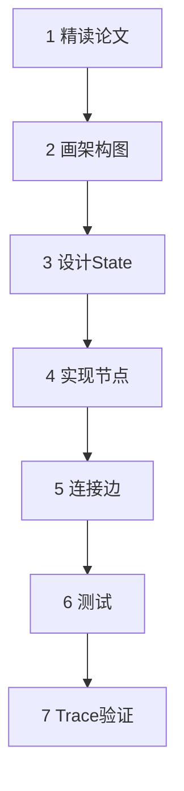
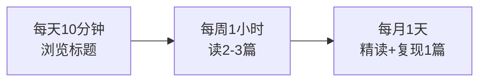

# 附录 AQ：AI Agent 论文阅读指南与必读清单

> 阶段 17 配套附录。论文精读方法、必读清单、追踪渠道一页通查。

---

## 一、论文精读三遍法

---

## 二、四问法

| 问题 | 回答什么 |
| --- | --- |
| What | 论文解决什么问题 |
| How | 用什么方法解决 |
| Why | 为什么这个方法有效 |
| So What | 对我的项目有什么启发 |

---

## 三、论文结构速查

| 部分 | 读什么 | 时间 |
| --- | --- | --- |
| Abstract | 一句话了解 | 1 分钟 |
| Introduction | 问题+动机 | 5 分钟 |
| Method | 核心方法（最重要） | 15 分钟 |
| Experiments | 实验设计+结果 | 5 分钟 |
| Conclusion | 贡献总结 | 2 分钟 |

---

## 四、必读论文清单

### 4.1 基础论文（本阶段已精读）

| 论文 | 年份 | 核心 | arXiv |
| --- | --- | --- | --- |
| ReAct | 2022 | 推理+行动循环 | 2210.03629 |
| Reflexion | 2023 | 自省+记忆 | 2303.11366 |
| Tree of Thoughts | 2023 | 树搜索推理 | 2305.10601 |
| Self-RAG | 2023 | 模型自决策RAG | 2310.11511 |
| CRAG | 2024 | 检索纠错 | 2401.01584 |

### 4.2 进阶论文推荐

| 论文 | 年份 | 核心 | 难度 |
| --- | --- | --- | --- |
| Plan-and-Solve | 2023 | 先规划再执行 | 低 |
| GraphRAG | 2024 | 图结构RAG | 中 |
| LLMCompiler | 2023 | 并行函数调用 | 中 |
| MetaGPT | 2023 | 多Agent框架 | 中 |
| SWE-agent | 2024 | 代码Agent | 高 |
| Swarm | 2024 | 轻量多Agent | 低 |
| Chain-of-Thought | 2022 | 思维链推理 | 低 |
| In-context Learning | 2022 | 上下文学习 | 低 |

### 4.3 论文关系图

---

## 五、论文追踪渠道

| 渠道 | 用途 | 频率 |
| --- | --- | --- |
| arXiv | 搜索具体论文 | 按需 |
| Papers with Code | 论文+代码 | 每周 |
| Hugging Face Papers | 每日热文 | 每天 |
| Twitter/X | 研究者讨论 | 每天 |
| 顶会 | 系统浏览 | 每半年 |

---

## 六、论文复现通用流程

---

## 七、论文阅读习惯建议

| 频率 | 动作 | 目标 |
| --- | --- | --- |
| 每天 | 浏览 HuggingFace Papers 标题 | 了解趋势 |
| 每周 | 精读 1-2 篇 | 深入理解 |
| 每月 | 复现 1 篇 | 动手实践 |

---

## 八、本阶段精读论文速查

### ReAct

| 项目 | 内容 |
| --- | --- |
| 核心 | Thought→Action→Observation 循环 |
| LangGraph | Agent 节点 + ToolNode + 条件边 |
| 关键 | temperature=0, max_iterations |

### Reflexion

| 项目 | 内容 |
| --- | --- |
| 核心 | Actor→Evaluator→Reflector + 记忆 |
| LangGraph | 三节点 + 条件路由 + 重试上限 |
| 关键 | retry_count, 反思简洁 |

### Tree of Thoughts

| 项目 | 内容 |
| --- | --- |
| 核心 | 生成→评估→搜索→回溯 |
| LangGraph | generate + evaluate + finalize |
| 关键 | 生成温度高, 评估温度低 |

### Self-RAG

| 项目 | 内容 |
| --- | --- |
| 核心 | Retrieve/Rel/Critique 反思标记 |
| LangGraph | 决策→检索→评估→生成→评判 |
| 关键 | 需微调, 可用 LangGraph 模拟 |

### CRAG

| 项目 | 内容 |
| --- | --- |
| 核心 | 检索评估→三路纠错 |
| LangGraph | 检索→评估→条件路由→精炼/搜索/混合→生成 |
| 关键 | 即插即用, 不需训练 |

---

> 本指南配合知识库 90-93 和课程 103-106 使用。