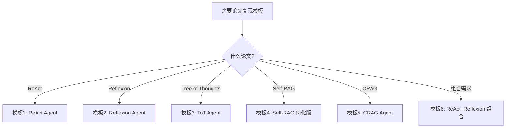

# 附录 AR：论文复现代码模板库

> 阶段 17 配套附录。五篇论文的可直接复用 LangGraph 代码模板，含完整注释。

---

## 一、模板选用指南



---

## 二、模板 1：ReAct Agent

```python
"""
ReAct 论文复现模板
论文：ReAct: Synergizing Reasoning and Acting (Yao et al., 2022)
用途：推理+行动循环 Agent
"""
from langgraph.graph import StateGraph, END
from langgraph.prebuilt import ToolNode
from langchain_openai import ChatOpenAI
from langchain_core.tools import tool
from typing import TypedDict, Annotated
from langgraph.graph.message import add_messages

@tool
def search(query: str) -> str:
    """搜索信息"""
    return f"搜索结果: {query}"

@tool
def calculate(expr: str) -> str:
    """数学计算"""
    try:
        return str(eval(expr))
    except:
        return "计算错误"

tools = [search, calculate]
llm = ChatOpenAI(model="gpt-4o", temperature=0).bind_tools(tools)

class State(TypedDict):
    messages: Annotated[list, add_messages]

def agent(state: State):
    system = "你是 ReAct Agent，用工具回答问题"
    msgs = [{"role": "system", "content": system}] + state["messages"]
    return {"messages": [llm.invoke(msgs)]}

def route(state: State) -> str:
    last = state["messages"][-1]
    if hasattr(last, "tool_calls") and last.tool_calls:
        return "tools"
    return END

graph = StateGraph(State)
graph.add_node("agent", agent)
graph.add_node("tools", ToolNode(tools))
graph.set_entry_point("agent")
graph.add_conditional_edges("agent", route, {"tools": "tools", END: END})
graph.add_edge("tools", "agent")
app = graph.compile()
```

---

## 三、模板 2：Reflexion Agent

```python
"""
Reflexion 论文复现模板
论文：Reflexion: Verbal Reinforcement Learning (Shinn et al., 2023)
用途：自省+记忆的 Agent
"""
from langgraph.graph import StateGraph, END
from langchain_openai import ChatOpenAI
from typing import TypedDict, List

llm = ChatOpenAI(model="gpt-4o", temperature=0)

class State(TypedDict):
    question: str
    answer: str
    critique: str
    reflections: List[str]
    retry_count: int

def actor(state: State):
    refs = ""
    if state.get("reflections"):
        refs = "\n\n参考过往反思：\n" + "\n".join(state["reflections"])
    resp = llm.invoke(f"回答：{state['question']}{refs}")
    state["answer"] = resp.content
    return state

def evaluator(state: State):
    resp = llm.invoke(f"评估回答：\n问题：{state['question']}\n回答：{state['answer']}\n合格说'通过'。")
    state["critique"] = resp.content
    state["retry_count"] = state.get("retry_count", 0) + 1
    return state

def reflector(state: State):
    resp = llm.invoke(f"改进建议：\n问题：{state['question']}\n回答：{state['answer']}\n评估：{state['critique']}\n给1-3条。")
    refs = state.get("reflections", [])
    refs.append(resp.content)
    state["reflections"] = refs
    return state

def route(state: State) -> str:
    if "通过" in state.get("critique", "") or state["retry_count"] >= 3:
        return END
    return "reflector"

graph = StateGraph(State)
graph.add_node("actor", actor)
graph.add_node("evaluator", evaluator)
graph.add_node("reflector", reflector)
graph.set_entry_point("actor")
graph.add_edge("actor", "evaluator")
graph.add_conditional_edges("evaluator", route, {"reflector": "reflector", END: END})
graph.add_edge("reflector", "actor")
app = graph.compile()
```

---

## 四、模板 3：Tree of Thoughts Agent

```python
"""
Tree of Thoughts 论文复现模板
论文：Tree of Thoughts (Yao et al., 2023)
用途：树搜索推理
"""
from langgraph.graph import StateGraph, END
from langchain_openai import ChatOpenAI
from typing import TypedDict, List

gen_llm = ChatOpenAI(model="gpt-4o", temperature=0.8)
eval_llm = ChatOpenAI(model="gpt-4o", temperature=0)

class State(TypedDict):
    problem: str
    current_path: List[str]
    candidates: List[str]
    best_score: float
    best_answer: str
    iteration: int

N = 3
MAX_ITER = 8

def generate(state: State):
    last = state["current_path"][-1] if state["current_path"] else ""
    resp = gen_llm.invoke(f"问题：{state['problem']}\n当前：{last}\n生成{N}个下一步。")
    lines = [l.strip().lstrip('0123456789.') for l in resp.content.split('\n') if l.strip()]
    state["candidates"] = lines[:N]
    return state

def evaluate(state: State):
    best = state.get("best_score", 0)
    for c in state["candidates"]:
        resp = eval_llm.invoke(f"问题：{state['problem']}\n候选：{c}\n打分1-10。")
        try:
            score = float(resp.content.strip())
        except:
            score = 5.0
        if score > best:
            best = score
            state["best_score"] = score
            state["best_answer"] = c
            state["current_path"].append(c)
    state["iteration"] += 1
    return state

def should_continue(state: State) -> str:
    if state["iteration"] >= MAX_ITER or state.get("best_score", 0) >= 9:
        return "done"
    return "generate"

def finalize(state: State):
    resp = eval_llm.invoke(f"问题：{state['problem']}\n推理：{' -> '.join(state['current_path'])}\n给最终答案。")
    state["best_answer"] = resp.content
    return state

graph = StateGraph(State)
graph.add_node("generate", generate)
graph.add_node("evaluate", evaluate)
graph.add_node("done", finalize)
graph.set_entry_point("generate")
graph.add_edge("generate", "evaluate")
graph.add_conditional_edges("evaluate", should_continue, {"generate": "generate", "done": "done"})
graph.add_edge("done", END)
app = graph.compile()
```

---

## 五、模板 4：Self-RAG 简化版

```python
"""
Self-RAG 论文简化复现模板
论文：Self-RAG (Asai et al., 2023)
用途：模型自决策 RAG
"""
from langgraph.graph import StateGraph, END
from langchain_openai import ChatOpenAI
from typing import TypedDict

llm = ChatOpenAI(model="gpt-4o", temperature=0)

class State(TypedDict):
    question: str
    need_retrieve: bool
    doc: str
    is_relevant: bool
    answer: str
    is_good: bool

def decide(state: State):
    resp = llm.invoke(f"问题：{state['question']}\n需要查资料吗？yes/no。")
    state["need_retrieve"] = "yes" in resp.content.lower()
    return state

def retrieve(state: State):
    if state["need_retrieve"]:
        state["doc"] = f"关于'{state['question']}'的文档"
    return state

def check(state: State):
    if state["need_retrieve"]:
        resp = llm.invoke(f"文档：{state['doc']}\n问题：{state['question']}\n相关吗？yes/no。")
        state["is_relevant"] = "yes" in resp.content.lower()
    else:
        state["is_relevant"] = True
    return state

def generate(state: State):
    if state["need_retrieve"] and state["is_relevant"]:
        resp = llm.invoke(f"基于文档回答：{state['doc']}\n问题：{state['question']}")
    else:
        resp = llm.invoke(f"回答：{state['question']}")
    state["answer"] = resp.content
    return state

def critique(state: State):
    resp = llm.invoke(f"答案：{state['answer']}\n问题：{state['question']}\n好不好？yes/no。")
    state["is_good"] = "yes" in resp.content.lower()
    return state

def route(state: State) -> str:
    if state.get("is_good"):
        return END
    return "generate"

graph = StateGraph(State)
graph.add_node("decide", decide)
graph.add_node("retrieve", retrieve)
graph.add_node("check", check)
graph.add_node("generate", generate)
graph.add_node("critique", critique)
graph.set_entry_point("decide")
graph.add_edge("decide", "retrieve")
graph.add_edge("retrieve", "check")
graph.add_edge("check", "generate")
graph.add_edge("generate", "critique")
graph.add_conditional_edges("critique", route, {"generate": "generate", END: END})
app = graph.compile()
```

---

## 六、模板 5：CRAG Agent

```python
"""
CRAG 论文复现模板
论文：Corrective RAG (Yan et al., 2024)
用途：检索纠错 RAG
"""
from langgraph.graph import StateGraph, END
from langchain_openai import ChatOpenAI
from typing import TypedDict, List
import re

llm = ChatOpenAI(model="gpt-4o", temperature=0)

class State(TypedDict):
    question: str
    docs: List[str]
    score: float
    confidence: str
    context: str
    answer: str

def retrieve(state: State):
    state["docs"] = ["文档1", "文档2"]
    return state

def evaluate(state: State):
    text = "\n".join(state["docs"])
    resp = llm.invoke(f"文档：{text}\n问题：{state['question']}\n相关度打分1-10。")
    try:
        state["score"] = float(re.search(r'\d+', resp.content).group())
    except:
        state["score"] = 5.0
    state["confidence"] = "correct" if state["score"] >= 7 else "incorrect" if state["score"] <= 3 else "ambiguous"
    return state

def refine(state: State):
    text = "\n".join(state["docs"])
    resp = llm.invoke(f"提取关键句：\n{text}\n问题：{state['question']}")
    state["context"] = resp.content
    return state

def web_search(state: State):
    state["context"] = f"网络搜索：关于'{state['question']}'的信息"
    return state

def combine(state: State):
    text = "\n".join(state["docs"])
    state["context"] = f"检索：{text}\n网络搜索：补充信息"
    return state

def generate(state: State):
    resp = llm.invoke(f"回答：\n{state['context']}\n问题：{state['question']}")
    state["answer"] = resp.content
    return state

def route(state: State) -> str:
    c = state.get("confidence", "ambiguous")
    return {"correct": "refine", "incorrect": "web_search", "ambiguous": "combine"}.get(c, "combine")

graph = StateGraph(State)
graph.add_node("retrieve", retrieve)
graph.add_node("evaluate", evaluate)
graph.add_node("refine", refine)
graph.add_node("web_search", web_search)
graph.add_node("combine", combine)
graph.add_node("generate", generate)
graph.set_entry_point("retrieve")
graph.add_edge("retrieve", "evaluate")
graph.add_conditional_edges("evaluate", route, {
    "refine": "refine", "web_search": "web_search", "combine": "combine"
})
graph.add_edge("refine", "generate")
graph.add_edge("web_search", "generate")
graph.add_edge("combine", "generate")
graph.add_edge("generate", END)
app = graph.compile()
```

---

## 七、模板 6：ReAct + Reflexion 组合

```python
"""
ReAct + Reflexion 组合模板
先做 ReAct 推理，再做 Reflexion 自省
"""
from langgraph.graph import StateGraph, END
from langgraph.prebuilt import ToolNode
from langchain_openai import ChatOpenAI
from langchain_core.tools import tool
from typing import TypedDict, Annotated, List
from langgraph.graph.message import add_messages

@tool
def search(query: str) -> str:
    """搜索信息"""
    return f"结果: {query}"

tools = [search]
llm = ChatOpenAI(model="gpt-4o", temperature=0).bind_tools(tools)

class State(TypedDict):
    messages: Annotated[list, add_messages]
    reflections: List[str]
    retry_count: int
    critique: str

def react_agent(state: State):
    system = "你是 ReAct Agent"
    refs = "\n参考反思：" + "\n".join(state.get("reflections", [])) if state.get("reflections") else ""
    msgs = [{"role": "system", "content": system + refs}] + state["messages"]
    return {"messages": [llm.invoke(msgs)]}

def reflector(state: State):
    last = state["messages"][-1].content
    resp = llm.invoke(f"评估答案：{last}\n问题：{state['messages'][0].content}\n合格说'通过'。")
    state["critique"] = resp.content
    state["retry_count"] = state.get("retry_count", 0) + 1
    if "通过" not in state["critique"]:
        refs = state.get("reflections", [])
        refs.append(state["critique"])
        state["reflections"] = refs
    return state

def route(state: State) -> str:
    if "通过" in state.get("critique", "") or state["retry_count"] >= 3:
        return END
    return "react"

def tool_route(state: State) -> str:
    last = state["messages"][-1]
    if hasattr(last, "tool_calls") and last.tool_calls:
        return "tools"
    return "reflect"

graph = StateGraph(State)
graph.add_node("react", react_agent)
graph.add_node("tools", ToolNode(tools))
graph.add_node("reflect", reflector)
graph.set_entry_point("react")
graph.add_conditional_edges("react", tool_route, {"tools": "tools", "reflect": "reflect"})
graph.add_edge("tools", "react")
graph.add_conditional_edges("reflect", route, {"react": "react", END: END})
app = graph.compile()
```

---

## 八、使用说明

| 模板 | 复制后修改 | 注意 |
| --- | --- | --- |
| 模板1 ReAct | 工具函数 | max_iterations 防死循环 |
| 模板2 Reflexion | 评估标准 | retry_count 上限 |
| 模板3 ToT | 搜索深度 | 成本高 |
| 模板4 Self-RAG | 检索实现 | 简化版 |
| 模板5 CRAG | 搜索API | 即插即用 |
| 模板6 组合 | 重试一致 | 两个上限一致 |

---

> 本模板库可复制即用，配合附录 AQ 论文阅读指南使用。