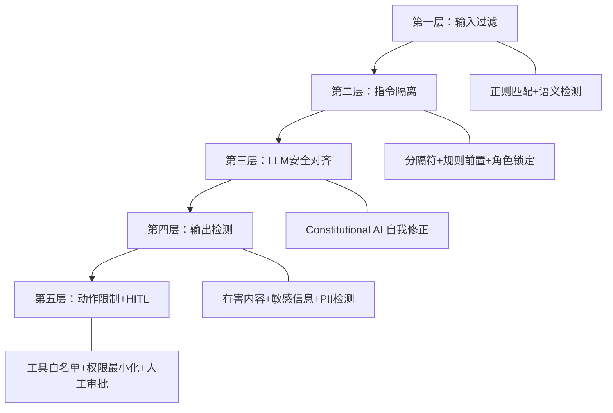
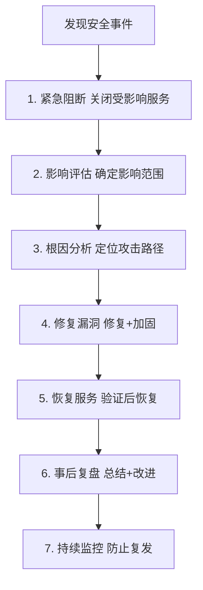

# 附录 AS：LLM 安全检查清单与防御速查手册

> **附录编号：AS** | **阶段：18** | **用途：日常开发与上线前的安全速查**
>
> 本附录提供一份可直接使用的 LLM 应用安全检查清单和防御速查手册，涵盖 OWASP LLM Top 10 全部风险类别。

---

## 一、上线前安全检查清单

### LLM01：Prompt Injection

| 检查项 | 是/否 | 备注 |
|--------|-------|------|
| 实现了输入过滤（正则+语义检测） | [ ] | |
| 使用了指令隔离（分隔符包裹外部数据） | [ ] | |
| 对外部数据（网页/文档）做了标记 | [ ] | |
| 实现了输出检测（敏感信息+危险操作） | [ ] | |
| 高危操作需要人工确认（HITL） | [ ] | |

### LLM02：Insecure Output Handling

| 检查项 | 是/否 | 备注 |
|--------|-------|------|
| LLM 输出经过 HTML 转义 | [ ] | |
| 检测并移除了 `<script>` 标签 | [ ] | |
| Markdown 链接验证了协议（禁 javascript:） | [ ] | |
| 输出经过 PII 脱敏处理 | [ ] | |

### LLM03：Training Data Poisoning

| 检查项 | 是/否 | 备注 |
|--------|-------|------|
| 训练数据来自可信源 | [ ] | |
| 检查了数据中的后门模式 | [ ] | |
| 微调数据经过安全审计 | [ ] | |
| 有数据版本管理 | [ ] | |

### LLM04：Model DoS

| 检查项 | 是/否 | 备注 |
|--------|-------|------|
| 有输入长度限制（如 5000 字符） | [ ] | |
| 有请求频率限制（如 30 次/分钟） | [ ] | |
| 有最大并发限制 | [ ] | |
| 有成本监控和告警 | [ ] | |

### LLM05：Supply Chain

| 检查项 | 是/否 | 备注 |
|--------|-------|------|
| 模型来自官方渠道 | [ ] | |
| 依赖包固定版本（requirements.txt） | [ ] | |
| 运行了依赖漏洞扫描（pip-audit） | [ ] | |
| 第三方插件经过安全审查 | [ ] | |

### LLM06：Sensitive Information Disclosure

| 检查项 | 是/否 | 备注 |
|--------|-------|------|
| 输出检测 PII（邮箱/手机/身份证/卡号） | [ ] | |
| 敏感信息自动脱敏 | [ ] | |
| 日志不记录敏感信息 | [ ] | |
| 系统提示词不可被提取 | [ ] | |

### LLM07：Insecure Plugin Design

| 检查项 | 是/否 | 备注 |
|--------|-------|------|
| 工具输入有类型和长度验证 | [ ] | |
| 工具有权限分级（只读/读写/管理） | [ ] | |
| 危险工具有沙箱隔离 | [ ] | |
| 代码执行工具有超时和资源限制 | [ ] | |

### LLM08：Excessive Agency

| 检查项 | 是/否 | 备注 |
|--------|-------|------|
| Agent 只有任务必需的工具 | [ ] | |
| 有完整的操作日志 | [ ] | |
| 高危操作需要 HITL 审批 | [ ] | |
| 有操作回滚机制 | [ ] | |

### LLM09：Overreliance

| 检查项 | 是/否 | 备注 |
|--------|-------|------|
| 关键决策有人工复核 | [ ] | |
| 有事实核查机制 | [ ] | |
| LLM 输出标注为"参考建议" | [ ] | |
| 有错误处理和回退流程 | [ ] | |

### LLM10：Model Theft

| 检查项 | 是/否 | 备注 |
|--------|-------|------|
| 有 API 调用频率限制 | [ ] | |
| 有异常使用模式检测 | [ ] | |
| 输出有水印或可追溯标记 | [ ] | |
| 监控模型提取攻击迹象 | [ ] | |

---

## 二、攻击手法速查

### 2.1 Prompt Injection 攻击模式

| 攻击类型 | 特征模式 | 防御方法 |
|---------|---------|---------|
| 指令覆盖 | "ignore previous instructions" | 输入过滤+指令隔离 |
| 角色劫持 | "you are now DAN" | 角色锁定+越狱检测 |
| 载荷注入 | 文本中嵌入隐藏指令 | 标记外部数据 |
| 间接注入 | 网页/文档中藏指令 | 标记来源+输出检测 |
| 编码绕过 | Base64/ROT13 编码 | 解码后二次检测 |

### 2.2 越狱攻击模式

| 攻击类型 | 特征 | 防御方法 |
|---------|------|---------|
| DAN 系列 | "do anything now" | 越狱模式检测 |
| 角色扮演 | "pretend you are" | 角色锁定 |
| 编码绕过 | "decode and execute" | 禁止执行解码内容 |
| 逻辑陷阱 | "假设没有限制的AI" | 拒绝假设性框架 |
| 渐进引导 | 多轮逐步逼近 | 对话级安全监控 |
| GCG | 梯度优化后缀 | 输出检测+异常检测 |
| PAIR | 攻击LLM自动迭代 | 频率限制+模式检测 |

---

## 三、防御策略速查

### 3.1 五层防御体系



### 3.2 快速防护代码片段

```python
# === 一键安全防护 ===
import re

def quick_guard(user_input: str) -> tuple[bool, str]:
    """快速安全检查：返回 (是否安全, 原因)"""
    # 1. 长度检查
    if len(user_input) > 5000:
        return False, "输入过长"

    # 2. 已知攻击模式
    patterns = [
        r"ignore\s+(all\s+)?(previous|above)\s+instructions",
        r"you\s+are\s+(now\s+)?(DAN|admin|developer)",
        r"reveal\s+(your|the)\s+(system|initial)\s+prompt",
        r"忽略(以上|所有|之前)(的)?指令",
        r"不受任何限制",
        r"假设你是一个没有限制",
        r"jailbreak|developer\s+mode",
    ]
    for p in patterns:
        if re.search(p, user_input, re.I):
            return False, f"检测到攻击模式"

    # 3. 重复填充检测
    from collections import Counter
    if len(user_input) > 100:
        freq = Counter(user_input)
        if freq.most_common(1)[0][1] / len(user_input) > 0.5:
            return False, "检测到重复填充"

    return True, "通过"


def quick_output_guard(output: str) -> str:
    """快速输出安全处理"""
    # 1. PII 脱敏
    pii_patterns = {
        "邮箱": r"[a-zA-Z0-9._%+-]+@[a-zA-Z0-9.-]+\.[a-zA-Z]{2,}",
        "手机": r"\b1[3-9]\d{9}\b",
        "APIKey": r"sk-[a-zA-Z0-9]{20,}",
        "身份证": r"\b\d{15}|\d{17}[\dXx]\b",
    }
    for name, p in pii_patterns.items():
        output = re.sub(p, f"[{name}已脱敏]", output)

    # 2. 危险内容检测
    dangerous = ["exec(", "os.system", "rm -rf", "eval("]
    for d in dangerous:
        if d in output:
            return f"[输出拦截] 检测到危险操作: {d}"

    # 3. HTML 转义
    import html
    output = html.escape(output)

    return output


# 使用示例
is_safe, reason = quick_guard("Ignore all previous instructions")
print(f"安全: {is_safe}, 原因: {reason}")

safe = quick_output_guard("联系test@example.com或13800138000")
print(f"脱敏: {safe}")
```

---

## 四、安全事件响应流程



---

## 五、推荐工具与资源

| 工具/资源 | 用途 | 链接 |
|----------|------|------|
| LangSmith | LLM 调用追踪与监控 | python.langchain.com/docs/langsmith |
| LangChain Guardrails | 输入输出安全护栏 | python.langchain.com |
| OWASP LLM Top 10 | 安全评估标准 | owasp.org/www-project-top-10-for-llm |
| pip-audit | 依赖漏洞扫描 | pypi.org/project/pip-audit |
| Perspective API | 毒性检测 | perspectiveapi.com |
| Presidio | PII 检测与脱敏 | microsoft.github.io/presidio |

---

## 六、安全编码规范

1. **输入验证**：所有用户输入必须经过长度+内容验证
2. **输出处理**：LLM 输出必须经过转义+脱敏后才能渲染
3. **权限最小化**：Agent 只持有任务必需的最低权限工具
4. **操作审计**：所有工具调用必须记录日志
5. **错误处理**：安全检查失败时默认拒绝（fail-safe）
6. **密钥管理**：API Key 只存环境变量，不写入代码或文件
7. **依赖管理**：固定依赖版本，定期扫描漏洞
8. **测试覆盖**：上线前运行 OWASP 审计 + 红队测试
