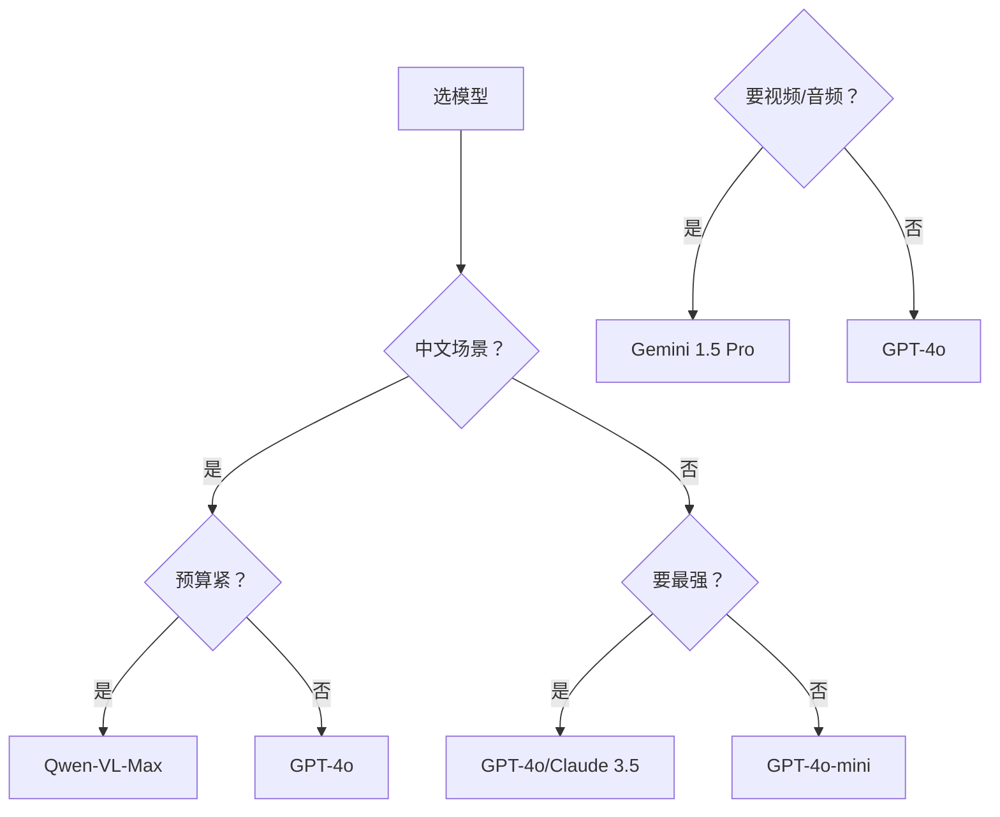

# 附录 AU：多模态开发速查手册与模型选型指南

> **附录编号：AU** | **阶段：19** | **用途：多模态 LLM 应用开发速查**
>
> 本手册汇总阶段 19 全部多模态开发的关键命令、API、配置和选型决策，供日常开发快速查阅。

---

## 1. 多模态模型选型速查

### 1.1 能力矩阵

| 模型 | 看图 | 认字 | 表格 | 推理 | 中文 | 价格 | API |
|------|------|------|------|------|------|------|-----|
| GPT-4o | 优秀 | 优秀 | 优秀 | 优秀 | 良好 | 高 | OpenAI |
| GPT-4o-mini | 良好 | 良好 | 一般 | 良好 | 良好 | 低 | OpenAI |
| Claude 3.5 Sonnet | 优秀 | 优秀 | 优秀 | 优秀 | 良好 | 高 | Anthropic |
| Gemini 1.5 Pro | 优秀 | 优秀 | 良好 | 优秀 | 良好 | 中 | Google |
| Gemini 1.5 Flash | 良好 | 良好 | 一般 | 良好 | 良好 | 低 | Google |
| Qwen-VL-Max | 良好 | 优秀 | 良好 | 良好 | 优秀 | 低 | 阿里 |

### 1.2 选型决策



---

## 2. LangChain多模态API速查

### 2.1 基本调用

```python
from langchain_openai import ChatOpenAI
from langchain_core.messages import HumanMessage
import base64

llm = ChatOpenAI(model="gpt-4o", temperature=0)

# Base64图片
msg = HumanMessage(content=[
    {"type": "text", "text": "描述这张图片"},
    {"type": "image_url", "image_url": {"url": f"data:image/png;base64,{b64}"}},
])
response = llm.invoke([msg])

# URL图片
msg = HumanMessage(content=[
    {"type": "text", "text": "描述这张图片"},
    {"type": "image_url", "image_url": {"url": "https://example.com/img.jpg"}},
])

# 多图对比
msg = HumanMessage(content=[
    {"type": "text", "text": "对比这两张图"},
    {"type": "image_url", "image_url": {"url": "url1.jpg"}},
    {"type": "image_url", "image_url": {"url": "url2.jpg"}},
])
```

### 2.2 不同Provider

```python
# OpenAI
from langchain_openai import ChatOpenAI
llm = ChatOpenAI(model="gpt-4o")

# Anthropic
from langchain_anthropic import ChatAnthropic
llm = ChatAnthropic(model="claude-3-5-sonnet-20241022")

# Google
from langchain_google_genai import ChatGoogleGenerativeAI
llm = ChatGoogleGenerativeAI(model="gemini-1.5-pro")
```

---

## 3. ASR/TTS速查

### 3.1 ASR

| 方案 | 安装 | 调用 | 成本 |
|------|------|------|------|
| Whisper本地 | `pip install openai-whisper` | `whisper.load_model("base")` | 免费 |
| Whisper API | `pip install openai` | `client.audio.transcriptions.create()` | $0.006/分钟 |

```python
# 本地Whisper
import whisper
model = whisper.load_model("base")
result = model.transcribe("audio.wav", language="zh")
print(result["text"])

# Whisper API
from openai import OpenAI
client = OpenAI()
with open("audio.wav", "rb") as f:
    result = client.audio.transcriptions.create(
        model="whisper-1", file=f, language="zh"
    )
print(result.text)
```

### 3.2 TTS

| 方案 | 安装 | 调用 | 成本 |
|------|------|------|------|
| OpenAI TTS | `pip install openai` | `client.audio.speech.create()` | $0.015/1K字 |
| Edge TTS | `pip install edge-tts` | `edge_tts.Communicate()` | 免费 |

```python
# OpenAI TTS
from openai import OpenAI
client = OpenAI()
resp = client.audio.speech.create(
    model="tts-1", voice="nova", input="你好"
)
resp.write_to_file("output.mp3")

# Edge TTS
import edge_tts, asyncio
async def speak(text, voice="zh-CN-XiaoxiaoNeural"):
    comm = edge_tts.Communicate(text, voice)
    await comm.save("output.mp3")
asyncio.run(speak("你好"))
```

---

## 4. CLIP嵌入速查

```python
from transformers import CLIPModel, CLIPProcessor, CLIPTokenizer
from PIL import Image
import torch

model = CLIPModel.from_pretrained("openai/clip-vit-base-patch32")
processor = CLIPProcessor.from_pretrained("openai/clip-vit-base-patch32")
tokenizer = CLIPTokenizer.from_pretrained("openai/clip-vit-base-patch32")

# 文本嵌入
inputs = tokenizer(["一只猫"], padding=True, return_tensors="pt")
with torch.no_grad():
    text_emb = model.get_text_features(**inputs)

# 图像嵌入
image = Image.open("cat.jpg")
inputs = processor(images=[image], return_tensors="pt")
with torch.no_grad():
    img_emb = model.get_image_features(**inputs)

# 相似度
import numpy as np
sim = np.dot(text_emb[0].numpy(), img_emb[0].numpy())
```

---

## 5. PDF解析速查

| 类型 | 工具 | 代码 |
|------|------|------|
| 数字PDF | pdfplumber | `page.extract_text()` |
| 扫描PDF | pdf2image+VLM | `convert_from_path()` → GPT-4o |
| 表格 | pdfplumber | `page.extract_tables()` |

```python
import pdfplumber

# 数字PDF
with pdfplumber.open("doc.pdf") as pdf:
    for page in pdf.pages:
        text = page.extract_text()
        tables = page.extract_tables()

# 扫描PDF
from pdf2image import convert_from_path
import base64, io
from langchain_openai import ChatOpenAI
from langchain_core.messages import HumanMessage

images = convert_from_path("scan.pdf", dpi=200)
for img in images:
    buf = io.BytesIO()
    img.save(buf, format="PNG")
    b64 = base64.b64encode(buf.getvalue()).decode()
    msg = HumanMessage(content=[
        {"type": "text", "text": "提取全部内容"},
        {"type": "image_url", "image_url": {"url": f"data:image/png;base64,{b64}"}},
    ])
    response = ChatOpenAI(model="gpt-4o").invoke([msg])
```

---

## 6. 多模态RAG速查

```python
from langchain_chroma import Chroma
from langchain_openai import OpenAIEmbeddings, ChatOpenAI
from langchain_core.documents import Document

# 创建双轨向量库
embedder = OpenAIEmbeddings(model="text-embedding-3-small")
text_store = Chroma("text", embedder, persist_directory="./vdb")
image_store = Chroma("image", embedder, persist_directory="./vdb")

# 添加文本
text_store.add_documents([Document(page_content="内容")])

# 添加图片（用VLM描述嵌入）
image_store.add_documents([
    Document(page_content="图片描述", 
             metadata={"image_path": "img.png"})
])

# 检索
text_results = text_store.similarity_search("查询", k=3)
image_results = image_store.similarity_search("查询", k=3)
```

---

## 7. 图像预处理速查

| 步骤 | 命令 | 效果 |
|------|------|------|
| 缩放 | `img.resize((w,h), Image.LANCZOS)` | 降低Token消耗 |
| 倾斜矫正 | `cv2.warpAffine()` | 提升OCR |
| 去噪 | `cv2.fastNlMeansDenoisingColored()` | 清除噪点 |
| 对比度 | `cv2.createCLAHE()` | 增强清晰度 |
| 阴影去除 | `cv2.dilate()+medianBlur()` | 均匀光照 |

```python
from PIL import Image
import io, base64

def optimize_image(path, max_size=768, quality=85):
    img = Image.open(path)
    if max(img.size) > max_size:
        ratio = max_size / max(img.size)
        img = img.resize(tuple(int(d*ratio) for d in img.size), Image.LANCZOS)
    buf = io.BytesIO()
    img.save(buf, format="JPEG", quality=quality)
    return base64.b64encode(buf.getvalue()).decode("utf-8")
```

---

## 8. 成本优化速查

| 策略 | 方法 | 节省 |
|------|------|------|
| 图片压缩 | resize到768px | 75% Token |
| 缓存 | InMemoryCache | 重复请求100% |
| 轻量模型 | GPT-4o-mini | 70% LLM |
| 本地ASR | Whisper本地 | 100% ASR |
| 免费TTS | Edge TTS | 100% TTS |

```python
from langchain_core.caches import InMemoryCache
from langchain_core.globals import set_llm_cache
set_llm_cache(InMemoryCache())  # 全局缓存
```

---

## 9. 常见问题速查

| 问题 | 原因 | 解决 |
|------|------|------|
| 图片太大报错 | 超过API限制 | 压缩到768px |
| 格式不支持 | WebP/BMP | 转JPEG/PNG |
| 识别不准 | 图片模糊 | 引导多步推理 |
| ASR超时 | 文件过大 | 截短音频 |
| TTS不自然 | 模型选择 | 换nova/shimmer |
| CLIP中文差 | 默认模型 | 换Chinese-CLIP |
| 表格乱码 | 无边框 | 用VLM直接理解 |

---

## 10. 环境安装速查

```bash
# 核心依赖
pip install langchain langchain-openai langchain-chroma

# 多模态
pip install pillow opencv-python pdfplumber pdf2image

# ASR
pip install openai-whisper
# 或: pip install openai  # API版

# TTS
pip install edge-tts
# 或: pip install openai  # API版

# CLIP
pip install transformers torch

# 文档处理
pip install pymupdf unstructured
```
