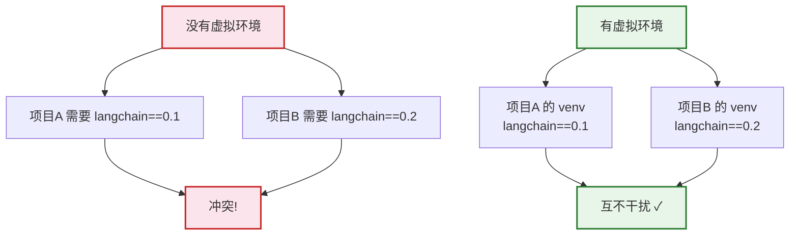
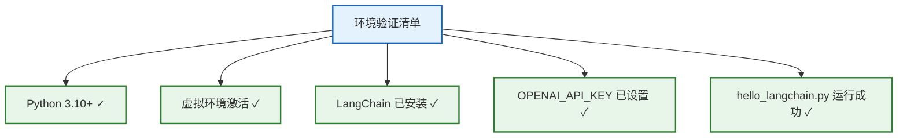
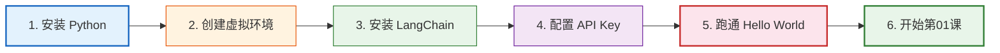

# 附录 A：环境搭建与快速入门指南

> **定位**：从零搭建 LangChain 开发环境，覆盖 Python 安装、虚拟环境、包管理、API Key 配置和第一个 Hello World 程序。

---

## 目录

1. [Python 环境准备](#1-python-环境准备)
2. [虚拟环境管理](#2-虚拟环境管理)
3. [包安装](#3-包安装)
4. [API Key 配置](#4-api-key-配置)
5. [IDE 推荐](#5-ide-推荐)
6. [第一个程序](#6-第一个程序)
7. [常见问题](#7-常见问题)

---

## 1. Python 环境准备

### 版本要求

| 版本 | 状态 | 说明 |
|------|------|------|
| Python 3.8 | ⚠️ 即将弃用 | 部分新功能不支持 |
| Python 3.9 | ✅ 支持 | 最低推荐版本 |
| Python 3.10 | ✅ 推荐 | 稳定，兼容性好 |
| Python 3.11 | ✅ 推荐 | 性能提升显著 |
| Python 3.12 | ✅ 最新 | 最新特性 |

### 检查安装

```bash
# 检查 Python 版本
python3 --version
# 输出: Python 3.11.x

# 检查 pip
pip3 --version
# 输出: pip 24.x
```

### 安装 Python（如未安装）

```bash
# macOS (使用 Homebrew)
brew install python@3.11

# Ubuntu/Debian
sudo apt update && sudo apt install python3.11 python3.11-venv

# Windows (从官网下载)
# https://www.python.org/downloads/
```

---

## 2. 虚拟环境管理

### 为什么需要虚拟环境



> **图解说明**：虚拟环境的作用——不同项目可能依赖不同版本的同一个包，没有虚拟环境会冲突。每个项目建一个独立的虚拟环境，互不干扰。

### 创建虚拟环境

```bash
# 1. 创建项目目录
mkdir my-langchain-project && cd my-langchain-project

# 2. 创建虚拟环境
python3 -m venv venv

# 3. 激活虚拟环境
# macOS/Linux:
source venv/bin/activate
# Windows:
venv\Scripts\activate

# 激活后命令行前缀变成 (venv)
# (venv) $
```

### 退出虚拟环境

```bash
deactivate
```

---

## 3. 包安装

### 核心包

```bash
# 安装 LangChain 核心包
pip install langchain

# 安装 LangChain 社区包（包含第三方集成）
pip install langchain-community

# 安装 OpenAI 集成
pip install langchain-openai

# 安装 Chroma 向量库
pip install langchain-chroma chromadb

# 安装文本处理工具
pip install pypdf

# 安装 Web 框架（用于部署）
pip install fastapi uvicorn

# 一次性安装所有
pip install langchain langchain-community langchain-openai \
    langchain-chroma chromadb pypdf fastapi uvicorn python-dotenv
```

### 版本管理

```bash
# 查看已安装版本
pip list | grep langchain

# 导出依赖
pip freeze > requirements.txt

# 从依赖安装
pip install -r requirements.txt
```

### requirements.txt 模板

```
langchain>=0.2.0
langchain-community>=0.2.0
langchain-openai>=0.1.0
langchain-chroma>=0.1.0
chromadb>=0.5.0
pypdf>=4.0.0
fastapi>=0.110.0
uvicorn>=0.29.0
python-dotenv>=1.0.0
```

---

## 4. API Key 配置

### 需要的 API Key

| API Key | 用途 | 获取地址 |
|---------|------|---------|
| `OPENAI_API_KEY` | GPT 模型 + Embedding | platform.openai.com |
| `LANGSMITH_API_KEY` | 追踪 + 评估 | smith.langchain.com |
| `COHERE_API_KEY` | Re-Ranking | cohere.com |
| `TAVILY_API_KEY` | 搜索工具 | tavily.com |

### 配置方式

```bash
# 方法1: 创建 .env 文件（推荐）
cat > .env << EOF
OPENAI_API_KEY=sk-你的密钥
LANGSMITH_API_KEY=ls-你的密钥
LANGSMITH_TRACING=true
LANGSMITH_PROJECT=my-project
EOF
```

```python
# 方法2: Python 代码中加载 .env
from dotenv import load_dotenv
load_dotenv()  # 自动加载 .env 文件中的环境变量

from langchain_openai import ChatOpenAI
llm = ChatOpenAI()  # 自动读取 OPENAI_API_KEY 环境变量
```

```python
# 方法3: 直接传入（不推荐，密钥暴露在代码中）
llm = ChatOpenAI(openai_api_key="sk-xxx")  # ❌ 不要这样做
```

> ⚠️ **安全提醒**：`.env` 文件必须加入 `.gitignore`，切勿提交到 Git。

### .gitignore 模板

```
.env
venv/
__pycache__/
*.pyc
chroma_db/
data/*.pdf
```

---

## 5. IDE 推荐

### VS Code（首选推荐）

| 优点 | 说明 |
|------|------|
| 免费 | 开源跨平台 |
| Python 支持 | 官方插件优秀 |
| 调试方便 | 内置断点调试 |
| Jupyter 集成 | 支持 .ipynb |

**推荐插件**：
- Python（Microsoft）
- Pylance（Microsoft）
- Jupyter（Microsoft）
- autoDocstring

### PyCharm

| 优点 | 说明 |
|------|------|
| 智能提示 | 最强代码补全 |
| 远程开发 | 支持远程解释器 |
| 社区版免费 | 基础功能够用 |

### Jupyter Notebook

适合交互式开发和数据探索：

```bash
pip install jupyter
jupyter notebook
```

---

## 6. 第一个程序

### Hello World

```python
# hello_langchain.py
from dotenv import load_dotenv
from langchain_openai import ChatOpenAI
from langchain_core.prompts import ChatPromptTemplate
from langchain_core.output_parsers import StrOutputParser

load_dotenv()

# 1. 创建 LLM
llm = ChatOpenAI(model="gpt-4o-mini", temperature=0)

# 2. 创建 Prompt
prompt = ChatPromptTemplate.from_messages([
    ("system", "你是一个友好的助手，用简洁的中文回答。"),
    ("human", "{question}"),
])

# 3. 创建输出解析器
parser = StrOutputParser()

# 4. 用管道组合
chain = prompt | llm | parser

# 5. 运行
result = chain.invoke({"question": "什么是 LangChain? 用一句话回答。"})
print(result)
```

### 运行

```bash
python hello_langchain.py
# 输出: LangChain 是一个用于开发大语言模型应用的开源框架。
```

### 验证环境检查清单



> **图解说明**：环境验证五步清单——Python 版本、虚拟环境、LangChain 安装、API Key 配置、Hello World 程序运行。全部打勾就可以开始学习了。

---

## 7. 常见问题

### Q1: `ModuleNotFoundError: No module named 'langchain'`

```bash
# 原因: 没有安装或没激活虚拟环境
# 解决:
source venv/bin/activate
pip install langchain
```

### Q2: `AuthenticationError: Incorrect API key`

```bash
# 原因: API Key 错误或未设置
# 检查:
echo $OPENAI_API_KEY  # 应输出 sk-xxx
# 如果为空:
export OPENAI_API_KEY=sk-你的密钥
# 或检查 .env 文件
```

### Q3: `RateLimitError: Rate limit reached`

```python
# 原因: API 调用频率超出限制
# 解决: 降低频率或使用重试
from langchain_openai import ChatOpenAI
llm = ChatOpenAI(model="gpt-4o-mini").with_retry(stop_after_attempt=3)
```

### Q4: 中文显示乱码

```python
# 确保文件编码为 UTF-8
# Python 3 默认 UTF-8，一般不会出问题
# 如果终端乱码:
import sys
sys.stdout.reconfigure(encoding='utf-8')
```

### Q5: `pip install` 速度慢

```bash
# 使用国内镜像
pip install -i https://pypi.tuna.tsinghua.edu.cn/simple langchain

# 或设置默认镜像
pip config set global.index-url https://pypi.tuna.tsinghua.edu.cn/simple
```

---

## 快速上手路线



> **图解说明**：六步快速上手路线——安装 Python → 创建虚拟环境 → 安装 LangChain → 配置 API Key → 跑通 Hello World → 开始学习第01课。每步只需几分钟。

---

## 配套文档

- 📖 所有课程文档都假设你已完成本指南的环境搭建
- 📖 `知识库/01_核心架构技术参考.md` — 核心架构参考
