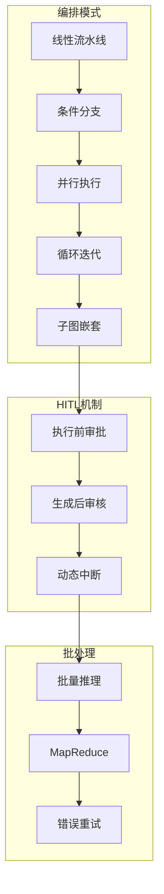

# 附录 BA：高级编排与 HITL 速查手册

> 本手册是阶段 22（Agent 高级编排与人机协作实战）的快速参考。

---

## 全景图



---

## 一、编排模式速查

### 1.1 五大编排模式

| 模式 | 类比 | 关键API | 适用场景 |
|------|------|---------|---------|
| 线性流水线 | 自助餐排队 | `add_edge` | 顺序处理 |
| 条件分支 | 银行取号 | `add_conditional_edges` | 分类路由 |
| 并行执行 | 多灶台炒菜 | Fan-out/Fan-in | 多源检索 |
| 循环迭代 | 反复改作文 | 条件边+计数器 | 质量优化 |
| 子图嵌套 | 部门协作 | 子图compile() | 复杂系统 |

### 1.2 条件路由模板

```python
graph.add_conditional_edges(
    "source_node",
    route_function,           # 返回目标节点名
    {"target1": "target1", "target2": "target2"}  # 路由映射
)
```

### 1.3 并行执行模板

```python
# Fan-out: 多个节点并行启动
graph.add_edge(START, "node_a")
graph.add_edge(START, "node_b")
graph.add_edge(START, "node_c")

# Fan-in: 多个结果汇聚
graph.add_edge("node_a", "merge")
graph.add_edge("node_b", "merge")
graph.add_edge("node_c", "merge")
```

### 1.4 循环迭代模板

```python
# 条件边实现循环
graph.add_conditional_edges(
    "evaluate",
    should_continue,          # 返回 "continue" 或 "done"
    {"continue": "refine", "done": "finalize"}
)
graph.add_edge("refine", "evaluate")  # 形成循环
```

---

## 二、HITL 速查

### 2.1 中断方式对比

| 方式 | API | 使用场景 | 恢复方式 |
|------|-----|---------|---------|
| 节点前中断 | `interrupt_before=["node"]` | 执行前审批 | update_state + invoke |
| 节点后中断 | `interrupt_after=["node"]` | 生成后审核 | update_state + invoke |
| 动态中断 | `raise GraphInterrupt(...)` | 运行时条件判断 | 异常处理后 invoke |

### 2.2 审批工作流模板

```python
# 编译时配置中断
app = graph.compile(
    checkpointer=MemorySaver(),
    interrupt_before=["approval_node"]
)

# 执行到中断点
config = {"configurable": {"thread_id": "session-001"}}
result = app.invoke(initial_state, config=config)

# 人工注入审批结果
app.update_state(config, {"approval_status": "approved"}, as_node="approval_node")

# 恢复执行
result = app.invoke(None, config=config)
```

### 2.3 风险分级

| 风险等级 | 判断条件 | 介入方式 |
|---------|---------|---------|
| P0 高 | 删除/发送/格式化 | 人工审批 |
| P1 中 | 大量数据处理 | 人工确认 |
| P2 低 | 只读/查询 | 自动执行 |

---

## 三、批处理速查

### 3.1 并发控制模板

```python
import asyncio

async def batch_process(items, func, concurrency=5):
    semaphore = asyncio.Semaphore(concurrency)
    
    async def limited(item):
        async with semaphore:
            return await func(item)
    
    return await asyncio.gather(*[limited(i) for i in items])
```

### 3.2 批处理参数推荐

| 参数 | 推荐值 | 说明 |
|------|--------|------|
| batch_size | 5-20 | 每批条数 |
| concurrency | 3-10 | 并发数 |
| max_retries | 3 | 最大重试 |
| retry_delay | 1-5s | 重试间隔 |
| timeout | 30-60s | 单批超时 |

### 3.3 MapReduce 模板

```python
# Map: 并行处理
async def map_stage(state):
    tasks = [process(item) for item in state["items"]]
    results = await asyncio.gather(*tasks)
    return {"mapped": results}

# Reduce: 汇总
async def reduce_stage(state):
    return {"final": combine(state["mapped"])})
```

---

## 四、产品化检查清单

### 4.1 上线前检查

```
[ ] 代码审查通过
[ ] 单元测试覆盖率 >80%
[ ] 评估测试达标 >0.85
[ ] Docker镜像构建成功
[ ] 健康检查端点正常
[ ] 告警规则已配置
[ ] 输入验证已启用
[ ] 审计日志已开启
[ ] 回滚脚本已测试
[ ] 文档已更新
```

### 4.2 成熟度等级

| 等级 | 名称 | 特征 |
|------|------|------|
| L0 | 原型 | 能跑就行 |
| L1 | MVP | 核心功能可用 |
| L2 | 测试版 | 有测试覆盖 |
| L3 | 生产版 | 监控+告警 |
| L4 | 优化版 | 性能+成本调优 |
| L5 | 规模化 | 多团队协作 |

---

## 五、版本信息

| 组件 | 版本 |
|------|------|
| langchain-core | 1.5.3 |
| langgraph | 1.0.7 |
| langgraph-cli | 0.4.12 |
| Context API | v0.6 |
| Python | 3.11+ |
